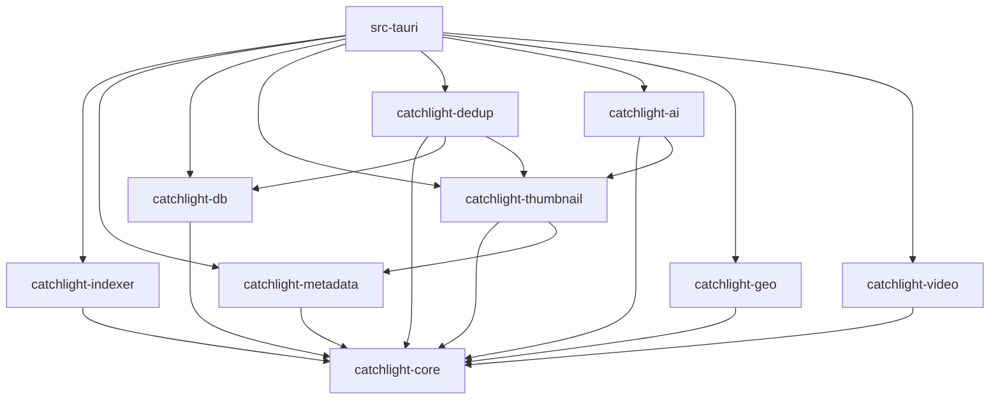
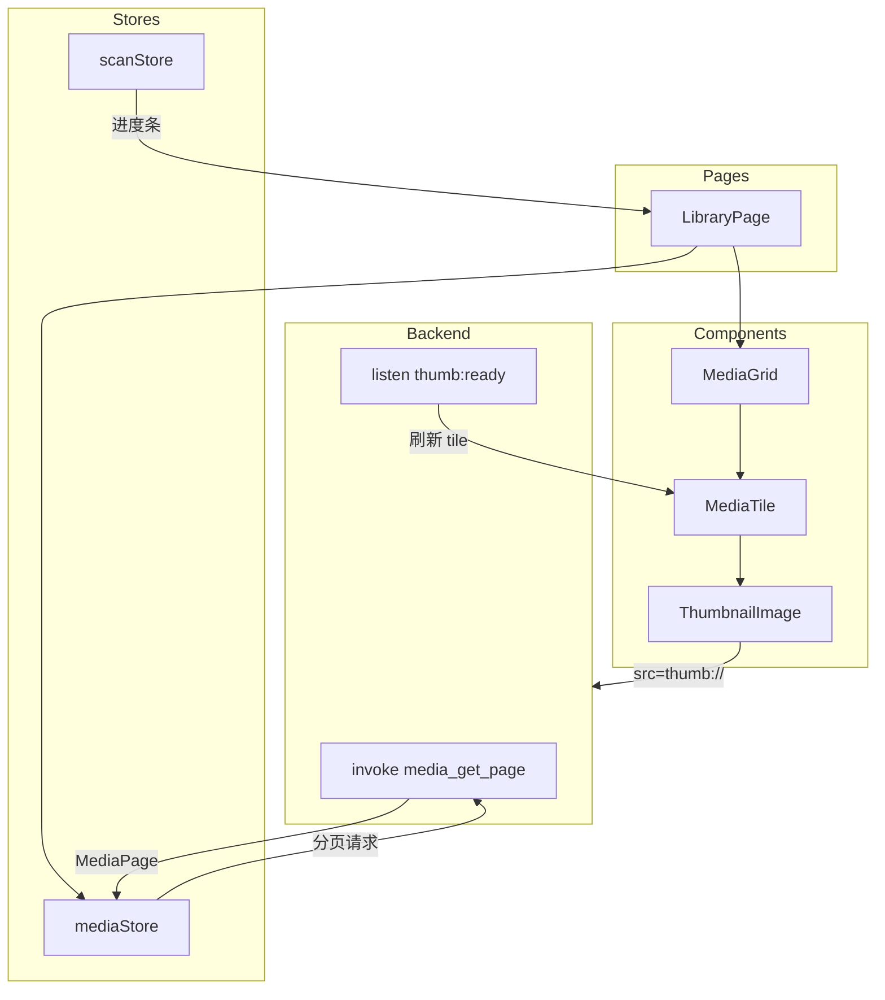
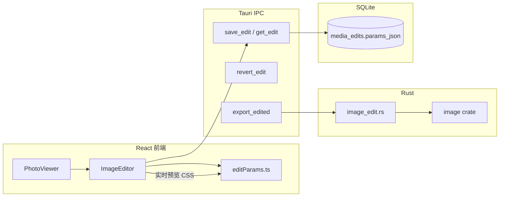
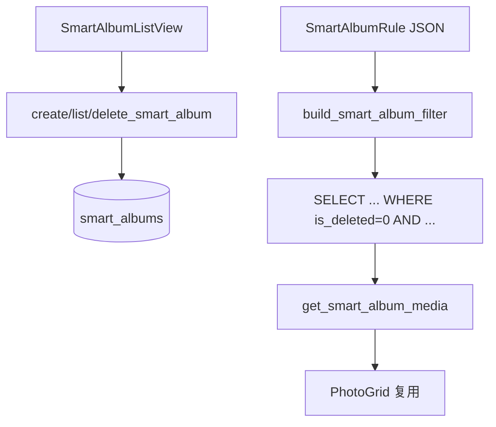

# CatchLight（拾光）架构设计文档

> **版本：** 1.2  
> **日期：** 2026-06-28  
> **状态：** Phase 1–3 + 高级编辑器已实现（与代码同步）  
> **技术栈：** Tauri 2.x + Rust + React 19 + Python AI 扩展（可选）

---

## 目录

1. [架构概览](#1-架构概览)
2. [后端架构（Rust）](#2-后端架构rust)
3. [前端架构（React）](#3-前端架构react)
4. [数据架构](#4-数据架构)
5. [跨平台适配层](#5-跨平台适配层)
6. [安全与权限](#6-安全与权限)
7. [图像编辑器架构](#7-图像编辑器架构)
8. [智能相簿与回忆](#8-智能相簿与回忆)

---

## 1. 架构概览

### 1.1 系统整体架构

CatchLight 采用 **Tauri 2.x 桌面壳 + Rust 后端 + React WebView 前端 + Python AI 扩展（可选）** 的混合分层架构。核心设计原则：**不复制照片文件**，通过高速索引就地查看；**Cargo workspace 多 crate** 隔离领域逻辑，避免 Lap 式单文件 7300 行巨石模块；**核心功能不依赖 Python**，AI 增强层通过 JSON-RPC 与 Python sidecar 通信，按需启动。技术路线详细对比分析见 [技术路线决策](1-tech-stack-decision.md)。

```mermaid
flowchart TB
    subgraph Frontend["前端 (React 19 + TypeScript)"]
        UI[页面 / 组件]
        Store[useSyncExternalStore 全局 store]
        Virtual[@tanstack/react-virtual]
        I18n[自定义 i18n 模块]
        Map[Leaflet / MapLibre]
    end

    subgraph IPC["Tauri IPC 层"]
        Cmd[invoke 命令<br/>按功能域分组]
        Event[emit 事件<br/>扫描/缩略图/进度]
        Proto[自定义协议<br/>thumb:// / file://]
    end

    subgraph Backend["后端 (Rust Workspace)"]
        Core[catchlight-core<br/>领域模型]
        Indexer[catchlight-indexer<br/>MFT/USN/inotify]
        Meta[catchlight-metadata<br/>EXIF/GPS]
        Thumb[catchlight-thumbnail<br/>缩略图缓存]
        DB[catchlight-db<br/>SQLite]
        Dedup[catchlight-dedup<br/>BLAKE3/PHash]
        AI[catchlight-ai<br/>CLIP/人脸]
        Geo[catchlight-geo<br/>反向地理编码]
        Video[catchlight-video<br/>FFmpeg]
    end

    subgraph PythonAI["Python AI 扩展 (可选, 按需启动)"]
        PyRPC[JSON-RPC Server]
        PyClip[高级语义搜索<br/>CLIP + FAISS]
        PyOCR[截图 OCR + 分类]
        PyTag[场景/活动标签]
        PyCluster[深度聚类]
    end

    subgraph Storage["持久化层"]
        GlobalDB[(global.db)]
        LibDB[(library_*.db)]
        Cache[缩略图缓存<br/>~/.catchlight/cache/]
        Config[config.json]
    end

    UI --> Cmd
    UI --> Event
    UI --> Proto
    Cmd --> Backend
    Event --> UI
    Proto --> Thumb
    Backend --> Storage
    Indexer --> DB
    Meta --> DB
    Thumb --> Cache
    AI -.->|JSON-RPC| PyRPC
    PyRPC --> PyClip
    PyRPC --> PyOCR
    PyRPC --> PyTag
    PyRPC --> PyCluster
```

### 1.2 ASCII 分层概览

```
┌─────────────────────────────────────────────────────────────────┐
│                     表现层 (Presentation)                        │
│  React 19 · TailwindCSS v4 · shadcn/ui · 虚拟滚动 · i18n        │
├─────────────────────────────────────────────────────────────────┤
│                     应用层 (Application)                         │
│  Tauri commands/ · state.rs · protocol.rs · 事件总线             │
├─────────────────────────────────────────────────────────────────┤
│                     领域层 (Domain)                              │
│  catchlight-core · 相簿/媒体/扫描任务 领域模型与业务规则          │
├─────────────────────────────────────────────────────────────────┤
│                     基础设施层 (Infrastructure)                   │
│  indexer · metadata · thumbnail · db · dedup · ai · geo · video│
├─────────────────────────────────────────────────────────────────┤
│                     平台层 (Platform)                            │
│  Windows: MFT/USN · Linux: inotify · FFmpeg sidecar · 系统托盘   │
├ ─ ─ ─ ─ ─ ─ ─ ─ ─ ─ ─ ─ ─ ─ ─ ─ ─ ─ ─ ─ ─ ─ ─ ─ ─ ─ ─ ─ ─┤
│                     AI 扩展层 (可选, Python sidecar)               │
│  JSON-RPC · 高级语义搜索 · OCR · 场景标签 · 深度聚类 · 新模型     │
└─────────────────────────────────────────────────────────────────┘
```

### 1.3 前后端职责边界

| 层级 | 职责 | 不做 |
|------|------|------|
| **React 前端** | UI 渲染、虚拟滚动、路由、本地 UI 状态、地图展示、用户交互 | 文件 I/O、EXIF 解析、数据库访问 |
| **Tauri 壳层** | IPC 路由、State 注入、自定义 URI 协议、窗口/托盘管理 | 业务逻辑 |
| **Rust Crates** | 索引、元数据、缩略图、去重、AI 推理、持久化 | UI 渲染 |
| **SQLite** | 索引事实、用户状态（收藏/相簿）、FTS5 搜索 | 存储原始照片 |

### 1.4 关键架构决策记录（ADR）

#### ADR-001：选用 Tauri 2.x + Rust + React

| 字段 | 内容 |
|------|------|
| **状态** | 已采纳 |
| **背景** | 需跨平台（Windows + Linux）、小安装包、高性能文件索引 |
| **决策** | Tauri 2.x + Rust 后端 + React 19 前端 |
| **理由** | Rust 适合 MFT/USN 与并行哈希；Tauri 安装包 < 15MB；Web 前端便于实现 macOS 照片风格 UI |
| **备选** | .NET + Avalonia（索引性能弱于 Rust）；fork iPhotron（Python 性能瓶颈） |
| **后果** | Linux 需 WebKitGTK 依赖；CSS 跨平台需额外测试 |

#### ADR-002：Cargo Workspace 多 Crate，拒绝扁平 `t_*` 结构

| 字段 | 内容 |
|------|------|
| **状态** | 已采纳 |
| **背景** | Lap 的 `t_sqlite.rs`（7300 行）和 `t_cmds.rs`（180+ IPC 命令）维护成本极高 |
| **决策** | 按领域拆分为 9 个独立 crate + Tauri 壳层 `commands/` 分组 |
| **理由** | 编译并行、边界清晰、可独立测试、避免循环依赖 |
| **后果** | 初期 crate 间接口设计需 upfront 投入 |

#### ADR-003：混合式存储（方案 C）

| 字段 | 内容 |
|------|------|
| **状态** | 已采纳 |
| **背景** | 需在「集中管理」与「照片目录可移植」之间取舍 |
| **决策** | 元数据与缓存集中存放于 `~/.catchlight/`，照片目录零污染 |
| **理由** | 见 [§4.1 存储方案对比](#41-存储方案对比) |
| **后果** | 移动照片目录后需重新扫描或路径修复 |

#### ADR-004：thumb:// 自定义协议提供缩略图

| 字段 | 内容 |
|------|------|
| **状态** | 已采纳 |
| **背景** | 10 万+ 缩略图通过 IPC 传 Base64 不可行 |
| **决策** | 注册 `thumb://localhost/{library_id}/{file_id}/{size}` 异步 URI 协议 |
| **参考** | Lap `t_protocol.rs` |
| **理由** | `` 原生懒加载；浏览器缓存友好；按需触发生成 |
| **后果** | 需处理协议未就绪时的占位图与后台生成回调 |

#### ADR-005：Preview / HQ 双轨缓存（查看器）

| 字段 | 内容 |
|------|------|
| **状态** | 已采纳 |
| **背景** | 全尺寸解码慢，网格滚动与全屏查看需求不同 |
| **决策** | micro(64) / small(256) / large(1024) 三级缓存；micro 存 DB BLOB，small/large 存磁盘 WebP |
| **参考** | FlyPhotos Preview/HQ 双轨 + 滑动窗口预取 |
| **理由** | 网格 60fps 滚动用 micro BLOB；相簿/查看器用 small/large WebP |
| **后果** | 缓存目录需分层管理与 LRU 淘汰策略；视频缩略图依赖 FFmpeg 抽帧（best-effort） |

#### ADR-006：Tokio 异步 + 信号量限流

| 字段 | 内容 |
|------|------|
| **状态** | 已采纳 |
| **背景** | 扫描、缩略图、AI 推理并发需控，避免 IO/CPU 争抢 |
| **决策** | Tokio 运行时 + `ProcessingBudget` 式信号量（参考 Lap） |
| **理由** | 按任务类型分配预算：普通缩略图 / 重型解码 / AI 嵌入各自限流 |
| **后果** | 需优先级队列区分用户可见区域 vs 后台批量任务 |

---

## 2. 后端架构（Rust）

### 2.1 模块划分（Cargo Workspace）

```
src-tauri/
├── Cargo.toml                  # workspace 根
├── crates/
│   ├── catchlight-core/        # 核心领域模型（零框架依赖）
│   ├── catchlight-indexer/     # 文件索引引擎
│   ├── catchlight-metadata/    # EXIF/GPS 元数据
│   ├── catchlight-thumbnail/   # 缩略图生成与缓存
│   ├── catchlight-db/          # SQLite 数据层
│   ├── catchlight-dedup/       # 去重引擎
│   ├── catchlight-ai/          # AI 功能（可选）
│   ├── catchlight-geo/         # 反向地理编码
│   └── catchlight-video/       # 视频处理
└── src/
    ├── main.rs
    ├── lib.rs
    ├── commands/               # IPC 命令分组
    │   mod.rs
    │   library.rs              # 图库/监控文件夹
    │   media.rs                # 媒体文件 CRUD/查询
    │   album.rs                # 相簿管理
    │   scan.rs                 # 扫描控制
    │   thumbnail.rs            # 缩略图触发/状态
    │   search.rs               # FTS5 搜索
    │   dedup.rs                # 去重操作
    │   settings.rs             # 设置读写
    │   ai.rs                   # AI 分类/人脸
    │   geo.rs                  # 地点查询
    │   video.rs                # 视频播放信息
    │   system.rs               # 系统/托盘/更新
    ├── state.rs                # AppState / Tauri Managed State
    └── protocol.rs             # thumb:// / preview:// 协议
```

#### 2.1.1 Crate 职责与公开 API

##### catchlight-core

**职责：** 纯领域模型与业务规则，不依赖 Tauri、SQLite、Tokio。

**公开类型：**

```rust
// 媒体文件领域实体
pub struct MediaFile { pub id: MediaId, pub path: FilePath, pub taken_at: Option<Timestamp>, ... }
pub struct Album { pub id: AlbumId, pub name: String, pub album_type: AlbumType, ... }
pub struct ScanJob { pub id: JobId, pub status: ScanStatus, pub progress: ScanProgress, ... }
pub struct Library { pub id: LibraryId, pub root_paths: Vec<PathBuf>, ... }

// 值对象
pub enum MediaType { Photo, Video, Screenshot, Raw, LivePhoto }
pub enum IndexPhase { Discovering, ExtractingExif, GeneratingThumbs, Complete }

// 领域服务 trait（由 infra crate 实现）
pub trait MediaRepository { ... }
pub trait ScanEventPublisher { ... }
```

**依赖：** 仅 `serde`、`thiserror`、`chrono`（或自定义时间类型）。

---

##### catchlight-indexer

**职责：** 跨平台文件发现与变更监听。

**公开 API：**

```rust
#[async_trait]
pub trait FileIndexer: Send + Sync {
    async fn full_scan(&self, root: &Path, filter: &MediaFilter) -> Result<ScanBatch>;
    async fn watch(&self, roots: &[PathBuf]) -> Result<FileChangeStream>;
    fn capabilities(&self) -> IndexerCapabilities; // Mft | Usn | Inotify | WalkDir
}

pub struct NtfsIndexer;      // Windows: MFT + USN Journal
pub struct LinuxIndexer;     // Linux: walkdir + inotify
pub struct GenericIndexer;   // 降级：notify + walkdir

pub enum FileChange { Created(PathBuf), Modified(PathBuf), Deleted(PathBuf), Renamed { from, to } }
```

**依赖：** `catchlight-core`、平台 crate（`ntfs-reader`、`notify`、`walkdir`）。

---

##### catchlight-metadata

**职责：** EXIF/IPTC/XMP 提取，拍摄时间/GPS/相机信息标准化。

**公开 API：**

```rust
pub struct ExifExtractor;
impl ExifExtractor {
    pub fn extract(&self, path: &Path) -> Result<MediaMetadata>;
    pub fn extract_batch(&self, paths: &[PathBuf]) -> impl Stream<Item = (PathBuf, Result<MediaMetadata>)>;
}

pub struct MediaMetadata {
    pub taken_at: Option<Timestamp>,
    pub camera_make: Option<String>,
    pub camera_model: Option<String>,
    pub gps: Option<GpsCoordinate>,
    pub dimensions: Option<(u32, u32)>,
    pub embedded_thumb: Option<Vec<u8>>,  // JPEG 内嵌缩略图
}
```

**策略：** `kamadak-exif` 处理 JPEG/HEIF/PNG；ExifTool sidecar 兜底 RAW/特殊格式。

**依赖：** `catchlight-core`、`kamadak-exif`、`image`。

---

##### catchlight-thumbnail

**职责：** 多级缩略图生成、磁盘缓存、内存 LRU。

**公开 API：**

```rust
pub enum ThumbSize { Micro = 64, Small = 256, Preview = 1024, Hq = 4096 }

pub struct ThumbnailService {
    pub async fn get_or_schedule(&self, file_id: i64, size: ThumbSize) -> ThumbResult;
    pub async fn prefetch_window(&self, file_ids: &[i64], center: usize, radius: usize);
    pub fn cache_path(&self, library_id: &str, file_id: i64, size: ThumbSize) -> PathBuf;
}

pub enum ThumbResult { Ready(PathBuf), Scheduled, Error(ThumbError) }
```

**缓存路径：** `~/.catchlight/cache/thumbs/{size}/{blake3_prefix}.webp`；micro 级另存 `media_files.micro_thumb` BLOB（64×64 JPEG）。

**三级规格（已实现）：**

| 级别 | 尺寸 | 格式 | 存储 |
|------|------|------|------|
| micro | 64×64 | JPEG | SQLite BLOB |
| small | 256×256 | WebP | 磁盘缓存 |
| large | 1024×1024 | WebP | 磁盘缓存 |

**依赖：** `catchlight-core`、`catchlight-metadata`、`image`、`webp`。

---

##### catchlight-db

**职责：** SQLite schema、迁移、类型安全查询、FTS5 同步。

**公开 API：**

```rust
pub struct DatabasePool { ... }
pub struct MediaRepositoryImpl { ... }
pub struct AlbumRepositoryImpl { ... }
pub struct MigrationRunner;  // refinery 或自研版本表

// 查询构建器（避免原始 SQL 散落）
pub struct MediaQuery {
    pub library_id: Option<String>,
    pub taken_after: Option<Timestamp>,
    pub media_type: Option<MediaType>,
    pub is_favorite: Option<bool>,
    pub limit: u32,
    pub offset: u32,
}
```

**Phase 2 已实现能力：**
- **FTS5 全文搜索**：`media_fts` 外部内容表（`filename`、`city`、`country`、`media_type`），INSERT/UPDATE/DELETE 同步触发器；`search.rs` 暴露 `search_media` IPC，查询自动过滤 `is_deleted = 0`
- **软删除**：`is_deleted` + `deleted_at` 标记；列表/搜索/FTS 默认排除已删项；应用启动时 `cleanup_deleted_older_than(30)` 永久清理超期记录；`DeletedView` 展示最近删除

**Schema 版本（已实现）：** v1 基础表 → v2 `scan_status` → v3 `is_favorite`/`is_deleted`/`deleted_at` → v4 FTS5 → v5 部分索引（`idx_media_not_deleted`、`idx_media_type_active`、`idx_media_deleted_at`）

**依赖：** `catchlight-core`、`rusqlite`（bundled）、`refinery` 或 `rusqlite_migration`。

---

##### catchlight-dedup

**职责：** 三级去重：精确（BLAKE3）→ 感知（DHash/PHash）→ 语义（CNN 向量，可选）。**Phase 2 已实现 L1+L2**：BLAKE3 精确分组 + DHash 汉明距离聚类，`DedupView` 工具页展示重复组。

**公开 API：**

```rust
pub struct DedupEngine {
    pub async fn compute_file_hash(&self, path: &Path) -> Result<Blake3Hash>;
    pub async fn compute_perceptual_hash(&self, path: &Path) -> Result<PerceptualHash>;
    pub fn find_exact_duplicates(&self, db: &DatabasePool) -> Result<Vec<DuplicateGroup>>;
    pub fn find_similar(&self, phash: &PerceptualHash, threshold: u32) -> Result<Vec<MediaId>>;
}
```

**依赖：** `catchlight-core`、`catchlight-db`、`blake3`、`img_hash`。

---

##### catchlight-ai

**职责：** AI 统一分发器（AiDispatcher），管理 Rust ONNX 基础推理与 Python sidecar 高级 AI 扩展。包含 CLIP 截图识别、人脸检测（InsightFace ONNX）、Python JSON-RPC 桥接。**可选模块**，未安装模型或 Python 时优雅降级。

**公开 API：**

```rust
pub struct AiClassifier {
    pub fn is_available(&self) -> bool;
    pub async fn classify_screenshot(&self, path: &Path) -> Result<ScreenshotClassification>;
    pub async fn detect_faces(&self, path: &Path) -> Result<Vec<FaceDetection>>;
}

pub enum ScreenshotClassification { Screenshot, Document, Code, Chat, CameraPhoto, Unknown }
```

**依赖：** `catchlight-core`、`ort`（ONNX Runtime）、`catchlight-thumbnail`。

---

##### catchlight-geo

**职责：** GPS → 国家/城市/地点名，离线 K-D Tree 查询。**Phase 2 已实现**：扫描流水线在 EXIF 提取 GPS 后调用 `reverse_geocode`，结果写入 `country`/`city` 列。

**公开 API：**

```rust
pub struct GeoResolver {
    pub fn reverse(&self, lat: f64, lon: f64) -> GeoLocation;
    pub fn cluster_locations(&self, points: &[(f64, f64)]) -> Vec<LocationCluster>;
}
```

**依赖：** `catchlight-core`、`rrgeo`。

---

##### catchlight-video

**职责：** FFmpeg 封装，视频缩略图（best-effort）、时长、编码信息。

**Phase 1 实现：** 扫描流水线中若 PATH 存在 `ffmpeg`，抽取第 1 秒帧为临时 JPEG，再生成 micro/small 缩略图；未找到 FFmpeg 时跳过，视频仍可索引。

**公开 API：**

```rust
pub fn find_ffmpeg() -> Option<PathBuf>;
pub fn probe_duration(path: &Path) -> Result<f64>;
```

**依赖：** `catchlight-core`、`tokio::process`。

---

#### 2.1.2 Crate 依赖关系



**规则：**
- `catchlight-core` 不依赖任何 sibling crate
- infra crate 之间禁止循环依赖
- Tauri 壳层仅通过 crate 公开 API 访问，不直接写 SQL

---

### 2.2 IPC 设计

#### 2.2.1 命令分组策略

对比 Lap 将 180+ 命令堆入 `t_cmds.rs` 的反模式，CatchLight 按**功能域**拆分：

| 模块文件 | 命令示例 | 预估数量 |
|----------|----------|----------|
| `library.rs` | `add_watched_folder`, `remove_watched_folder`, `list_libraries` | ~8 |
| `media.rs` | `get_media_page`, `get_media_by_id`, `toggle_favorite`, `soft_delete` | ~15 |
| `album.rs` | `create_album`, `add_to_album`, `remove_from_album`, `list_albums` | ~12 |
| `scan.rs` | `start_scan`, `pause_scan`, `get_scan_status` | ~6 |
| `thumbnail.rs` | `request_thumbnail`, `get_thumb_status` | ~4 |
| `search.rs` | `search_media`, `search_suggestions` | ~4 |
| `dedup.rs` | `start_dedup_scan`, `list_duplicate_groups`, `resolve_duplicate` | ~8 |
| `settings.rs` | `get_settings`, `update_settings`, `get_locale` | ~6 |
| `ai.rs` | `classify_batch`, `list_people`, `merge_persons` | ~10 |
| `geo.rs` | `get_places_tree`, `get_media_by_place` | ~5 |
| `video.rs` | `get_video_info`, `get_video_stream_url` | ~4 |
| `system.rs` | `show_in_folder`, `get_app_info`, `check_update` | ~8 |

**命名规范：** `{domain}_{action}`，如 `media_get_page`、`album_create`。

**注册方式（`main.rs`）：**

```rust
tauri::Builder::default()
    .invoke_handler(tauri::generate_handler![
        commands::library::add_watched_folder,
        commands::library::remove_watched_folder,
        commands::media::get_media_page,
        // ... 按模块分组注册
    ])
```

#### 2.2.2 事件推送设计

前端通过 `listen()` 订阅后端 `emit` 事件，实现进度与状态实时更新：

| 事件名 | 载荷 | 触发时机 |
|--------|------|----------|
| `scan-progress` | `ScanProgress`（见下） | 扫描进行中（每文件更新） |
| `scan:complete` | `{ job_id, library_id, stats }` | 扫描完成 |
| `thumb:ready` | `{ file_id, size, url }` | 缩略图生成完毕 |
| `index:changed` | `{ library_id, change_type, paths[] }` | USN/inotify 增量变更 |
| `dedup:progress` | `{ current, total, groups_found }` | 去重扫描进度 |
| `ai:classified` | `{ file_id, media_type, confidence }` | AI 分类完成 |
| `language:changed` | `{ locale }` | 多窗口语言同步 |

**ProgressTracker 模式（借鉴 Lap）：**

```rust
// 当前实现：src-tauri/src/state.rs
pub struct ScanProgress {
    pub folder_id: i64,
    pub scanned: i64,
    pub total: i64,
    pub status: String,  // idle | scanning | complete | error
}

// 前端 tauri.ts 与后端 serde 字段对齐
pub struct WatchedFolder {
    pub id: i64,
    pub path: String,
    pub media_count: i64,
    pub last_scan: Option<String>,
    pub scan_status: String,  // idle | scanning | complete | error
}
```

**扫描流水线（Phase 1–2 实现）：** `futures::stream` + `buffer_unordered(concurrency)` 有界并发，在信号量预算内并行处理每个文件（EXIF、BLAKE3/DHash 哈希、缩略图、截图规则检测、GPS 反向地理编码），而非 per-file `spawn` 无界任务。GPS 坐标经 `catchlight-geo::reverse_geocode`（`reverse_geocoder` / rrgeo）解析为国家/城市后写入 `media_files`，供地点分组视图与 FTS5 索引。

```rust
// src-tauri/src/scan.rs
stream::iter(files.into_iter().map(|path| async move { process_file(...).await }))
    .buffer_unordered(concurrency)
    .collect::<()>()
    .await;
```

#### 2.2.3 自定义 URI 协议

##### thumb:// 缩略图协议

```
URL 格式: thumb://localhost/{library_id}/{file_id}/{size}
示例:     thumb://localhost/default/12345/256

处理流程:
  1. 解析 library_id, file_id, size
  2. 查磁盘缓存 → 命中则直接返回 WebP/JPEG
  3. 未命中 → 返回 1×1 透明占位图 + 后台 schedule 生成
  4. 生成完成 → emit thumb:ready → 前端刷新 src
```

##### preview:// 全尺寸预览协议（查看器专用）

```
URL 格式: preview://localhost/{library_id}/{file_id}?level=preview|hq
```

FlyPhotos 式双轨：先返回 preview(1024)，后台升 HQ，前端监听 `preview:upgraded` 切换。

**Tauri 注册（`protocol.rs`）：**

```rust
builder.register_asynchronous_uri_scheme_protocol("thumb", |ctx, request, responder| {
    tauri::async_runtime::spawn(async move {
        let response = handle_thumb_request(&request).await;
        responder.respond(response);
    });
})
```

---

### 2.3 并发模型

#### 2.3.1 Tokio 异步运行时

```rust
// main.rs
#[tokio::main]
async fn main() {
    // Tauri 2.x 内置 tokio，后台任务统一 spawn 到 async_runtime
}
```

**任务分类：**

| 类型 | 运行时特征 | 示例 |
|------|-----------|------|
| IO 密集 | 多任务并发，信号量限流 | 文件扫描、EXIF 读取 |
| CPU 密集 | `spawn_blocking` 池 | 缩略图解码、BLAKE3、DHash |
| GPU/AI | 专用单线程 + 队列 | ONNX 推理 |

#### 2.3.2 ProcessingBudget 信号量限流

借鉴 Lap `ProcessingBudget`，按 CPU 核心数动态分配：

```rust
pub struct ProcessingBudget {
    pub scan: Arc<Semaphore>,           // 文件发现：2-4
    pub exif: Arc<Semaphore>,           // EXIF 提取：cores * 0.5
    pub normal_thumb: Arc<Semaphore>,   // 普通缩略图：cores * 0.5
    pub heavy_thumb: Arc<Semaphore>,    // RAW/HEIF/视频帧：1-2
    pub hash: Arc<Semaphore>,           // BLAKE3/DHash：cores * 0.7
    pub ai: Arc<Semaphore>,             // AI 推理：1（避免 GPU/CPU 争抢）
}

impl ProcessingBudget {
    pub fn new() -> Self {
        let cores = available_parallelism().unwrap_or(4);
        let total = (cores as f64 * 0.7).floor().max(1.0) as usize;
        // ...
    }
}
```

#### 2.3.3 优先级调度


**实现：** 双队列 `PriorityQueue`（`high` / `low`），P0 任务可 preempt P2 信号量槽位。

**滑动窗口预取（参考 FlyPhotos）：**

```rust
// 用户查看 file_id=N 时
thumbnail_service.prefetch_window(&file_ids, center_index, radius: 10);
// 网格滚动时
thumbnail_service.prefetch_visible_range(visible_start, visible_end, overscan: 5);
```

---

## 3. 前端架构（React）

### 3.1 技术选型

| 类别 | 选型 | 用途 |
|------|------|------|
| 框架 | React 19 + TypeScript + Vite | UI 渲染与构建 |
| 样式 | TailwindCSS v4 + shadcn/ui | macOS 照片风格组件 |
| 虚拟滚动 | @tanstack/react-virtual | 10 万+ 照片网格 60fps |
| 国际化 | 自定义 `src/i18n/`（JSON + `useTranslation` hook） | 中/英，localStorage 持久化 |
| 状态管理 | 自定义 `useSyncExternalStore` store（`appStore.ts`） | 轻量，无外部状态库依赖 |
| 路由 | React Router v7 | 页面级导航 |
| 地图 | Leaflet（轻量）/ MapLibre GL（矢量） | 地点浏览 |
| Tauri API | @tauri-apps/api + plugin-os | IPC、系统 locale |
| 动画 | Framer Motion | 页面过渡、网格动画 |

### 3.2 组件架构

#### 3.2.1 目录结构

```
src/
├── app/
│   ├── App.tsx
│   ├── routes.tsx
│   └── providers.tsx           # i18n, theme, query client
├── pages/
│   ├── LibraryPage.tsx         # 图库（全部照片时间线）
│   ├── TimelinePage.tsx        # 年/月/日分组
│   ├── PlacesPage.tsx          # 地点 + 地图
│   ├── PeoplePage.tsx          # 人物（Phase 3）
│   ├── AlbumsPage.tsx          # 相簿列表
│   ├── AlbumDetailPage.tsx     # 相簿详情
│   ├── FoldersPage.tsx         # 文件夹树浏览
│   ├── DuplicatesPage.tsx      # 重复照片
│   ├── ScreenshotsPage.tsx     # 截图
│   ├── ViewerPage.tsx          # 全屏查看器
│   ├── SearchPage.tsx          # 搜索结果
│   └── SettingsPage.tsx        # 设置
├── components/
│   ├── layout/
│   │   ├── AppShell.tsx        # 侧边栏 + 主内容
│   │   ├── Sidebar.tsx
│   │   └── StatusBar.tsx
│   ├── media/
│   │   ├── MediaGrid.tsx       # 虚拟滚动网格
│   │   ├── MediaTile.tsx       # 单张照片 tile
│   │   ├── TimelineSection.tsx # 日期分组头
│   │   └── ThumbnailImage.tsx  # thumb:// 封装
│   ├── viewer/
│   │   ├── PhotoViewer.tsx
│   │   ├── Filmstrip.tsx       # 底部胶片条
│   │   └── InfoPanel.tsx       # EXIF 信息面板
│   ├── album/
│   ├── map/
│   └── ui/                     # shadcn/ui 组件
├── store/
│   └── appStore.ts             # useSyncExternalStore 全局状态（文件夹、视图、扫描进度、查看器）
├── hooks/
│   ├── useMediaPage.ts         # 分页加载 + 虚拟滚动数据
│   ├── useThumbnail.ts         # thumb:// + thumb:ready 监听
│   ├── useScanProgress.ts
│   └── usePrefetch.ts          # 滑动窗口预取
├── lib/
│   ├── tauri.ts                # invoke 封装
│   ├── events.ts               # listen 封装
│   └── utils.ts
└── i18n/
    ├── index.ts                # t() / setLocale / subscribe
    ├── useTranslation.ts       # React hook（useSyncExternalStore）
    └── locales/
        ├── zh-CN.json
        └── en.json
```

#### 3.2.2 页面路由设计

```tsx
// routes.tsx
const routes = [
  { path: '/', element: <LibraryPage /> },
  { path: '/timeline', element: <TimelinePage /> },
  { path: '/timeline/:year/:month?', element: <TimelinePage /> },
  { path: '/places', element: <PlacesPage /> },
  { path: '/places/:country/:city?', element: <PlacesPage /> },
  { path: '/people', element: <PeoplePage /> },
  { path: '/people/:personId', element: <PeoplePage /> },
  { path: '/albums', element: <AlbumsPage /> },
  { path: '/albums/:albumId', element: <AlbumDetailPage /> },
  { path: '/folders', element: <FoldersPage /> },
  { path: '/folders/*', element: <FoldersPage /> },
  { path: '/tools/duplicates', element: <DuplicatesPage /> },
  { path: '/tools/screenshots', element: <ScreenshotsPage /> },
  { path: '/search', element: <SearchPage /> },
  { path: '/viewer/:fileId', element: <ViewerPage /> },
  { path: '/settings', element: <SettingsPage /> },
];
```

#### 3.2.3 组件层级与数据流



#### 3.2.4 状态管理方案

| 状态类型 | 方案 | 示例 |
|----------|------|------|
| **全局持久** | localStorage（语言）+ SQLite 经 IPC（业务数据） | `catchlight-locale`、监控文件夹 |
| **全局会话** | `appStore.ts`（`useSyncExternalStore`） | 当前视图、侧边栏、扫描进度 |
| **列表数据** | 组件内 useState + IPC 分页 | `PhotoGrid`、`TimelineView` 按需加载 |
| **服务端状态** | IPC + `listen()` 事件 | `scan-progress`、`thumb://` 协议 |
| **组件局部** | useState | 对话框开关、hover 状态 |

**原则：** 照片元数据权威来源是 SQLite（后端），前端仅缓存当前视图窗口数据，不做全量同步。

#### 3.2.5 MediaGrid 虚拟滚动

```tsx
// 核心模式：固定行高 + 按行虚拟化
const virtualizer = useVirtualizer({
  count: rowCount,
  getScrollElement: () => parentRef.current,
  estimateSize: () => TILE_SIZE + GAP,
  overscan: 3,  // 预渲染 3 行
});

// 滚动时触发预取
useEffect(() => {
  const range = virtualizer.range;
  invoke('thumbnail_prefetch_range', { start: range.start, end: range.end });
}, [virtualizer.range]);
```

---

## 4. 数据架构

### 4.1 存储方案对比

#### 方案 A：集中式存储

```
~/.catchlight/                          # Linux
%LOCALAPPDATA%\CatchLight\              # Windows
├── config.json
├── libraries/
│   ├── {library_id}.db                 # 每个库一个 SQLite
│   └── cache/
│       └── thumbs/{lib_id}/
```

| 维度 | 评价 |
|------|------|
| 优点 | 管理简单；卸载彻底；权限统一；备份一处 |
| 缺点 | 元数据与照片物理位置分离；移动照片目录需路径修复 |
| 适用 | 固定工作站的单一用户场景 |

#### 方案 B：分散式存储（iPhotron 模式）

```
/photos/trip/
├── .catchlight/          # 或 .iPhoto/
│   ├── index.db
│   ├── cache/thumbs/
│   └── album.json
├── photo1.jpg
└── photo2.jpg
```

| 维度 | 评价 |
|------|------|
| 优点 | 照片与元数据同目录，U 盘可携 |
| 缺点 | 隐藏目录污染；多库散落难管理；NAS/权限问题；同步工具误上传 |
| 适用 | 可移动存储、多人共享文件夹 |

#### 方案 C：混合式（推荐）

```
~/.catchlight/
├── config.json                         # 全局配置
├── global.db                           # 全局合并视图 + 用户状态
├── libraries/
│   └── {library_id}.db                 # 按监控根目录分库（可选）
├── cache/
│   ├── thumbs/{library_id}/{size}/     # 缩略图集中缓存
│   └── previews/{library_id}/          # Preview/HQ 缓存
└── models/                             # AI 模型（可选组件）

/photos/trip/                           # 照片目录：零污染
├── photo1.jpg
└── photo2.jpg
```

| 维度 | 评价 |
|------|------|
| 优点 | 照片目录干净；元数据集中可备份；支持多库统一搜索；缩略图 LRU 统一淘汰 |
| 缺点 | 不如方案 B 便携（但可通过「导出库配置」部分弥补） |
| 适用 | CatchLight 主场景：多文件夹监控、大规模本地库 |

#### 推荐结论：**方案 C（混合式）**

**理由：**

1. **核心产品定位是「就地查看、不复制文件」**，照片目录不应被 `.catchlight/` 污染（对标 macOS 照片的非破坏性理念）。
2. **10 万+ 规模**需要集中式缩略图 LRU 与统一 FTS 搜索，`global.db` 提供跨库合并视图。
3. iPhotron 的分散式适合「库根 = 单一照片目录」，CatchLight 支持多盘符/多根目录监控，集中式更自然。
4. Lap 同样采用应用数据目录存库 + 照片路径引用，验证可行。
5. 便携需求通过「库配置导出/导入 + 路径重映射向导」解决，而非污染照片目录。

**库 ID 生成：** `blake3(normalized_root_path)[0..16]`

---

### 4.2 SQLite Schema 设计

参考 iPhotron `assets` 表（库相对路径 + 扫描任务）与 Lap `afiles`/`albums` 表（丰富 EXIF 索引），融合 CatchLight 差异化字段（去重、截图分类、索引状态机）。

#### 4.2.1 数据库文件布局

| 文件 | 内容 |
|------|------|
| `global.db` | libraries、settings、watched_folders、跨库 FTS 视图 |
| `libraries/{id}.db` | media_files、albums、album_files、scan_jobs、去重/人脸 |

#### 4.2.2 核心表结构

```sql
-- ============================================================
-- global.db
-- ============================================================

CREATE TABLE libraries (
    id              TEXT PRIMARY KEY,           -- blake3 前缀
    name            TEXT NOT NULL,
    root_path       TEXT NOT NULL UNIQUE,       -- 规范化绝对路径
    created_at      INTEGER NOT NULL,
    last_scan_at    INTEGER,
    file_count      INTEGER DEFAULT 0,
    media_count     INTEGER DEFAULT 0,
    db_path         TEXT NOT NULL               -- libraries/{id}.db 相对路径
);

CREATE TABLE watched_folders (
    id              INTEGER PRIMARY KEY,
    path            TEXT NOT NULL UNIQUE,
    added_at        TEXT NOT NULL DEFAULT (datetime('now')),
    last_scan_at    TEXT,
    scan_status     TEXT NOT NULL DEFAULT 'idle'  -- v2 迁移新增：idle|scanning|complete|error
);

CREATE TABLE settings (
    key             TEXT PRIMARY KEY,
    value_json      TEXT NOT NULL,
    updated_at      INTEGER NOT NULL
);
-- 预置 key: locale, theme, thumb_quality, ai_enabled, scan_on_startup, ...

-- ============================================================
-- libraries/{id}.db
-- ============================================================

CREATE TABLE media_files (
    id                  INTEGER PRIMARY KEY,
    file_path           TEXT NOT NULL UNIQUE,   -- 绝对路径
    file_name           TEXT NOT NULL,
    file_ext            TEXT NOT NULL,
    file_size           INTEGER NOT NULL,
    file_hash           BLOB,                   -- BLAKE3 (32 bytes)
    inode               INTEGER,                -- 重命名检测辅助
    created_at          INTEGER,                -- 文件系统创建时间
    modified_at         INTEGER,                -- 文件系统修改时间

    -- 时间（多级回退后的最终值）
    taken_at            INTEGER,                -- 拍摄时间 Unix ms
    taken_at_source     TEXT,                   -- exif_original | exif_create | fs_mtime

    -- EXIF 元数据
    camera_make         TEXT,
    camera_model        TEXT,
    lens_model          TEXT,
    focal_length        REAL,
    aperture            REAL,
    shutter_speed       TEXT,
    iso                 INTEGER,
    width               INTEGER,
    height              INTEGER,
    orientation         INTEGER DEFAULT 1,
    color_space         TEXT,

    -- GPS
    latitude            REAL,
    longitude           REAL,
    altitude            REAL,
    country             TEXT,                   -- rrgeo 反向编码
    admin1              TEXT,                   -- 省/州
    city                TEXT,
    place_cluster_id    INTEGER,                -- DBSCAN 聚类 ID

    -- 分类
    media_type          TEXT NOT NULL DEFAULT 'Unknown',  -- Photo|Video|Screenshot|Raw|LivePhoto
    content_class       TEXT,                   -- screenshot|document|code|chat|camera
    content_confidence  REAL,
    is_favorite         INTEGER NOT NULL DEFAULT 0,
    is_hidden           INTEGER NOT NULL DEFAULT 0,
    is_deleted          INTEGER NOT NULL DEFAULT 0,   -- 软删除
    deleted_at          INTEGER,
    rating              INTEGER DEFAULT 0,

    -- micro 缩略图（64×64 JPEG BLOB，网格占位，避免磁盘 I/O）
    micro_thumb         BLOB,

    -- Live Photo 配对
    live_partner_id     INTEGER REFERENCES media_files(id),

    -- 去重
    dhash               INTEGER,                -- 64-bit
    phash               BLOB,                   -- 8 bytes
    duplicate_group_id  INTEGER,
    similar_group_id    INTEGER,

    -- 索引处理状态（位掩码或独立列）
    index_flags         INTEGER NOT NULL DEFAULT 0,
    -- bit0=discovered bit1=exif bit2=thumb_micro bit3=thumb_small
    -- bit4=hash bit5=phash bit6=geo bit7=ai_classified
    index_error         TEXT,
    last_indexed_at     INTEGER,

    -- 文件夹浏览辅助
    parent_dir          TEXT GENERATED ALWAYS AS (
        substr(file_path, 1, length(file_path) - length(file_name) - 1)
    ) STORED
);

CREATE TABLE albums (
    id              INTEGER PRIMARY KEY,
    name            TEXT NOT NULL,
    description     TEXT,
    cover_file_id   INTEGER REFERENCES media_files(id) ON DELETE SET NULL,
    album_type      TEXT NOT NULL DEFAULT 'user',  -- user|smart|folder|favorites|recently_deleted
    smart_rule_json TEXT,                          -- 智能相簿 SQL/JSON 规则
    sort_order      INTEGER NOT NULL DEFAULT 0,
    created_at      INTEGER NOT NULL,
    updated_at      INTEGER NOT NULL
);

CREATE TABLE album_files (
    album_id        INTEGER NOT NULL REFERENCES albums(id) ON DELETE CASCADE,
    file_id         INTEGER NOT NULL REFERENCES media_files(id) ON DELETE CASCADE,
    sort_order      INTEGER NOT NULL DEFAULT 0,
    added_at        INTEGER NOT NULL,
    PRIMARY KEY (album_id, file_id)
);

CREATE TABLE scan_jobs (
    job_id          TEXT PRIMARY KEY,
    library_id      TEXT NOT NULL,
    scope           TEXT NOT NULL,              -- full|incremental|folder:{path}
    status          TEXT NOT NULL,              -- pending|running|paused|completed|failed
    phase           TEXT,                       -- discovering|exif|thumbs|complete
    found_count     INTEGER DEFAULT 0,
    processed_count INTEGER DEFAULT 0,
    failed_count    INTEGER DEFAULT 0,
    started_at      INTEGER,
    updated_at      INTEGER,
    finished_at     INTEGER,
    error_message   TEXT
);

CREATE TABLE scan_events (
    event_id        INTEGER PRIMARY KEY AUTOINCREMENT,
    job_id          TEXT NOT NULL REFERENCES scan_jobs(job_id),
    event_type      TEXT NOT NULL,
    payload_json    TEXT,
    created_at      INTEGER NOT NULL
);

-- 精确去重组（BLAKE3）
CREATE TABLE duplicate_groups (
    id              INTEGER PRIMARY KEY,
    hash            BLOB NOT NULL,              -- BLAKE3
    file_size       INTEGER NOT NULL,
    file_count      INTEGER NOT NULL,
    total_size      INTEGER NOT NULL,
    reviewed        INTEGER NOT NULL DEFAULT 0,
    updated_at      INTEGER NOT NULL,
    UNIQUE(hash, file_size)
);

CREATE TABLE duplicate_group_items (
    group_id        INTEGER NOT NULL REFERENCES duplicate_groups(id) ON DELETE CASCADE,
    file_id         INTEGER NOT NULL REFERENCES media_files(id) ON DELETE CASCADE,
    is_keeper       INTEGER NOT NULL DEFAULT 0,
    score           REAL DEFAULT 0,             -- 保留建议评分（分辨率/EXIF完整度）
    PRIMARY KEY (group_id, file_id)
);

-- 人脸（Phase 3）
CREATE TABLE persons (
    id              INTEGER PRIMARY KEY,
    name            TEXT,
    cover_face_id   INTEGER,
    photo_count     INTEGER DEFAULT 0,
    created_at      INTEGER
);

CREATE TABLE faces (
    id              INTEGER PRIMARY KEY,
    file_id         INTEGER NOT NULL REFERENCES media_files(id) ON DELETE CASCADE,
    bbox_json       TEXT NOT NULL,              -- [x,y,w,h] 归一化坐标
    embedding       BLOB,
    person_id       INTEGER REFERENCES persons(id) ON DELETE SET NULL,
    confidence      REAL,
    created_at      INTEGER
);
```

#### 4.2.3 FTS5 全文搜索

```sql
-- 外部内容表模式（与 media_files 同步）
CREATE VIRTUAL TABLE media_fts USING fts5(
    file_name,
    camera_make,
    camera_model,
    lens_model,
    country,
    city,
    content_class,
    content='media_files',
    content_rowid='id',
    tokenize='unicode61 remove_diacritics 2'
);

-- 同步触发器
CREATE TRIGGER media_fts_insert AFTER INSERT ON media_files BEGIN
    INSERT INTO media_fts(rowid, file_name, camera_make, camera_model, lens_model, country, city, content_class)
    VALUES (NEW.id, NEW.file_name, NEW.camera_make, NEW.camera_model, NEW.lens_model, NEW.country, NEW.city, NEW.content_class);
END;

CREATE TRIGGER media_fts_delete AFTER DELETE ON media_files BEGIN
    INSERT INTO media_fts(media_fts, rowid, file_name, camera_make, camera_model, lens_model, country, city, content_class)
    VALUES ('delete', OLD.id, OLD.file_name, OLD.camera_make, OLD.camera_model, OLD.lens_model, OLD.country, OLD.city, OLD.content_class);
END;

CREATE TRIGGER media_fts_update AFTER UPDATE ON media_files BEGIN
    INSERT INTO media_fts(media_fts, rowid, file_name, camera_make, camera_model, lens_model, country, city, content_class)
    VALUES ('delete', OLD.id, OLD.file_name, OLD.camera_make, OLD.camera_model, OLD.lens_model, OLD.country, OLD.city, OLD.content_class);
    INSERT INTO media_fts(rowid, file_name, camera_make, camera_model, lens_model, country, city, content_class)
    VALUES (NEW.id, NEW.file_name, NEW.camera_make, NEW.camera_model, NEW.lens_model, NEW.country, NEW.city, NEW.content_class);
END;
```

**Phase 2 实现：** 字段为 `filename`、`city`、`country`、`media_type`（与 v4 迁移一致）；`repo::search_media` 通过 `media_fts MATCH` 查询并 JOIN `media_files`，软删除项不参与结果。

**中文搜索：** 文件名含中文时 `unicode61` 分词器按 Unicode 字符切分；如需更好中文支持，后续可评估 `simple` 或外接 jieba 预处理。

#### 4.2.4 索引设计（10 万+ 性能）

```sql
-- 时间线（最高频）
CREATE INDEX idx_media_taken_at ON media_files(taken_at DESC) WHERE is_deleted = 0;

-- 地点浏览
CREATE INDEX idx_media_geo ON media_files(country, admin1, city) WHERE latitude IS NOT NULL;

-- 类型筛选
CREATE INDEX idx_media_type ON media_files(media_type) WHERE is_deleted = 0;

-- 收藏
CREATE INDEX idx_media_favorite ON media_files(is_favorite) WHERE is_favorite = 1;

-- 文件夹浏览
CREATE INDEX idx_media_parent_dir ON media_files(parent_dir, file_name);

-- 去重
CREATE INDEX idx_media_file_hash ON media_files(file_hash) WHERE file_hash IS NOT NULL;
CREATE INDEX idx_media_dhash ON media_files(dhash) WHERE dhash IS NOT NULL;
CREATE INDEX idx_media_dup_group ON media_files(duplicate_group_id);

-- 截图/分类
CREATE INDEX idx_media_content_class ON media_files(content_class);

-- 索引状态（后台任务补全）
CREATE INDEX idx_media_index_pending ON media_files(index_flags) WHERE index_flags != 255;

-- 软删除清理
CREATE INDEX idx_media_deleted ON media_files(deleted_at) WHERE is_deleted = 1;

-- 相簿
CREATE INDEX idx_album_files_album ON album_files(album_id, sort_order);
CREATE INDEX idx_album_files_file ON album_files(file_id);

-- 扫描
CREATE INDEX idx_scan_jobs_status ON scan_jobs(status, updated_at DESC);
```

**SQLite 优化 PRAGMA（连接初始化）：**

```sql
PRAGMA journal_mode = WAL;
PRAGMA synchronous = NORMAL;
PRAGMA cache_size = -64000;      -- 64MB
PRAGMA mmap_size = 268435456;    -- 256MB
PRAGMA temp_store = MEMORY;
```

#### 4.2.5 迁移策略

```sql
CREATE TABLE schema_migrations (
    version         INTEGER PRIMARY KEY,
    applied_at      INTEGER NOT NULL,
    description     TEXT
);
```

**原则：**

1. **只增不改：** 新字段通过 `ALTER TABLE ADD COLUMN` + 默认值，禁止破坏性变更。
2. **版本递增：** 每个 `libraries/{id}.db` 和 `global.db` 独立版本号。
3. **启动迁移：** `MigrationRunner::run()` 在打开数据库时自动执行 pending migrations。
4. **大数据迁移：** 超过 10 万行回填走后台 `scan_job`，不阻塞 UI。
5. **回滚：** 不支持降级；备份 `{db}.bak.{timestamp}` 后再迁移。

**示例迁移：**

```rust
// migrations/V002__add_content_class.rs
pub fn up(conn: &Connection) -> Result<()> {
    conn.execute("ALTER TABLE media_files ADD COLUMN content_class TEXT", [])?;
    conn.execute("CREATE INDEX IF NOT EXISTS idx_media_content_class ON media_files(content_class)", [])?;
    Ok(())
}
```

---

## 5. 跨平台适配层

### 5.1 文件索引平台抽象

```rust
// catchlight-indexer/src/platform/mod.rs

#[async_trait]
pub trait FileIndexer: Send + Sync {
    async fn full_scan(&self, root: &Path, filter: &MediaFilter) -> Result<ScanBatch>;
    async fn watch(&self, roots: &[PathBuf]) -> Result<FileChangeStream>;
    fn capabilities(&self) -> IndexerCapabilities;
}

pub fn create_indexer() -> Box<dyn FileIndexer> {
    #[cfg(windows)]
    {
        if NtfsIndexer::is_available() {
            return Box::new(NtfsIndexer::new());
        }
    }
    #[cfg(target_os = "linux")]
    {
        return Box::new(LinuxIndexer::new());
    }
    Box::new(GenericIndexer::new())
}
```

| 平台 | 首次扫描 | 增量监听 | 性能预期 |
|------|---------|---------|---------|
| Windows NTFS | MFT 全量读取 | USN Journal | 100 万文件 < 5s |
| Windows 非 NTFS | walkdir 递归 | ReadDirectoryChangesW | ~30s / 百万 |
| Linux ext4/btrfs | walkdir + 并行 | inotify / notify crate | ~15s / 百万 |
| 网络驱动器 | walkdir（标记慢速源） | 轮询（降频） | 取决于网络 |

**降级路径：** MFT 不可用（无管理员权限）→ GenericIndexer + UI 提示「启用快速索引」。

### 5.2 系统托盘与通知

| 功能 | Windows | Linux |
|------|---------|-------|
| 系统托盘 | Tauri tray-icon（原生） | tray-icon + `libayatana-appindicator` |
| 扫描完成通知 | Tauri notification plugin | 同上（需 desktop portal） |
| 最小化到托盘 | 自定义 window 事件 | 同 |

### 5.3 FFmpeg Sidecar 管理

```
~/.catchlight/bin/
├── win32/
│   └── ffmpeg.exe
└── linux/
    └── ffmpeg

查找顺序:
  1. 内置 sidecar（打包时 embed 或首次启动解压）
  2. PATH 中的 ffmpeg
  3. 用户设置中的自定义路径
  4. 不可用 → 视频功能降级，显示安装指引
```

### 5.4 安装包与自动更新

| 平台 | 安装格式 | 更新机制 |
|------|---------|---------|
| Windows | NSIS / MSI（Tauri bundler） | Tauri updater + 签名验证 |
| Linux | AppImage（首选）+ .deb + .rpm | AppImage 替换 / 包管理器 |

**CI/CD：** GitHub Actions / GitLab CI 矩阵构建 `x86_64-pc-windows-msvc` + `x86_64-unknown-linux-gnu`。

---

## 6. 安全与权限

### 6.1 管理员权限需求（MFT/USN）

| 操作 | 权限 | 降级 |
|------|------|------|
| MFT 直接读取 | Windows 管理员或 SeBackupPrivilege | walkdir 递归扫描 |
| USN Journal 监听 | 同上 | ReadDirectoryChangesW |
| 普通文件读取 | 用户权限 | 无 |
| Linux inotify | 用户权限（目录可读） | 轮询 |
| Linux fanotify | root（不采用） | inotify |

**UX：** 首次启动检测 NTFS + 无 MFT 能力 → 可选 UAC 提权引导；用户拒绝则静默降级。

### 6.2 文件系统访问范围（Tauri Capabilities）

```json
// src-tauri/capabilities/default.json
{
  "permissions": [
    "core:default",
    "fs:allow-read",
    "fs:allow-exists",
    "fs:allow-stat",
    "dialog:allow-open",
    {
      "identifier": "fs:scope",
      "allow": [
        "$HOME/**",
        "$DOCUMENT/**",
        "$PICTURE/**",
        "$DOWNLOAD/**"
      ]
    }
  ]
}
```

**原则：**

1. **最小权限：** 仅读取用户显式添加的监控文件夹及其子目录。
2. **写入限制：** 软删除/收藏/相簿操作只写 SQLite，不修改照片文件。Phase 2 软删除仅设 `is_deleted=1` + `deleted_at`，不移动原文件；30 天后 `cleanup_deleted_older_than` 从索引移除（永久删除文件为 Phase 3 扩展）。
3. **动态 scope：** 用户添加监控文件夹时，通过 `tauri::ipc::Scope` 动态扩展允许路径。
4. **禁止任意路径：** 前端不可传入未授权路径执行读取。

### 6.3 数据隔离

| 数据类型 | 存储位置 | 隔离 |
|----------|---------|------|
| 照片原文件 | 用户磁盘任意位置 | 只读访问，路径存 SQLite |
| 索引/用户状态 | `~/.catchlight/` | 当前 OS 用户 |
| 缩略图缓存 | `~/.catchlight/cache/` | 可安全删除，自动重建 |
| AI 模型 | `~/.catchlight/models/` | 可选下载，不含用户数据 |
| 日志 | `~/.catchlight/logs/` | 不含照片内容，可配置级别 |

**多用户：** 每 OS 用户独立 `~/.catchlight/`，不共享索引。

**隐私：** AI 推理本地执行，不上传照片；GeoNames 数据离线嵌入。

---

## 7. 图像编辑器架构

### 7.1 设计原则

CatchLight 图像编辑器采用 **非破坏性编辑**：原始照片文件只读，编辑参数以 JSON 形式持久化于 SQLite `media_edits` 表；预览在前端通过 CSS filter/transform 实时渲染，导出时由 Rust 后端 `image_edit` 模块对原图做像素级处理并写入新文件。



### 7.2 前后端职责

| 层级 | 职责 |
|------|------|
| **ImageEditor.tsx** | 分区面板（裁剪/光线/颜色/曲线/色阶/可选颜色/细节/效果）、滑块 UI、对比模式、裁剪 overlay、撤销/重做（50 步、Ctrl+Z/Shift+Z、300ms 防抖） |
| **CurvesSection.tsx** | 256×256 Canvas 交互式曲线编辑器，RGB/R/G/B 四通道独立，拖拽控制点，三次样条插值 |
| **LevelsSection.tsx** | 输入/输出黑白点 + Gamma 调节，带伪直方图可视化 |
| **SelectiveColorSection.tsx** | 6 色范围（红/黄/绿/青/蓝/品红），每色独立 H/S/L 滑块 |
| **editParams.ts** | TypeScript 类型、`parseEditParams`/`serializeEditParams`、`buildCssFilter`/`buildImageTransform`/`buildClipPath` 实时预览 |
| **curves.ts** | 曲线控制点排序、Fritsch-Carlson 单调三次样条 LUT 构建、恒等曲线检测 |
| **image_edit.rs** | JSON 反序列化、旋转/翻转/裁剪/透视（单应性矩阵）/曲线 LUT/色阶映射/可选颜色 HSL 范围调整/色调映射、JPEG 导出 |
| **catchlight-db** | `save_edit_params` / `get_edit_params` / `clear_edit_params` |

### 7.3 IPC 命令

| 命令 | 说明 |
|------|------|
| `save_edit(media_id, params)` | 保存 JSON 编辑参数 |
| `get_edit(media_id)` | 读取已保存参数（无则 null） |
| `revert_edit(media_id)` | 清除编辑记录 |
| `export_edited(media_id, output_path, quality)` | 按参数导出 JPEG 副本 |

### 7.4 预览 vs 导出

- **预览**：前端 `buildCssFilter` + `buildImageTransform` + `clip-path`，零延迟交互。曲线和色阶通过亮度/对比度近似模拟；透视通过 CSS `perspective(800px) rotateX/Y` 预览。
- **导出**：Rust `apply_edits()` 完整像素管线：

  ```
  裁剪 → 旋转(90/180/270) → 拉直(双线性) → 翻转 → 透视(单应性变换)
    → 色阶映射 → 曲线 LUT(RGB+R+G+B) → 黑场 → 曝光/亮度
    → 阴影/高光 → 鲜明度 → 对比度/清晰度 → 可选颜色(HSL范围调整)
    → 饱和度/自然饱和度 → 色温/色调 → 黑白 → 暗角 → 颗粒
    → 锐化(卷积核) → 降噪(box blur)
  ```

### 7.5 撤销/重做

编辑器内置最多 50 步历史栈，基于 `useRef` 管理快照：
- 每次参数变更以 300ms 防抖推入历史，避免拖拽滑块时洪泛
- Ctrl+Z 撤销 / Ctrl+Shift+Z 重做，工具栏显示当前步数/总步数
- 加载已保存参数时初始化历史栈，重置/恢复原始时清空

### 7.6 编辑参数 JSON Schema

```json
{
  "crop": { "x": 0.1, "y": 0.1, "width": 0.8, "height": 0.8 },
  "rotate": 0, "straighten": 0, "flipH": false, "flipV": false,
  "perspectiveV": 0, "perspectiveH": 0,
  "curves": {
    "rgb": [[0,0],[128,128],[255,255]],
    "r": [[0,0],[255,200]]
  },
  "levels": {
    "inputBlack": 0, "inputWhite": 255, "gamma": 1.0,
    "outputBlack": 0, "outputWhite": 255
  },
  "selectiveColor": {
    "reds": { "hue": 10, "saturation": 20, "luminance": -5 }
  },
  "brightness": 0, "contrast": 0, "exposure": 0,
  "highlights": 0, "shadows": 0, "brilliance": 0, "blackPoint": 0,
  "saturation": 0, "vibrance": 0, "warmth": 0, "tint": 0,
  "sharpness": 0, "definition": 0, "noiseReduction": 0,
  "vignette": 0, "vignetteRadius": 50, "grain": 0,
  "bwIntensity": 0, "bwTone": 0
}
```

---

## 8. 智能相簿与回忆

### 8.1 智能相簿（Smart Albums）

智能相簿基于 **规则 DSL → 动态 SQL** 实现，数据存储于 `smart_albums` 表（`name`、`icon`、`rule_json`）。前端 `SmartAlbumListView` / `SmartAlbumView` 提供 CRUD 与媒体浏览。



**规则字段**：`media_type`、`taken_at` 范围、`country`/`city`、`camera`、`is_favorite` 等；`match: all|any` 控制 AND/OR 组合。

### 8.2 回忆（Memories）

回忆功能按 **日期 + 地点** 聚类自动生成：`generate_memories()` 在后台线程扫描 GPS + `taken_at` 数据，合并相近事件为 `Memory` 记录（标题、封面 `file_id`、照片数、日期范围）。

| 组件 | 职责 |
|------|------|
| `MemoriesView` | 卡片网格展示回忆列表 |
| `MemoryDetailView` | 回忆内照片浏览 |
| `repo::generate_memories` | 聚类算法 + 持久化 |

索引更新后可调用 `generate_memories` 增量刷新；无 GPS 数据时回忆数量可能为零（优雅降级）。

---

## 附录 A：与参考项目的对照

| 维度 | iPhotron | Lap | FlyPhotos | CatchLight |
|------|----------|-----|-----------|------------|
| 存储 | 库根 `.iPhoto/` | 应用数据目录 | SQLite + 磁盘缓存 | 混合式 `~/.catchlight/` |
| 后端结构 | Python DDD 分层 | 扁平 `t_*` 模块 | C# 服务层 | Rust workspace 9 crate |
| IPC | Qt 信号槽 | 180+ 命令单文件 | N/A（原生） | 按域分组 ~90 命令 |
| 缩略图 | DB BLOB + 磁盘 | `thumb://` 协议 | Preview/HQ 双轨 | 协议 + 四级缓存 + 预取 |
| 索引 | walkdir | 扫描 | FileDiscovery | MFT/USN + inotify |
| 去重 | 无 | BLAKE3 + 感知哈希 | 无 | 三级去重 |
| 截图识别 | 无 | 无 | 无 | 规则 + CLIP |

---

## 附录 B：性能目标

| 场景 | 目标 | 实现路径 |
|------|------|---------|
| 10 万照片首次索引 | < 30s（发现阶段） | MFT / 并行 walkdir |
| 增量更新 | < 1s | USN / inotify |
| 网格滚动 | 60fps | virtual scroll + micro thumb |
| FTS 搜索 | < 50ms | FTS5 + 覆盖索引 |
| 精确去重 10 万张 | < 5min | BLAKE3 并行 |
| 应用启动 | < 1s | 懒加载 + 延迟扫描 |

---

> **CatchLight / 拾光** — 拾一束光，留一段时光。  
> Catch the light, keep the moment.
