# CatchLight（拾光）详细方案设计

> **文档版本**：v1.1  
> **更新日期**：2026-06-28  
> **关联文档**：[需求规格说明书](./2-requirements.md) · [技术调研报告](./0-research-report.md) · [技术路线决策](./1-tech-stack-decision.md)  
> **技术栈**：Tauri 2.x + Rust + React + Python AI 扩展（可选）  
> **状态**：Phase 1–2 已实现（本文档与代码同步）

---

## 文档说明

本文档在需求规格说明书基础上，给出 CatchLight 各核心模块的**实现级设计**，包含设计决策、接口定义（伪代码/Rust trait）、流程图及方案对比，供开发直接参照执行。

**设计原则**：

1. **就地索引**：不复制文件，索引与缓存均为附加数据。
2. **平台优先 + 优雅降级**：Windows NTFS 走 MFT/USN 极速路径；Linux/非 NTFS 走 walkdir + inotify；全平台可回退 notify 通用方案。
3. **混合存储（方案 C）**：全局 SQLite 集中索引 + 缩略图集中缓存 + sidecar 跟随原文件（见需求文档 DSR）。
4. **借鉴开源最佳实践**：iPhotron（Gallery 分页/三车道调度）、Lap（并发预算/分片缓存）、FlyPhotos（三级预览/Burst 模式）。

---

## 0. 系统架构总览

### 0.1 分层架构

```
┌─────────────────────────────────────────────────────────────────┐
│                     前端 (React 19 + TailwindCSS)                 │
│  Gallery 虚拟滚动 │ Viewer │ 相簿/地点/搜索 │ Settings │ i18n    │
├─────────────────────────────────────────────────────────────────┤
│                     Tauri IPC (Commands + Events)                 │
├─────────────────────────────────────────────────────────────────┤
│                     后端 Rust 核心服务层                          │
│ ┌─────────────┐ ┌─────────────┐ ┌─────────────┐ ┌─────────────┐ │
│ │ IndexEngine │ │ MetadataSvc │ │ ThumbnailSvc│ │ DedupEngine │ │
│ └─────────────┘ └─────────────┘ └─────────────┘ └─────────────┘ │
│ ┌─────────────┐ ┌─────────────┐ ┌─────────────┐ ┌─────────────┐ │
│ │ScreenshotDet│ │ AlbumSvc    │ │ SearchSvc   │ │ AiDispatcher│ │
│ └─────────────┘ └─────────────┘ └─────────────┘ └─────────────┘ │
├─────────────────────────────────────────────────────────────────┤
│  SQLite │ 磁盘缓存 │ ONNX 模型 │ ExifTool │ Python AI sidecar  │
│                                              │  (JSON-RPC, 可选)  │
└─────────────────────────────────────────────────────────────────┘
```

### 0.2 核心 Crate 模块划分

| Crate / 模块 | 职责 |
|--------------|------|
| `catchlight-core` | 共享类型、错误、配置 schema |
| `catchlight-index` | FileIndexer trait 及平台实现 |
| `catchlight-metadata` | EXIF、GPS、反向地理编码 |
| `catchlight-thumb` | 缩略图生成、缓存、自定义协议 |
| `catchlight-dedup` | 三级去重 |
| `catchlight-ai` | 截图识别、CLIP ONNX、Python sidecar 桥接（AiDispatcher） |
| `catchlight-db` | SQLite schema、migration、查询 |
| `catchlight-app` | Tauri commands、服务编排 |

### 0.3 数据流总览

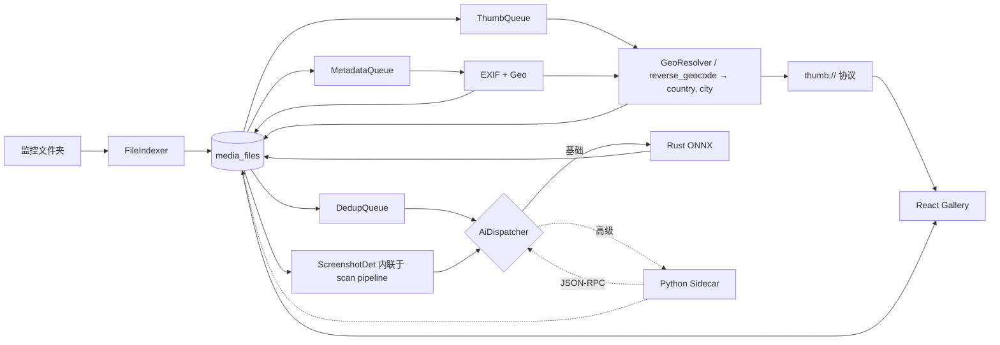

---

## 1. 文件索引引擎详细设计

### 1.1 设计决策

| 决策点 | 选定方案 | 理由 | 参考项目 |
|--------|----------|------|----------|
| 抽象接口 | `FileIndexer` trait | 上层业务无平台感知 | 调研报告 3.2 |
| Windows 首选 | MFT + USN Journal | 百万文件 < 5s | Everything 原理 |
| Windows 降级 | ReadDirectoryChangesW + walkdir | 非 NTFS / 无管理员权限 | FR-104 |
| Linux 首选 | walkdir + inotify | 无需 root，成熟稳定 | Lap/iPhotron |
| Linux 高级 | fanotify（可选） | 单 mount 监听，需 root | FR-113 |
| 通用降级 | notify crate | 跨平台统一事件模型 | 调研报告 |
| 增量判定 | size + mtime | 简单可靠，iPhotron/Lap 验证 | — |
| 文件身份 | Win: file_reference_number / Linux: (dev, inode) | 重命名时保留元数据 | FR-124 |

### 1.2 核心接口定义

```rust
// catchlight-index/src/lib.rs

#[derive(Debug, Clone, PartialEq, Eq)]
pub enum FileChangeKind {
    Created,
    Modified,
    Deleted,
    Renamed { old_path: PathBuf },
}

#[derive(Debug, Clone)]
pub struct FileEntry {
    pub path: PathBuf,
    pub name: String,
    pub extension: String,
    pub size: u64,
    pub created_at: i64,      // Unix 秒
    pub modified_at: i64,
    pub platform_id: PlatformFileId,
    pub is_directory: bool,
}

#[derive(Debug, Clone, PartialEq, Eq, Hash)]
pub enum PlatformFileId {
    Windows { volume_serial: u32, file_ref: u64 },
    Linux { dev: u64, inode: u64 },
    Generic { path_hash: u64 },  // 降级：BLAKE3(path) 前 8 字节
}

#[derive(Debug, Clone)]
pub struct FileChange {
    pub kind: FileChangeKind,
    pub entry: Option<FileEntry>,  // Deleted 时为 None，携带 old_path
    pub timestamp: i64,
}

#[derive(Debug, Clone, Copy, PartialEq, Eq)]
pub enum IndexerCapability {
    MftScan,
    UsnJournal,
    InotifyWatch,
    FanotifyWatch,
    PollingFallback,
}

pub struct ScanProgress {
    pub scanned: u64,
    pub total_hint: Option<u64>,
    pub current_path: PathBuf,
    pub phase: ScanPhase,
}

pub enum ScanPhase {
    Enumerating,
    Filtering,
    Persisting,
    Done,
}

#[async_trait]
pub trait FileIndexer: Send + Sync {
    fn capabilities(&self) -> Vec<IndexerCapability>;

    /// 首次或手动全量扫描
    async fn full_scan(
        &self,
        roots: &[PathBuf],
        recursive: bool,
        progress: mpsc::Sender<ScanProgress>,
    ) -> Result<Vec<FileEntry>>;

    /// 启动增量监听，返回变更事件流
    async fn watch_changes(
        &self,
        roots: &[PathBuf],
    ) -> Result<mpsc::Receiver<FileChange>>;

    /// 停止监听
    async fn stop_watching(&self) -> Result<()>;

    /// USN 溢出或长期离线后的增量 reconciliation
    async fn reconcile(
        &self,
        roots: &[PathBuf],
    ) -> Result<Vec<FileChange>>;
}

/// 工厂：按平台与配置选择实现
pub fn create_indexer(config: &IndexConfig) -> Box<dyn FileIndexer> {
    #[cfg(windows)]
    {
        if config.prefer_mft && is_ntfs(&config.roots) && has_mft_access() {
            return Box::new(NtfsIndexer::new(config.clone()));
        }
        if config.allow_admin_elevation && !has_mft_access() {
            // 见 1.1.4 权限处理
        }
        return Box::new(WindowsGenericIndexer::new(config.clone()));
    }
    #[cfg(target_os = "linux")]
    {
        if config.use_fanotify {
            return Box::new(LinuxFanotifyIndexer::new(config.clone()));
        }
        return Box::new(LinuxInotifyIndexer::new(config.clone()));
    }
    #[cfg(not(any(windows, target_os = "linux")))]
    {
        Box::new(GenericNotifyIndexer::new(config.clone()))
    }
}
```

### 1.3 Windows NTFS 快速索引

#### 1.3.1 MFT 扫描流程

**依赖**：`ntfs-reader` crate（MFT 枚举 + USN Journal API）

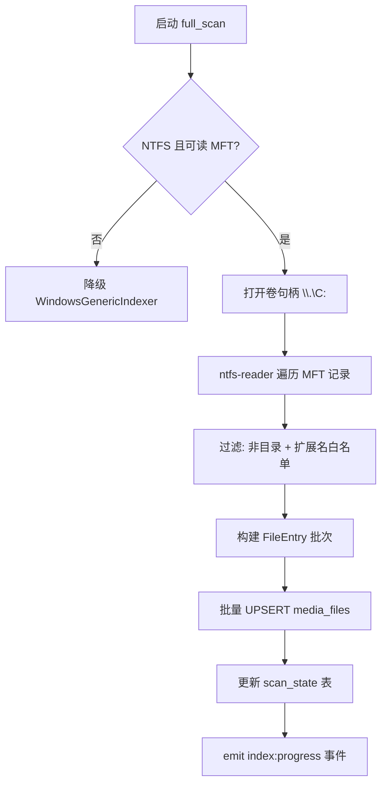

**伪代码**：

```rust
// catchlight-index/src/windows/ntfs.rs

const BATCH_SIZE: usize = 5000;

async fn mft_full_scan(volume: &str, roots: &[PathBuf]) -> Result<Vec<FileEntry>> {
    let ntfs = Ntfs::new(open_volume(volume)?)?;
    let mut entries = Vec::with_capacity(100_000);
    let root_prefixes = normalize_roots(roots);

    for record in ntfs.iter_mft_records()? {
        if record.is_directory() { continue; }

        let full_path = record.full_path()?;
        if !is_under_any_root(&full_path, &root_prefixes) { continue; }

        let ext = record.extension()?.to_ascii_lowercase();
        if !MEDIA_EXTENSIONS.contains(&ext.as_str()) { continue; }

        entries.push(FileEntry {
            path: full_path,
            name: record.file_name()?,
            extension: ext,
            size: record.data_size()?,
            created_at: record.created_time()?.unix(),
            modified_at: record.modified_time()?.unix(),
            platform_id: PlatformFileId::Windows {
                volume_serial: ntfs.volume_serial(),
                file_ref: record.file_reference_number(),
            },
            is_directory: false,
        });

        if entries.len() >= BATCH_SIZE {
            flush_batch(&entries).await?;
            entries.clear();
        }
    }
    flush_batch(&entries).await?;
    Ok(entries)
}
```

#### 1.3.2 扩展名过滤策略

**设计**：Rust 侧静态 `HashSet` 白名单，MFT 阶段即过滤，减少 DB 写入。

```rust
lazy_static! {
    static ref MEDIA_EXTENSIONS: HashSet<&'static str> = [
        // 图片 — 见 requirements FMT-001..012
        "jpg", "jpeg", "png", "gif", "webp", "heic", "heif", "avif", "jxl",
        "tif", "tiff", "bmp", "psd", "ico",
        // RAW — FMT-020..029
        "cr2", "cr3", "nef", "nrw", "arw", "dng", "raf", "orf", "rw2", "pef", "raw",
        // 视频 — FMT-040..047
        "mp4", "m4v", "mov", "mkv", "avi", "webm", "wmv", "flv", "3gp",
    ].into_iter().collect();
}

fn is_media_file(path: &Path) -> bool {
    path.extension()
        .and_then(|e| e.to_str())
        .map(|e| MEDIA_EXTENSIONS.contains(&e.to_ascii_lowercase()))
        .unwrap_or(false)
}
```

**对比**：

| 策略 | 优点 | 缺点 |
|------|------|------|
| MFT 阶段过滤 | 最小化 DB 体积与后续流水线负载 | 扩展名变更需发版或配置热更新 |
| DB 写入后过滤 | 灵活 | 浪费 I/O |
| **选用** | MFT 阶段 + `config.extra_extensions` 用户扩展 | 平衡性能与灵活性 |

#### 1.3.3 USN Journal 增量监听

```rust
async fn usn_watch_loop(volume: &str, tx: mpsc::Sender<FileChange>) -> Result<()> {
    let journal = UsnJournal::open(volume)?;
    let mut cursor = journal.last_read_usn()?;  // 持久化于 scan_state

    loop {
        let records = journal.read_changes_since(cursor, 4096)?;
        for rec in records {
            cursor = rec.usn;
            match rec.reason {
                USN_REASON_FILE_CREATE => handle_create(&rec, &tx).await?,
                USN_REASON_FILE_DELETE => handle_delete(&rec, &tx).await?,
                USN_REASON_RENAME_OLD_NAME | USN_REASON_RENAME_NEW_NAME => {
                    handle_rename(&rec, &tx).await?
                }
                USN_REASON_DATA_OVERWRITE | USN_REASON_DATA_EXTEND
                | USN_REASON_DATA_TRUNCATION | USN_REASON_CLOSE => {
                    handle_modify(&rec, &tx).await?
                }
                _ => {}
            }
        }
        persist_usn_cursor(cursor)?;
        tokio::time::sleep(Duration::from_millis(100)).await;
    }
}
```

**USN 溢出处理**：

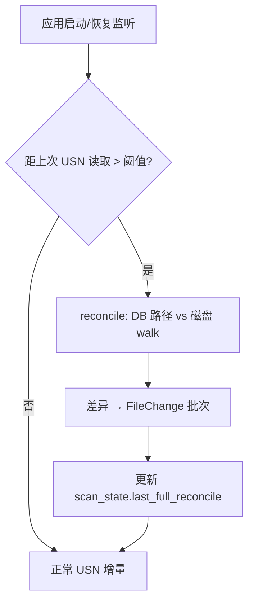

阈值默认：7 天未运行，或 USN Journal 返回 `JOURNAL_DELETE` / 记录被覆盖错误。

#### 1.3.4 管理员权限处理

| 方案 | 描述 | 用户体验 | 选用 |
|------|------|----------|------|
| **A. UAC 提升** | 首次启动检测权限，引导「以管理员运行一次」完成 MFT 初始扫描；后续 USN 监听尝试非提权（部分系统可行） | 一次授权，长期受益 | **默认推荐** |
| **B. 永久降级** | 用户选择「普通扫描」，持久化 `index.mode=generic` | 无 UAC 弹窗，10 万文件 ~30–60s | 备选 |
| **C. 计划任务** | 安装时注册 Windows 计划任务以 SYSTEM 跑 MFT | 复杂，企业场景 | P3 可选 |

**实现**：

```rust
enum IndexMode {
    NtfsFast,      // MFT + USN
    Generic,       // walkdir + notify
}

async fn detect_and_prompt_index_mode() -> IndexMode {
    if !cfg!(windows) { return IndexMode::Generic; }

    if has_se_backup_privilege() && is_ntfs_system_drive() {
        return IndexMode::NtfsFast;
    }

    // IPC → 前端展示对话框
    let choice = prompt_user(IndexModePrompt {
        title: "index.permission.title",
        fast_desc: "index.permission.fast",   // MFT: ~5s / 10万文件
        slow_desc: "index.permission.slow",     // 普通: ~30-60s
        options: ["elevate_once", "use_generic", "remember"],
    }).await?;

    match choice {
        ElevateOnce => {
            relaunch_as_admin()?;
            IndexMode::NtfsFast
        }
        UseGeneric => IndexMode::Generic,
        RememberGeneric => {
            config.index.mode = IndexMode::Generic;
            IndexMode::Generic
        }
    }
}
```

**权限检测 API**：

```rust
fn has_mft_access() -> bool {
    // 尝试 SeBackupPrivilege 或打开 \\.\C: 只读
    open_volume_readonly("C:").is_ok()
}
```

### 1.4 Linux 索引

#### 1.4.1 walkdir + inotify 实现

```rust
// catchlight-index/src/linux/inotify.rs

async fn linux_full_scan(roots: &[PathBuf], recursive: bool) -> Result<Vec<FileEntry>> {
    let mut entries = Vec::new();
    for root in roots {
        let walker = if recursive {
            WalkDir::new(root).follow_links(false)
        } else {
            WalkDir::new(root).max_depth(1)
        };
        for entry in walker.into_iter().filter_map(|e| e.ok()) {
            if !entry.file_type().is_file() { continue; }
            if !is_media_file(entry.path()) { continue; }

            let meta = entry.metadata()?;
            let (dev, ino) = platform_inode(&meta);
            entries.push(build_file_entry(entry.path(), &meta, dev, ino));
        }
    }
    Ok(entries)
}

async fn inotify_watch(roots: &[PathBuf], tx: mpsc::Sender<FileChange>) -> Result<()> {
    let (notify_tx, notify_rx) = std::sync::mpsc::channel();
    let mut watcher = RecommendedWatcher::new(notify_tx, Config::default())?;

    for root in roots {
        watch_recursive(&mut watcher, root)?;  // 递归 add watch
    }

    loop {
        match notify_rx.recv() {
            Ok(Ok(event)) => dispatch_notify_event(event, &tx).await?,
            Ok(Err(e)) if is_watch_limit_exceeded(&e) => {
                emit_event("index:watch_limit", WatchLimitPayload { ... });
                fallback_to_polling(roots, &tx).await?;
                break;
            }
            _ => {}
        }
    }
    Ok(())
}
```

#### 1.4.2 inotify watch 数量上限处理

**问题**：默认 `fs.inotify.max_user_watches = 8192`，大型图库（深层目录）易超限。

**策略**：

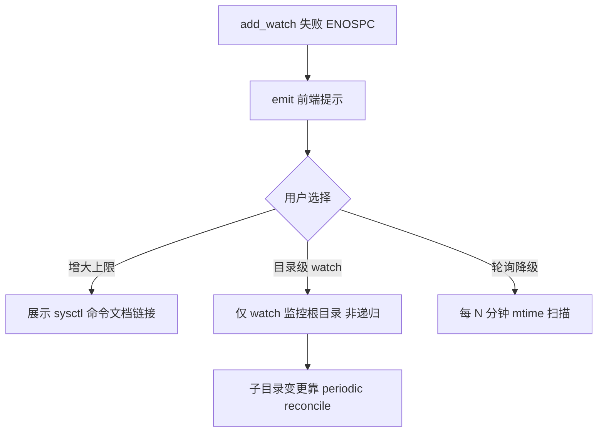

| 策略 | watch 数 | 实时性 | 复杂度 |
|------|----------|--------|--------|
| 递归 inotify | O(目录数) | 最佳 | 中 |
| **根目录 inotify + 轮询** | O(根数) | 良好 | 低 — **默认降级** |
| fanotify mount | 1 / mount | 最佳 | 高，需 root |

**配置**：

```json
{
  "index": {
    "linux": {
      "watch_strategy": "recursive_inotify",
      "poll_interval_secs": 1800,
      "fanotify_enabled": false
    }
  }
}
```

#### 1.4.3 fanotify 高级方案（可选）

```rust
// 需 CAP_SYS_ADMIN；监听整个 mount namespace
struct LinuxFanotifyIndexer { mount_fd: RawFd }

async fn fanotify_loop(mount_path: &Path, tx: mpsc::Sender<FileChange>) -> Result<()> {
    let fd = fanotify_init(FAN_CLASS_NOTIF | FAN_CLOEXEC, O_RDONLY)?;
    fanotify_mark(fd, FAN_MARK_ADD | FAN_MARK_MOUNT, FAN_MODIFY | FAN_CREATE
        | FAN_DELETE | FAN_MOVED_FROM | FAN_MOVED_TO, AT_FDCWD, mount_path)?;

    // 读取 fanotify_event_metadata，映射为 FileChange
}
```

**对比 inotify vs fanotify**：

| 维度 | inotify | fanotify |
|------|---------|----------|
| 权限 | 普通用户 | root / CAP_SYS_ADMIN |
| watch 上限 | 有（~8192 默认） | 按 mount，无 per-dir 限制 |
| 粒度 | 目录级 | 文件系统级 |
| **CatchLight 默认** | ✅ | 高级设置可选 |

### 1.5 通用降级方案

#### 1.5.1 递归目录扫描 + notify

```rust
struct GenericNotifyIndexer {
    poll_interval: Duration,
}

impl GenericNotifyIndexer {
    async fn watch_changes(&self, roots: &[PathBuf]) -> Result<mpsc::Receiver<FileChange>> {
        // 1. 尝试 notify RecommendedWatcher（跨平台）
        // 2. Windows 非 NTFS: ReadDirectoryChangesW 由 notify 内部封装
        // 3. 失败则纯轮询
        match try_notify_watch(roots).await {
            Ok(rx) => Ok(rx),
            Err(_) => self.start_polling_scan(roots).await,
        }
    }
}
```

#### 1.5.2 性能对比（预估，10 万媒体文件，本地 SSD）

| 方案 | 平台 | 首次全量 | 增量延迟 | 权限 |
|------|------|----------|----------|------|
| MFT 全量扫描 | Win NTFS | **3–8 s** | — | 管理员 |
| USN Journal | Win NTFS | — | **< 500 ms** | 管理员/部分可读 |
| walkdir 递归 | 全平台 | 15–30 s | — | 普通 |
| inotify | Linux | — | **< 1 s** | 普通 |
| notify (Win 非 NTFS) | Win | 25–60 s | 1–3 s | 普通 |
| 轮询 (5 min) | 全平台 | — | ≤ 300 s | 普通 |

### 1.6 增量扫描策略

#### 1.6.1 首次全量扫描流程（Phase 1–2 实现）

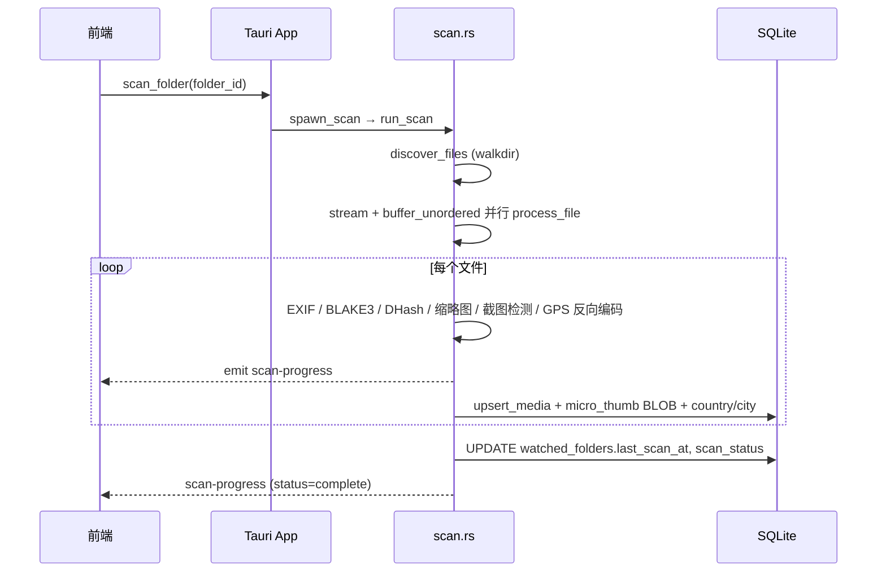

**并发模型：** `futures::stream::iter(files).map(process_file).buffer_unordered(concurrency)`，并发度由 `ScanSemaphore` 预算控制，避免 per-file 无界 `spawn`。

#### 1.6.2 增量判定条件

```rust
fn needs_reindex(existing: &MediaFileRow, entry: &FileEntry) -> bool {
    existing.file_size != entry.size as i64
        || existing.modified_at != entry.modified_at
}

async fn apply_file_change(change: FileChange, db: &DbPool) -> Result<()> {
    match change.kind {
        FileChangeKind::Created => insert_new_file(&change.entry.unwrap()).await?,
        FileChangeKind::Modified if needs_reindex(...) => {
            update_file_stats(...);
            invalidate_thumbnails(file_id);
            enqueue_metadata(file_id);
            enqueue_dedup(file_id);
        }
        FileChangeKind::Deleted => mark_removed(file_id),  // 非物理 DELETE
        FileChangeKind::Renamed { old_path } => {
            update_path_preserving_id(file_id, new_path, platform_id);
        }
    }
    Ok(())
}
```

**对比 iPhotron vs Lap vs CatchLight**：

| 项目 | 增量键 | 重命名检测 |
|------|--------|------------|
| iPhotron | size + mtime | 路径变更 → 重新索引 |
| Lap | mtime 目录同步 | 路径更新 |
| **CatchLight** | size + mtime | **platform_id 优先关联** |

#### 1.6.3 删除/移动/重命名检测

| 事件 | Windows (USN) | Linux (inotify) | DB 操作 |
|------|---------------|-----------------|---------|
| 删除 | FILE_DELETE | IN_DELETE | `is_removed=1` 或软删除 |
| 重命名 | RENAME_OLD + RENAME_NEW | MOVED_FROM + MOVED_TO | UPDATE path，保留 id |
| 移动跨卷 | DELETE + CREATE | 同上 | 新 platform_id，元数据重提取 |
| 原地修改 | DATA_EXTEND + CLOSE | IN_MODIFY | size/mtime 更新 |

#### 1.6.4 扫描状态持久化

```sql
CREATE TABLE scan_state (
    id              INTEGER PRIMARY KEY CHECK (id = 1),
    indexer_mode    TEXT NOT NULL,           -- ntfs_fast | inotify | generic
    last_usn        INTEGER,                 -- Windows
    last_full_scan  INTEGER,
    last_reconcile  INTEGER,
    checkpoint_path TEXT,                    -- 中断恢复
    pending_file_ids BLOB                    -- MessagePack 序列化
);

CREATE TABLE watched_folders (
    id          INTEGER PRIMARY KEY,
    path        TEXT NOT NULL UNIQUE,
    added_at    TEXT NOT NULL DEFAULT (datetime('now')),
    last_scan_at TEXT,
    scan_status TEXT NOT NULL DEFAULT 'idle',  -- v2 迁移
    -- media_count 由 list 查询 JOIN 计算
);
```

**崩溃恢复**：`full_scan` 每 5000 条写入 checkpoint；重启从 `checkpoint_path` 继续。

---

## 2. 元数据提取详细设计

### 2.1 设计决策

| 决策点 | 选定方案 | 对比 |
|--------|----------|------|
| 常见格式 EXIF | `kamadak-exif` 原生 Rust | vs rexiv2（需 libexiv2 系统依赖）→ **kamadak 更轻** |
| 特殊/RAW 格式 | ExifTool sidecar 子进程 | vs 纯 Rust → **ExifTool 格式最全** |
| 批量策略 | 异步队列 + 50 条/批 ExifTool | 参考 iPhotron |
| 反向地理编码 | `rrgeo` + GeoNames cities1000 | vs 在线 API → **离线优先** |
| 地点聚合 | 距离阈值 500m（简化的 DBSCAN） | vs 完整 DBSCAN → **O(n) 网格哈希足够** |

### 2.2 EXIF 提取

#### 2.2.1 双路径架构

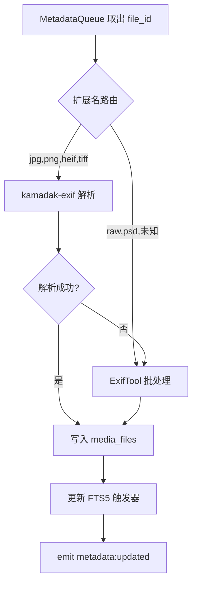

#### 2.2.2 Rust 原生解析

```rust
// catchlight-metadata/src/exif.rs

pub struct ExifData {
    pub taken_at: Option<i64>,
    pub time_source: TimeSource,
    pub camera_make: Option<String>,
    pub camera_model: Option<String>,
    pub lens: Option<String>,
    pub focal_length_mm: Option<f32>,
    pub aperture: Option<f32>,
    pub shutter: Option<String>,
    pub iso: Option<u32>,
    pub width: Option<u32>,
    pub height: Option<u32>,
    pub latitude: Option<f64>,
    pub longitude: Option<f64>,
    pub orientation: Option<u16>,
    pub embedded_thumb_offset: Option<(u64, u64)>,
}

pub fn extract_exif_native(path: &Path) -> Result<ExifData> {
    let file = File::open(path)?;
    let mut bufreader = BufReader::new(&file);
    let exif = exif::Reader::new().read_from_container(&mut bufreader)?;

    Ok(ExifData {
        taken_at: parse_datetime_original(&exif),
        camera_model: exif.get_field(Tag::Model, In::PRIMARY)
            .and_then(|f| f.display_value().to_string().into()),
        latitude: parse_gps_lat(&exif),
        longitude: parse_gps_lon(&exif),
        // ...
    })
}
```

#### 2.2.3 ExifTool sidecar

```rust
const EXIFTOOL_BATCH_SIZE: usize = 50;

async fn exiftool_batch(paths: &[PathBuf]) -> Result<Vec<ExifData>> {
    // exiftool -json -n -DateTimeOriginal -CreateDate -Model -LensModel ...
    //          -GPSLatitude -GPSLongitude -ImageWidth -ImageHeight
    let mut cmd = Command::new(locate_exiftool()?);
    cmd.args(["-json", "-n", ...TAGS]).args(paths);

    let output = cmd.output().await?;
    let json: Vec<ExifToolRecord> = serde_json::from_slice(&output.stdout)?;
    json.into_iter().map(|r| r.into_exif_data()).collect()
}
```

**ExifTool 路径解析**：打包 sidecar 于 `resources/exiftool/`（Windows exe + Perl 模块），或检测系统 PATH。

#### 2.2.4 提取字段清单

| 字段 | DB 列 | 来源 Tag | 用途 |
|------|-------|----------|------|
| 拍摄时间 | `taken_at` | DateTimeOriginal | 时间线 |
| 时间来源 | `time_source` | 派生 | UI 标注 |
| 相机品牌/型号 | `camera` | Make + Model | 搜索/智能相簿 |
| 镜头 | `lens` | LensModel | 智能相簿 |
| 焦距 | `focal_len` | FocalLength | 信息面板 |
| 光圈 | `aperture` | FNumber | 信息面板 |
| 快门 | `shutter` | ExposureTime | 信息面板 |
| ISO | `iso` | ISO | 信息面板 |
| 尺寸 | `width`, `height` | ImageWidth/Height | 网格/去重评分 |
| GPS | `latitude`, `longitude` | GPSLatitude/Longitude | 地点/地图 |
| 方向 | `orientation` | Orientation | 缩略图旋转 |
| 嵌入缩略图 | — | PreviewImage | 加速 thumb |

### 2.3 反向地理编码

#### 2.3.1 rrgeo 离线方案（Phase 2 已实现）

**实现 crate：** `catchlight-geo`，依赖 crates.io 上的 `reverse_geocoder`（rrgeo 项目）。扫描流水线 `process_file` 在 EXIF 提取 GPS 后调用 `reverse_geocode(lat, lon)`，将 `country`/`city` 写入 `media_files`，供 `LocationView` 国家→城市分组与 FTS5 索引。

```rust
// catchlight-metadata/src/geocode.rs

use rrgeo::{ReverseGeocoder, GeoNamesRecord};

lazy_static! {
    static ref GEOCODER: ReverseGeocoder = ReverseGeocoder::new_with_data(
        include_bytes!("../data/cities1000.bin")
    );
}

pub struct GeoLocation {
    pub country_code: String,
    pub country_name: String,
    pub admin1: Option<String>,   // 省/州
    pub city: String,
    pub distance_km: f64,
}

pub fn reverse_geocode(lat: f64, lon: f64) -> Option<GeoLocation> {
    GEOCODER.search(lat, lon).map(|r| GeoLocation {
        country_code: r.country.clone(),
        city: r.name.clone(),
        distance_km: r.distance,
        ..
    })
}
```

#### 2.3.2 GeoNames 数据集选择

| 数据集 | 记录数 | 体积 | 精度 | 选用 |
|--------|--------|------|------|------|
| cities500 | ~180K | ~15 MB | 更小城市 | 备选 |
| **cities1000** | ~130K | ~10 MB | 人口 ≥ 1000 | **默认** |
| cities5000 | ~50K | ~4 MB | 仅大中城市 | 省内存场景 |
| allCountries | 12M+ | ~1.5 GB | 村级 | 不采用 |

#### 2.3.3 查询性能

| 结构 | rrgeo 实现 | 查询复杂度 | 实测 |
|------|------------|------------|------|
| KD-Tree | ✅ 内置 | O(log n) | **< 0.1 ms** |
| R-tree (rstar) | Lap 用于 POI | O(log n) | 适合矩形范围查询 |

CatchLight 单点反向编码用 **rrgeo KD-Tree**；地图聚类标记可用 **rstar** 做视口内查询（P2）。

#### 2.3.4 地点聚合策略

**方案对比**：

| 算法 | 复杂度 | 效果 | 选用 |
|------|--------|------|------|
| 固定距离阈值 | O(n) 网格 | 500m 内合并 | **默认** |
| DBSCAN | O(n log n) | 任意形状簇 | 可选精细化 |
| K-Means | 需指定 k | 不适合地理 | 不采用 |

```rust
const CLUSTER_RADIUS_M: f64 = 500.0;

fn cluster_places(photos: &[(f64, f64, i64)]) -> Vec<PlaceCluster> {
    // 网格哈希：cell = (lat * 111000 / R, lon * cos(lat) * 111000 / R)
    let mut grid: HashMap<(i32, i32), Vec<i64>> = HashMap::new();
    for (lat, lon, file_id) in photos {
        let key = geo_cell(*lat, *lon, CLUSTER_RADIUS_M);
        grid.entry(key).or_default().push(*file_id);
    }
    grid.into_iter().map(|(cell, ids)| PlaceCluster {
        center: cell_center(cell),
        file_ids: ids,
        label: reverse_geocode_center(cell),
    }).collect()
}
```

### 2.4 时间处理

#### 2.4.1 时间源优先级

```rust
pub enum TimeSource {
    ExifDateTimeOriginal,
    ExifCreateDate,
    FilesystemModified,
    FilesystemCreated,
}

pub fn resolve_taken_at(exif: &ExifData, fs_mtime: i64, fs_ctime: i64) -> (i64, TimeSource) {
    if let Some(t) = exif.taken_at {
        return (t, TimeSource::ExifDateTimeOriginal);
    }
    if let Some(t) = exif.create_date {
        return (t, TimeSource::ExifCreateDate);
    }
    (fs_mtime, TimeSource::FilesystemModified)
}
```

#### 2.4.2 时区处理

| 场景 | 策略 |
|------|------|
| EXIF 无 TZ 偏移 | 视为**本地时区**（系统 TZ） |
| EXIF OffsetTimeOriginal | 解析为 UTC 存储 |
| 显示 | 前端 `Intl.DateTimeFormat` 按用户 locale |
| 分组 | DB 存 UTC Unix 秒；分组 SQL 按本地 TZ 转换 |

```sql
-- 按本地年月日分组（SQLite 需应用层或 strftime 偏移）
SELECT strftime('%Y', taken_at, 'unixepoch', 'localtime') AS year,
       strftime('%m', taken_at, 'unixepoch', 'localtime') AS month,
       COUNT(*) FROM media_files
       WHERE is_deleted = 0 GROUP BY year, month;
```

#### 2.4.3 分组粒度

```rust
pub enum TimelineGroup {
    Year(i32),
    Month(i32, u32),       // 2024, 8
    Day(i32, u32, u32),    // 2024, 8, 15
    Unknown,
}
```

前端 sticky header 按 `Day` 粒度渲染；年/月视图折叠时使用 `Year`/`Month` 聚合查询。

---

## 3. 缩略图系统详细设计

### 3.1 设计决策

| 决策点 | 选定 | 对比参考 |
|--------|------|----------|
| 三级规格 | micro 64 / small 256 / large 1024 | iPhotron 512 单一尺寸 → **分级更省空间** |
| micro 存储 | SQLite BLOB | iPhotron 16×16 → **64×64 更清晰** |
| small/large | WebP 磁盘 | Lap JPEG + thumb:// → **WebP 体积更小** |
| 缓存命名 | BLAKE3(path+size+mtime) | iPhotron md5(path+size) → **加 mtime 防 stale** |
| 调度 | 三车道 VISIBLE/GUARD/PREFETCH | iPhotron Gallery 调度 |
| 并发 | Semaphore 预算 = cores × 0.7 | Lap 模型 |

### 3.2 三级缩略图规格

| 级别 | 尺寸 | 格式 | 存储位置 | 用途 |
|------|------|------|---------|------|
| micro | 64×64 | JPEG (quality 75) | SQLite `media_files.micro_thumb` BLOB | 网格快速滚动占位；`thumb://` micro 优先读 BLOB |
| small | 256×256 | WebP (quality 80) | 磁盘缓存 | 相簿浏览 |
| large | 1024×1024 | WebP (quality 80) | 磁盘缓存 | 预览/查看器 |

**视频缩略图（best-effort）：** 扫描 `process_file` 中，若 `find_ffmpeg()` 可用，用 FFmpeg 抽取第 1 秒帧 → 生成 small/micro；失败或无 FFmpeg 时跳过，不影响索引。

**内存 LRU**（运行时）：

| 级别 | 容量 |
|------|------|
| micro | 2000 |
| small | 500 |
| large | 50 |

### 3.3 缓存路径与命名

#### 3.3.1 cache key 生成

```rust
pub fn thumb_cache_key(path: &str, size: u64, mtime: i64, level: ThumbLevel) -> String {
    let mut hasher = blake3::Hasher::new();
    hasher.update(path.as_bytes());
    hasher.update(&size.to_le_bytes());
    hasher.update(&mtime.to_le_bytes());
    hasher.update(&[level as u8]);
    hasher.finalize().to_hex()[..16].to_string()  // 16 hex chars
}

pub enum ThumbLevel { Micro, Small, Large }
```

#### 3.3.2 目录分片策略

**参考 Lap**：`{key[0..2]}/{key}.webp` 避免单目录过多文件。

```
~/.catchlight/cache/thumbs/
├── small/
│   ├── a3/
│   │   └── a3f2b8c9d1e04567.webp
│   └── ff/
│       └── ff00112233445566.webp
└── large/
    └── ...
```

**对比**：

| 策略 | 单目录文件上限 | 路径长度 |
|------|----------------|----------|
| 扁平 | 无限制 ❌ | 短 |
| **2 级 hex 分片** | ~256 子目录 × 均分 | 中 — **选用** |
| 3 级分片 (Lap album) | 更均分 | 长 |

#### 3.3.3 磁盘 LRU 淘汰

```sql
CREATE TABLE thumb_cache_index (
    cache_key   TEXT PRIMARY KEY,
    level       TEXT NOT NULL,
    file_path   TEXT,
    size_bytes  INTEGER,
    last_access INTEGER NOT NULL,
    created_at  INTEGER NOT NULL
);
CREATE INDEX idx_thumb_lru ON thumb_cache_index(level, last_access);
```

```rust
async fn evict_if_needed(level: ThumbLevel, max_bytes: u64) -> Result<()> {
    let current = dir_size(level_dir(level)).await?;
    if current <= max_bytes { return Ok(()); }

    let mut rows = db.query_lru(level, 100).await?;
    while dir_size(level_dir(level)).await? > max_bytes * 9 / 10 {
        let row = rows.next().unwrap();
        fs::remove_file(row.path).await.ok();
        db.delete_thumb_index(&row.cache_key).await?;
    }
    Ok(())
}
```

默认上限：small 2 GB、large 5 GB（可配置）。

### 3.4 生成流程

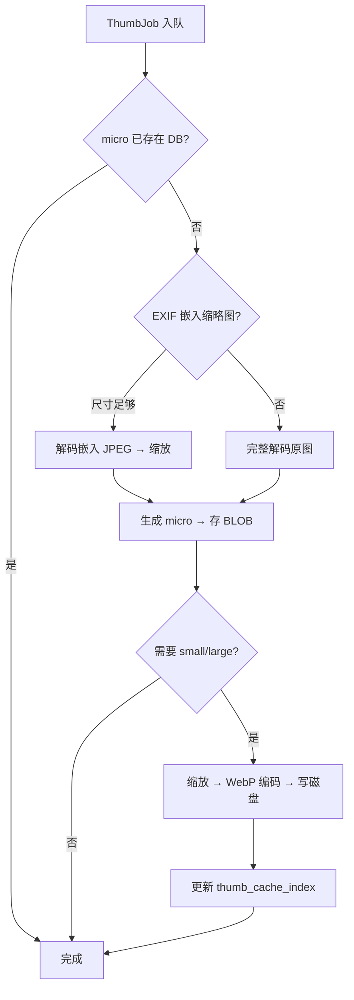

#### 3.4.1 扫描阶段 vs 运行时

| 阶段 | 行为 |
|------|------|
| 索引后后台 | 批量生成 micro（优先嵌入缩略图） |
| 用户滚动 | 按需 small，VISIBLE 优先 |
| 进入查看器 | large + 预加载相邻 |

#### 3.4.2 并发限流（Lap 模型）

```rust
pub struct ThumbConcurrency {
    total_budget: usize,           // (num_cpus * 0.7) as usize
    normal: Arc<Semaphore>,        // 60% — small/micro
    heavy: Arc<Semaphore>,         // 30% — large/RAW/HEIC
    embedding: Arc<Semaphore>,     // 10% — 预留给 AI（共享预算池）
}

impl ThumbConcurrency {
    pub fn new() -> Self {
        let total = ((num_cpus::get() as f64) * 0.7).ceil() as usize;
        Self {
            total_budget: total,
            normal: Arc::new(Semaphore::new(total * 6 / 10)),
            heavy: Arc::new(Semaphore::new(total * 3 / 10)),
            embedding: Arc::new(Semaphore::new(total * 1 / 10)),
        }
    }
}
```

#### 3.4.3 三车道调度

```rust
pub enum ThumbLane {
    Visible,   // 当前视口内 — 最高优先级
    Guard,     // 视口 ±1 屏
    Prefetch,  // 视口 ±2 屏
}

pub struct ThumbScheduler {
    visible: PriorityQueue<ThumbJob>,
    guard: PriorityQueue<ThumbJob>,
    prefetch: PriorityQueue<ThumbJob>,
}
```

### 3.5 自定义协议 `thumb://`

#### 3.5.1 URL 设计

```
thumb://localhost/{library_id}/{file_id}/{size}

size ∈ { micro | small | large }
library_id: 固定 "default"（单库）或 UUID（多库扩展）
```

**Tauri 注册**：

```rust
// tauri.conf.json register_uri_scheme_protocol
fn handle_thumb_request(request: &HttpRequest) -> HttpResponse {
    let parsed = parse_thumb_url(request.uri())?;
    // file_id → 查 DB 得 path, mtime, size

    match try_load_cached(&parsed) {
        Some(bytes) => HttpResponse::ok()
            .header("Cache-Control", "max-age=31536000, immutable")
            .body(bytes),
        None => {
            // 同步生成 micro；small/large 异步 + 202/placeholder
            let bytes = block_on_generate(parsed)?;
            HttpResponse::ok().body(bytes)
        }
    }
}
```

#### 3.5.2 响应策略

| 场景 | 策略 |
|------|------|
| 磁盘/BLOB 命中 | 立即返回，`Cache-Control: immutable` |
| 未生成 + micro | 同步快速生成（嵌入 thumb 或 64px 纯色占位） |
| 未生成 + small/large | 返回 micro 放大版或低分辨率占位；后台完成后前端刷新 |
| 生成失败 | 1×1 透明 WebP + `X-CatchLight-Error: corrupt` |

**对比 Lap thumb://**：Lap 按 album 分 cache；CatchLight 按全局 hash 分片，**跨相簿复用**。

---

## 4. 去重系统详细设计

**Phase 2 实现摘要：** `catchlight-dedup` 提供 BLAKE3 精确去重（同 `file_size` 预筛）与 DHash 感知去重（汉明距离阈值聚类）；`DedupView` 展示重复组；L3 语义去重（CLIP）留 Phase 3。

### 4.1 设计决策

三级架构参考调研报告 3.4，对比 Recasa（仅感知哈希）与 Lap（仅 BLAKE3）：

| 级别 | CatchLight | Recasa | Lap |
|------|------------|--------|-----|
| L1 文件 | BLAKE3 | — | BLAKE3 |
| L2 视觉 | DHash + PHash | PHash | — |
| L3 语义 | CLIP embedding | — | CLIP（搜索用） |

### 4.2 三级去重架构

#### 4.2.1 Level 1: 文件级（BLAKE3）

| 参数 | 值 |
|------|-----|
| 算法 | BLAKE3 全文件流式哈希 |
| 预筛选 | 相同 `file_size` 才哈希 |
| 阈值 | 哈希完全相同 → 100% 重复 |
| 性能 | ~500 MB/s（SSD），10 万文件 ~3–5 min |

```rust
async fn compute_file_hash(path: &Path) -> Result<[u8; 32]> {
    let mut reader = BufReader::new(File::open(path)?);
    let mut hasher = blake3::Hasher::new();
    std::io::copy(&mut reader, &mut hasher)?;
    Ok(*hasher.finalize().as_bytes())
}
```

#### 4.2.2 Level 2: 视觉级（DHash + PHash）

| 算法 | 尺寸 | 阈值（汉明距离） | 用途 |
|------|------|------------------|------|
| DHash | 9×8 灰度 → 64 bit | ≤ **5** | 快速近似 |
| PHash | 32×32 DCT → 64 bit | ≤ **10** | 准精确 |

**判定**：`dhash_dist ≤ 5 || phash_dist ≤ 10` → 感知重复（默认，可配置）。

性能：~2000 张/分钟/8 核。

#### 4.2.3 Level 3: 语义级（CLIP）

| 参数 | 值 |
|------|-----|
| 模型 | CLIP ViT-B/32 ONNX |
| 向量维度 | 512 |
| 相似度 | cosine > **0.92**（可配置） |
| 索引 | HNSW (usearch) 或暴力（< 5 万） |
| 性能 | ~10 张/秒 CPU；~50 张/秒 GPU |

**与 L2 关系**：L3 仅对 L2 未命中但用户请求「相似照片」或 burst 连拍场景启用。

### 4.3 去重流程

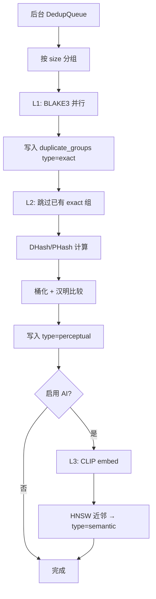

#### 4.3.1 增量去重

```rust
fn enqueue_dedup(file_id: i64, reason: IndexReason) {
    match reason {
        IndexReason::NewFile => dedup_queue.push(DedupJob::Full(file_id)),
        IndexReason::Modified => dedup_queue.push(DedupJob::Rehash(file_id)),
        IndexReason::Deleted => remove_from_groups(file_id),
    }
}
```

#### 4.3.2 结果分组与评分

```sql
CREATE TABLE duplicate_groups (
    id          INTEGER PRIMARY KEY,
    group_type  TEXT NOT NULL,  -- exact | perceptual | semantic
    score       REAL,           -- 组内平均相似度
    created_at  INTEGER,
    ignored     INTEGER DEFAULT 0
);

CREATE TABLE duplicate_group_members (
    group_id    INTEGER REFERENCES duplicate_groups(id),
    file_id     INTEGER REFERENCES media_files(id),
    is_primary  INTEGER DEFAULT 0,  -- 建议保留
    PRIMARY KEY (group_id, file_id)
);
```

**建议保留评分**：

```rust
fn suggest_primary(members: &[MediaFileRow]) -> i64 {
    members.iter()
        .max_by_key(|m| (m.width * m.height, m.modified_at, -(m.file_path.len() as i64)))
        .map(|m| m.id)
        .unwrap()
}
// 优先级：分辨率 > 最新 mtime > 最短路径
```

#### 4.3.3 用户操作

| 操作 | 行为 |
|------|------|
| 保留选中，删除其余 | 删除项 → 最近删除（FR-200） |
| 忽略此组 | `duplicate_groups.ignored = 1` |
| 手动设为主图 | `is_primary = 1` |

### 4.4 哈希存储

```sql
-- media_files 表
file_hash   BLOB,    -- 32 bytes BLAKE3
dhash       BLOB,    -- 8 bytes (64 bit)
phash       BLOB,    -- 8 bytes (64 bit)
clip_embed  BLOB,    -- 512 * 4 bytes float32 (可选)
```

#### 4.4.1 相似度查询优化

| 方法 | 适用 | 复杂度 |
|------|------|--------|
| 暴力汉明 | < 1 万 | O(n) |
| **按 dhash 高 16 位分桶** | 10 万+ | O(n/65536) — **L2 选用** |
| HNSW | CLIP 512 维 | O(log n) — **L3 选用** |
| SQLite 位运算 | `popcount(dhash ^ ?)` | 无索引加速，不推荐 |

```rust
fn hamming_bits(a: u64, b: u64) -> u32 {
    (a ^ b).count_ones()
}

fn dhash_bucket(dhash: u64) -> u16 {
    (dhash >> 48) as u16  // 高 16 位分桶
}
```

---

## 5. 截图识别详细设计

### 5.1 设计决策

采用调研报告 **三层检测**，对比 CONAN（重）与纯 CLIP（慢）：

| 层级 | 延迟 | 覆盖率 | 选用 |
|------|------|--------|------|
| L1 元数据 | < 1 ms | 过滤 60% 非截图 | ✅ |
| L2 视觉 | < 10 ms | 提升 30% | ✅ |
| L3 CLIP | ~100 ms | 最终分类 | 可选 AI 包 |

### 5.2 三层检测策略（Phase 2：规则层已集成扫描流水线）

扫描 `process_file` 在写入 DB 前调用 `catchlight_ai::detect_screenshot(path, width, height)`：对 Photo 类型按分辨率/扩展名规则判定，命中则设为 `MediaType::Screenshot`，`ScreenshotView` 提供专属浏览。L2/L3 视觉与 CLIP 分类为 Phase 3 扩展。

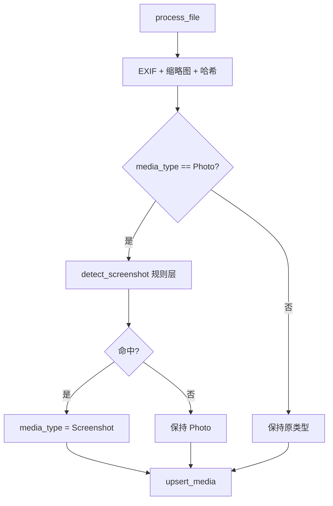

#### 5.2.1 L1 元数据快筛（规则列表）

```rust
fn metadata_screenshot_score(exif: &ExifData, width: u32, height: u32) -> u32 {
    let mut score = 0u32;
    if exif.camera_model.is_none() { score += 25; }
    if exif.aperture.is_none() && exif.shutter.is_none() { score += 15; }
    if matches_common_screen_resolution(width, height) { score += 20; }
    if matches_aspect_ratio(width, height, &[(16, 9), (16, 10), (4, 3)]) { score += 10; }
    if exif.iso.is_none() { score += 5; }
    score.min(100)
}

const SCREEN_RESOLUTIONS: &[(u32, u32)] = &[
    (1920, 1080), (2560, 1440), (3840, 2160),
    (1366, 768), (1440, 900), (2880, 1800),
    (1170, 2532), (1080, 2400),  // 常见手机
];
```

#### 5.2.2 L2 视觉特征（< 10 ms）

```rust
fn visual_screenshot_score(img: &DynamicImage) -> u32 {
    let mut score = 0u32;
    // 缩小到 256px 宽进行分析
    let small = img.resize(256, 256, FilterType::Triangle);

    if edge_variance(&small) < 100.0 { score += 15; }  // 纯色/渐变背景
    if detect_status_bar(&small) { score += 25; }       // 顶部/底部 5% 高对比条
    if ui_color_histogram_peaks(&small) { score += 10; } // 蓝/白/灰 UI 峰值
    score
}
```

#### 5.2.3 L3 CLIP 深度分类

见 5.3 分类体系。

### 5.3 分类体系

#### 5.3.1 主分类

| media_type | 说明 |
|------------|------|
| `photo` | 相机拍摄 |
| `screenshot` | 屏幕截图 |
| `document` | 文档扫描/照片 |
| `meme` | 梗图/网络图片 |
| `other` | 未分类 |

#### 5.3.2 截图子分类（screenshot_subtype）

| 值 | CLIP prompt 示例 |
|----|------------------|
| `code_screenshot` | "a screenshot of source code or terminal" |
| `chat_screenshot` | "a screenshot of a chat conversation" |
| `browser_screenshot` | "a screenshot of a web browser" |
| `game_screenshot` | "a screenshot of a video game" |
| `generic` | "a screenshot of a computer screen" |

```rust
async fn clip_classify(img: &DynamicImage) -> (String, f32) {
    let embedding = clip_model.encode_image(img).await?;
    let mut best = ("other", 0.0f32);
    for (label, text_emb) in PRECOMPUTED_TEXT_EMBEDDINGS.iter() {
        let sim = cosine_similarity(&embedding, text_emb);
        if sim > best.1 { best = (label, sim); }
    }
    if best.1 < 0.6 { ("other", best.1) } else { best }
}
```

### 5.4 模型管理

#### 5.4.1 文件位置

```
~/.catchlight/models/
├── clip-vit-b32-visual.onnx      (~350 MB)
├── clip-vit-b32-text-embeds.bin  (预计算文本向量，~1 MB)
├── manifest.json
└── mobilenetv3-feature.onnx      (去重 L3 可选，~15 MB)
```

#### 5.4.2 首次下载策略

```rust
struct ModelManifest {
    version: String,
    clip: ModelEntry { url, sha256, size },
}

async fn ensure_models(config: &AiConfig) -> Result<()> {
    if !config.ai_enabled { return Ok(()); }
    if !model_exists("clip-vit-b32-visual.onnx") {
        emit_event("ai:download_progress", ...);
        download_with_resume(manifest.clip.url, model_path).await?;
        verify_sha256(...)?;
    }
    Ok(())
}
```

- 基础安装包**不含**模型（NFR-064）
- 设置页「启用 AI 功能」触发下载
- 支持镜像 URL 配置

#### 5.4.3 版本更新

```json
// manifest.json
{
  "version": "2026.06.1",
  "models": {
    "clip": { "version": "1.0.0", "min_app_version": "0.2.0" }
  }
}
```

应用启动对比 `manifest.version`；不兼容时提示用户重新下载。

---

## 6. 相簿系统详细设计

**Phase 2 实现摘要：** `albums` + `album_items` 表支持用户相簿 CRUD；`is_favorite` 收藏夹与 `FavoritesView`；软删除（`is_deleted`/`deleted_at`）+ `DeletedView`，启动时 30 天自动清理；前端新增 `AlbumListView`、`AlbumDetailView`、`FavoritesView`、`DeletedView`。

### 6.1 设计决策

| 类型 | 存储 | 参考 |
|------|------|------|
| 用户相簿 | SQLite `albums` + `album_files` | iPhotron JSON manifest → **DB 为主，JSON 导出备份** |
| 智能相簿 | 规则 DSL → 动态 SQL | Apple Photos 智能相簿 |
| 自动相簿 | 内置 SQL 模板 | FR-190 |

### 6.2 相簿数据模型

```sql
CREATE TABLE albums (
    id          INTEGER PRIMARY KEY,
    name        TEXT NOT NULL,
    cover_file  INTEGER REFERENCES media_files(id),
    created_at  INTEGER,
    updated_at  INTEGER,
    sort_order  INTEGER DEFAULT 0,
    album_type  TEXT DEFAULT 'user',  -- user | smart | auto
    rule_json   TEXT,                 -- smart 专用
    is_hidden   INTEGER DEFAULT 0
);

CREATE TABLE album_files (
    album_id    INTEGER REFERENCES albums(id) ON DELETE CASCADE,
    file_id     INTEGER REFERENCES media_files(id) ON DELETE CASCADE,
    sort_order  INTEGER DEFAULT 0,
    added_at    INTEGER,
    PRIMARY KEY (album_id, file_id)
);
```

#### 6.2.1 三类相簿对比

| 类型 | album_type | 成员来源 | 可删除 | 示例 |
|------|------------|----------|--------|------|
| 用户相簿 | `user` | 手动添加 | ✅ | 「旅行」 |
| 智能相簿 | `smart` | 规则 DSL 动态查询 | ✅ | 「RF 镜头 · 2024」 |
| 自动相簿 | `auto` | 内置只读 SQL | ❌（可隐藏） | 全部照片、截图 |

#### 6.2.2 虚拟关联

- **不复制文件**；`album_files` 仅存储 `(album_id, file_id)` 关联
- 文件删除 → 外键 CASCADE 或触发器清理关联
- 同一文件可属于多个相簿

#### 6.2.3 封面选择策略

```rust
fn resolve_album_cover(album: &Album) -> Option<i64> {
    if let Some(id) = album.cover_file { return Some(id); }
    // 默认：最新 added_at 的照片
    db.query_scalar(
        "SELECT file_id FROM album_files WHERE album_id = ? \
         ORDER BY added_at DESC LIMIT 1", album.id)
}
```

### 6.3 智能相簿规则

#### 6.3.1 规则 DSL（JSON）

```json
{
  "version": 1,
  "match": "all",
  "conditions": [
    { "field": "media_type", "op": "eq", "value": "screenshot" },
    { "field": "taken_at", "op": "within_last_days", "value": 30 },
    { "field": "camera", "op": "contains", "value": "Canon" },
    { "field": "city", "op": "eq", "value": "Tokyo" },
    { "field": "file_ext", "op": "in", "value": ["cr3", "nef"] }
  ]
}
```

**支持字段与操作符**：

| field | op |
|-------|-----|
| media_type, screenshot_subtype | eq, ne, in |
| taken_at | before, after, within_last_days, between |
| camera, lens, country, city | eq, contains |
| file_ext | eq, in |
| is_favorite | eq |
| width, height | gt, lt |

#### 6.3.2 DSL → SQL 编译

```rust
fn compile_smart_album(rule: &SmartAlbumRule) -> Result<String> {
    let joiner = if rule.match_mode == MatchMode::All { " AND " } else { " OR " };
    let clauses: Vec<String> = rule.conditions.iter()
        .map(compile_condition)
        .collect();
    Ok(format!(
        "SELECT id FROM media_files WHERE is_deleted = 0 AND ({})",
        clauses.join(joiner)
    ))
}
```

#### 6.3.3 内置规则

| 名称 | rule 摘要 |
|------|-----------|
| 全部照片 | `media_type IN ('photo','screenshot','document')` |
| 全部视频 | `media_type = 'video'` |
| 收藏 | `is_favorite = 1` |
| 截图 | `media_type = 'screenshot'` |
| RAW | `file_ext IN (...RAW_EXT...)` |
| 最近 30 天 | `taken_at > unixepoch('now', '-30 days')` |

---

## 6.4 全文搜索（FTS5）— Phase 2 已实现

| 组件 | 实现 |
|------|------|
| 虚拟表 | `media_fts`（`filename`、`city`、`country`、`media_type`），外部内容表模式 |
| 同步 | INSERT/UPDATE/DELETE 触发器；v4 迁移回填存量数据 |
| 查询 | `repo::search_media` — `media_fts MATCH` + `is_deleted = 0` 过滤 |
| 前端 | 顶部搜索栏 → `SearchResults` 结果视图 |

---

## 7. 前端 Gallery 渲染详细设计

### 7.1 设计决策

| 决策点 | 选定 | 参考 |
|--------|------|------|
| 虚拟滚动 | @tanstack/react-virtual | FR-011 |
| 分页 | SQL keyset（非 offset） | iPhotron |
| 加载 | micro → small → large 三阶段 | FlyPhotos 三级缓存 |
| 快速翻页 | Burst 模式暂停 large | FlyPhotos |

### 7.2 虚拟滚动方案

#### 7.2.1 @tanstack/react-virtual 集成

```tsx
// src/components/gallery/VirtualGallery.tsx

interface GalleryRow {
  type: 'header' | 'items';
  dateKey?: string;           // header: "2024-08-15"
  items?: MediaFileSummary[]; // items: 一行 N 列
}

function VirtualGallery({ query }: { query: GalleryQuery }) {
  const columnCount = useResponsiveColumns();  // 3-8
  const { rows, totalCount } = useGalleryRows(query, columnCount);
  const parentRef = useRef<HTMLDivElement>(null);

  const virtualizer = useVirtualizer({
    count: rows.length,
    getScrollElement: () => parentRef.current,
    estimateSize: (index) => rows[index].type === 'header' ? 48 : cellSize + 4,
    overscan: 3,
  });

  return (
    <div ref={parentRef} className="h-full overflow-auto">
      <div style={{ height: virtualizer.getTotalSize() }}>
        {virtualizer.getVirtualItems().map(vRow => (
          <GalleryRowRenderer key={vRow.key} row={rows[vRow.index]} />
        ))}
      </div>
    </div>
  );
}
```

#### 7.2.2 动态行高与 sticky header

```tsx
function GalleryRowRenderer({ row }: { row: GalleryRow }) {
  if (row.type === 'header') {
    return (
      <div className="sticky top-0 z-10 bg-background/95 backdrop-blur px-4 py-2">
        <h3>{formatDateHeader(row.dateKey)}</h3>
        <span className="text-muted">{row.count} 张</span>
      </div>
    );
  }
  return <PhotoGridRow items={row.items} />;
}
```

**行构建**：后端按 `taken_at DESC` keyset 分页返回；前端按日期边界拆为 header + item 行。

#### 7.2.3 Keyset 分页 API

```rust
#[tauri::command]
async fn gallery_page(
    cursor: Option<(i64, i64)>,  // (taken_at, id)
    limit: u32,
    filter: GalleryFilter,
) -> Result<GalleryPage> {
    // WHERE (taken_at, id) < (?, ?) ORDER BY taken_at DESC, id DESC LIMIT ?
}
```

### 7.3 图片加载策略

#### 7.3.1 三阶段加载

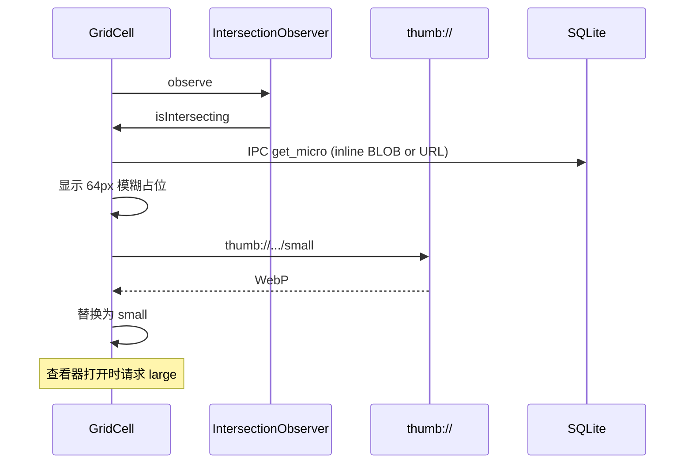

#### 7.3.2 可见区域 + 预加载

```typescript
const VISIBILITY_MARGIN = '200% 0px';  // 上下各 2 屏 — FlyPhotos ±200

useEffect(() => {
  const observer = new IntersectionObserver(
    entries => {
      for (const e of entries) {
        if (e.isIntersecting) {
          thumbLoader.request(fileId, 'small', laneFor(e));
        } else {
          thumbLoader.cancel(fileId, 'small');
        }
      }
    },
    { root: scrollRef.current, rootMargin: VISIBILITY_MARGIN }
  );
}, []);
```

**车道映射**：

| Intersection ratio | Lane |
|------------------|------|
| fully visible | VISIBLE |
| partial / near | GUARD |
| rootMargin 边缘 | PREFETCH |

#### 7.3.3 Burst 模式（FlyPhotos）

```typescript
let scrollVelocity = 0;
let burstMode = false;

onScroll(() => {
  scrollVelocity = computeVelocity();
  burstMode = scrollVelocity > BURST_THRESHOLD;
  if (burstMode) {
    thumbLoader.pauseLane('large');
    thumbLoader.onlyMicroAndSmall();
  }
});
```

### 7.4 照片查看器

#### 7.4.1 缩放/平移

```tsx
// react-zoom-pan-pinch 或自研 transform
<TransformWrapper
  initialScale={1}
  minScale={0.1}
  maxScale={4}
  wheel={{ step: 0.1 }}
  pinch={{ step: 5 }}
  doubleClick={{ mode: 'toggle', step: 1 }}
>
  <TransformComponent>
    
  </TransformComponent>
</TransformWrapper>
```

#### 7.4.2 左右切换与预加载

```typescript
const adjacentIds = useAdjacentFiles(currentId, 2);  // ±2
useEffect(() => {
  adjacentIds.forEach(id => thumbLoader.request(id, 'large', 'prefetch'));
}, [currentId]);
```

切换动画：200ms CSS `opacity` + `translateX`；`prefers-reduced-motion` 时禁用。

#### 7.4.3 视频播放器

```tsx
<video
  src={convertFileSrc(videoPath)}
  controls
  preload="metadata"
  onKeyDown={handleSpacePlayPause}  // UX-028
/>
```

无 FFmpeg 时显示占位 + 安装引导。

---

## 8. 多语言实现详细设计

### 8.1 设计决策

| 层级 | 方案 | 理由 |
|------|------|------|
| 前端 | 自定义 `src/i18n/`（JSON 词典 + `t()` + `useTranslation`） | 零依赖；与 `useSyncExternalStore` 订阅模式一致 |
| 后端 | **rust-i18n**（Phase 2+） | 宏编译期嵌入，比 fluent 轻量 |
| 日期/数字 | Intl API | 标准本地化 |

### 8.2 前端 i18n 架构

#### 8.2.1 目录结构（当前实现）

```
src/i18n/
├── index.ts              # t(), setLocale(), subscribe()
├── useTranslation.ts     # React hook
└── locales/
    ├── zh-CN.json
    └── en.json
```

#### 8.2.2 初始化

```typescript
// src/i18n/index.ts — 自定义实现，非 i18next
import zhCN from "./locales/zh-CN.json";
import en from "./locales/en.json";

let currentLocale: Locale = detectLocale(); // localStorage → navigator.language

export function t(key: string, params?: Record<string, string | number>): string {
  let text = translations[currentLocale][key] ?? key;
  // {count} 占位符替换
  ...
}

export function setLocale(locale: Locale) {
  currentLocale = locale;
  localStorage.setItem("catchlight-locale", locale);
  listeners.forEach((fn) => fn());
}
```

#### 8.2.3 系统语言检测

```typescript
function matchLocale(system: string, supported: string[]): string | null {
  if (supported.includes(system)) return system;
  const lang = system.split('-')[0];
  return supported.find(s => s.startsWith(lang)) ?? null;
}
```

### 8.3 Rust 后端 i18n

#### 8.3.1 rust-i18n 配置

```rust
// catchlight-core/src/i18n.rs
use rust_i18n::i18n;

i18n!("locales", fallback = "en");

pub fn t(key: &str, lang: &str) -> String {
    rust_i18n::set_locale(lang);
    key.into()  // macro t!("error.index.permission_denied")
}

#[tauri::command]
fn get_error_message(code: &str, lang: &str) -> String {
    t(&format!("error.{}", code), lang)
}
```

```
src-tauri/locales/
├── en.yml
└── zh-CN.yml
```

```yaml
# zh-CN.yml
error:
  index:
    permission_denied: "无法访问 MFT，已切换为普通扫描模式"
  thumb:
    corrupt: "无法生成缩略图，文件可能已损坏"
notification:
  scan_complete: "索引完成：{{count}} 个文件"
```

#### 8.3.2 前后端协作

- 前端启动后 IPC `set_backend_locale(lang)`
- 后端通知/错误返回 `{ code, params }`；前端也可本地翻译
- 日志始终英文；用户可见消息走 i18n

---

## 9. 配置与设置详细设计

### 9.1 设计决策

| 决策点 | 选定 | 对比 |
|--------|------|------|
| 格式 | **JSON** | vs TOML（需求文档示例）→ **JSON 与前端共享 schema 更简单** |
| 位置 | `~/.catchlight/config.json` | 方案 C |
| 迁移 | 版本号 + migration 链 | NFR-072 |

### 9.2 配置文件格式

```json
{
  "version": 1,
  "general": {
    "language": "auto",
    "theme": "system",
    "confirm_delete": true
  },
  "index": {
    "mode": "auto",
    "linux": {
      "watch_strategy": "recursive_inotify",
      "poll_interval_secs": 1800,
      "fanotify_enabled": false
    }
  },
  "watched_folders": [],
  "thumbnails": {
    "micro_size": 64,
    "small_size": 256,
    "large_size": 1024,
    "quality": 80,
    "cache_max_mb": { "small": 2048, "large": 5120 }
  },
  "performance": {
    "metadata_concurrency": 0,
    "thumb_concurrency_ratio": 0.7,
    "dedup_enabled": true
  },
  "ai": {
    "enabled": false,
    "screenshot_clip": true,
    "semantic_dedup": false,
    "model_mirror": null
  },
  "privacy": {
    "map_online_tiles": true,
    "telemetry": false,
    "update_check": true
  },
  "storage": {
    "data_dir": null
  }
}
```

`0` 表示自动（如 `metadata_concurrency: 0` → `num_cpus`）。

### 9.3 版本化迁移

```rust
fn migrate_config(raw: &serde_json::Value) -> Result<Config> {
    let version = raw.get("version").and_then(|v| v.as_i64()).unwrap_or(0);
    let mut value = raw.clone();
    for v in version..CURRENT_CONFIG_VERSION {
        value = match v {
            0 => migrate_0_to_1(value)?,
            1 => migrate_1_to_2(value)?,
            _ => value,
        };
    }
    serde_json::from_value(value).map_err(Into::into)
}
```

### 9.4 默认值管理

```rust
impl Default for Config {
    fn default() -> Self {
        Self {
            version: CURRENT_CONFIG_VERSION,
            general: GeneralConfig {
                language: "auto".into(),
                theme: ThemeMode::System,
                ..
            },
            performance: PerformanceConfig {
                metadata_concurrency: 0,
                thumb_concurrency_ratio: 0.7,
                ..
            },
            ..
        }
    }
}

// 合并：文件配置 override 默认值，缺失字段填默认
pub fn load_config() -> Result<Config> {
    let path = config_path();
    if !path.exists() {
        let cfg = Config::default();
        save_config(&cfg)?;
        return Ok(cfg);
    }
    let raw: serde_json::Value = serde_json::from_str(&fs::read_to_string(&path)?)?;
    migrate_config(&raw)
}
```

### 9.5 用户可配项与 Settings UI 映射

| 设置页分组 | 配置键 | 控件 |
|------------|--------|------|
| 监控文件夹 | `watched_folders` | 列表 + 添加/删除 |
| 缩略图 | `thumbnails.*` | 尺寸预设、缓存上限滑块 |
| 主题 | `general.theme` | 跟随系统/深色/浅色 |
| 语言 | `general.language` | 下拉（含「自动」） |
| AI 功能 | `ai.*` | 总开关 + 子开关 |
| 性能 | `performance.*` | 并发数、索引模式 |
| 隐私 | `privacy.*` | 地图/遥测/更新开关 |
| 存储 | `storage.data_dir` | 路径选择 + 清空缓存/重建索引 |

### 9.6 Tauri IPC 接口汇总

```rust
// 索引（Phase 1 已实现）
add_watched_folder(path) -> WatchedFolder
remove_watched_folder(id) -> ()
list_watched_folders() -> Vec<WatchedFolder>
scan_folder(folder_id) -> ()
get_scan_status() -> ScanProgress

// 相簿 / 收藏 / 软删除（Phase 2 已实现）
create_album(name) -> Album
list_albums() -> Vec<Album>
add_to_album(album_id, file_ids) -> ()
remove_from_album(album_id, file_ids) -> ()
toggle_favorite(file_id) -> ()
soft_delete(file_id) / restore_deleted(file_id) -> ()
list_deleted() -> Vec<MediaItem>

// 去重（Phase 2 已实现）
get_duplicate_groups(type, cursor) -> DuplicateGroupPage
start_dedup_scan() -> ()

// 搜索 / 地点（Phase 2 已实现）
search_media(query, limit) -> Vec<MediaItem>
list_countries() / list_cities(country) -> Vec<PlaceGroup>
get_media_by_place(country, city?) -> Vec<MediaItem>

// 配置
get_setting(key) -> Value
set_setting(key, value) -> ()
get_storage_stats() -> StorageStats
clear_thumb_cache(level?) -> ()
```

### 9.7 事件（Tauri emit）

| 事件名 | 载荷 | 用途 |
|--------|------|------|
| `scan-progress` | `ScanProgress` | 索引进度条 |
| `index:complete` | { count, duration_ms } | 完成通知 |
| `metadata:updated` | { file_ids } | 增量刷新网格 |
| `thumb:ready` | { file_id, level } | 缩略图升级 |
| `language-changed` | { lang } | 多窗口同步 |
| `ai:download_progress` | { pct, model } | 模型下载 |

---

## 10. Python AI 扩展层详细设计

### 10.1 设计决策

| 决策点 | 选定方案 | 对比/理由 |
|--------|----------|-----------|
| 通信协议 | JSON-RPC 2.0 over stdin/stdout | vs HTTP（端口冲突）/ gRPC（重）→ **stdin/stdout 无网络依赖，防火墙友好** |
| 进程模型 | 按需单进程 + 超时自动退出 | vs 常驻守护（占内存）→ **AI 功能低频，按需启动** |
| Python 版本 | 内嵌 Python 3.11+（可选系统 Python） | vs PyO3 嵌入（编译复杂）→ **子进程隔离更稳定** |
| 安装方式 | Settings UI 一键安装 / 手动 venv | vs 随主程序打包（+500MB）→ **按需安装不膨胀** |
| 模型管理 | Python 侧管理，共享 `~/.catchlight/models/` | Rust 侧已有基础模型；Python 追加高级模型 |

### 10.2 架构总览

```
┌────────────────────────────────────────────────────────────────────┐
│                     Rust 核心 (catchlight-ai)                       │
│  ┌──────────────┐                                                  │
│  │ AiDispatcher │──── 基础 AI: ONNX CLIP / DHash / PHash          │
│  │              │                                                  │
│  │              │──── Python RPC Client ◄─── JSON-RPC 2.0 ────┐   │
│  └──────────────┘                         stdin/stdout         │   │
├────────────────────────────────────────────────────────────────────┤
│                                                                    │
│  ┌─────────────────────── Python Sidecar ───────────────────────┐  │
│  │  catchlight-ai-py (venv)                                     │  │
│  │  ┌───────────┐ ┌───────────┐ ┌───────────┐ ┌──────────────┐ │  │
│  │  │ RPC Server│ │ModelLoader│ │CapRegistry│ │HealthReporter│ │  │
│  │  └─────┬─────┘ └───────────┘ └───────────┘ └──────────────┘ │  │
│  │        │                                                     │  │
│  │  ┌─────▼─────┐ ┌───────────┐ ┌───────────┐ ┌──────────────┐ │  │
│  │  │SemanticSrch│ │ScreenClass│ │ SceneTag  │ │  FaceCluster │ │  │
│  │  │CLIP+FAISS │ │CLIP+OCR   │ │CLIP零样本 │ │InsightFace   │ │  │
│  │  └───────────┘ └───────────┘ └───────────┘ └──────────────┘ │  │
│  └──────────────────────────────────────────────────────────────┘  │
└────────────────────────────────────────────────────────────────────┘
```

### 10.3 JSON-RPC 协议设计

#### 10.3.1 消息格式

**请求**：

```json
{
  "jsonrpc": "2.0",
  "id": 42,
  "method": "semantic_search",
  "params": {
    "query": "sunset at the beach",
    "top_k": 20,
    "threshold": 0.25
  }
}
```

**响应**：

```json
{
  "jsonrpc": "2.0",
  "id": 42,
  "result": {
    "matches": [
      { "file_id": 1234, "score": 0.87 },
      { "file_id": 5678, "score": 0.82 }
    ],
    "elapsed_ms": 45
  }
}
```

**错误**：

```json
{
  "jsonrpc": "2.0",
  "id": 42,
  "error": {
    "code": -32001,
    "message": "model_not_loaded",
    "data": { "model": "clip-vit-b32", "reason": "file not found" }
  }
}
```

#### 10.3.2 方法注册表

| 方法 | 参数 | 返回 | 用途 |
|------|------|------|------|
| `initialize` | `{ models_dir, db_path, locale }` | `{ capabilities }` | 启动握手 |
| `health` | `{}` | `{ status, memory_mb, loaded_models }` | 健康检查 |
| `shutdown` | `{}` | `{}` | 优雅退出 |
| `semantic_search` | `{ query, top_k, threshold }` | `{ matches[] }` | 文本→图像搜索 |
| `compute_embeddings` | `{ file_ids, batch_size }` | `{ count, errors[] }` | 批量向量化 |
| `build_faiss_index` | `{ rebuild }` | `{ total_vectors }` | 构建/重建向量索引 |
| `classify_screenshots` | `{ file_ids }` | `{ classifications[] }` | 截图细分类 |
| `ocr_extract` | `{ file_id }` | `{ text, regions[] }` | 截图文字提取 |
| `tag_scenes` | `{ file_ids, labels[] }` | `{ tags[] }` | 场景/活动标签 |
| `cluster_faces` | `{ embeddings_ready }` | `{ clusters[] }` | 人脸深度聚类 |
| `get_progress` | `{ task_id }` | `{ pct, phase, eta_s }` | 长任务进度 |
| `cancel_task` | `{ task_id }` | `{ cancelled }` | 取消长任务 |

#### 10.3.3 错误码

| 码 | 含义 |
|----|------|
| -32700 | 解析错误 |
| -32600 | 无效请求 |
| -32601 | 方法不存在 |
| -32001 | 模型未加载 |
| -32002 | 模型加载失败 |
| -32003 | GPU 不可用 |
| -32004 | 内存不足 |
| -32005 | 任务已取消 |
| -32006 | 文件不可访问 |

### 10.4 Rust 侧客户端

#### 10.4.1 进程生命周期管理

```rust
// catchlight-ai/src/python_bridge.rs

pub struct PythonSidecar {
    child: Option<Child>,
    stdin: Option<ChildStdin>,
    stdout_reader: Option<BufReader<ChildStdout>>,
    next_id: AtomicU64,
    capabilities: Vec<String>,
    last_activity: Instant,
    idle_timeout: Duration,
}

impl PythonSidecar {
    pub async fn ensure_running(&mut self) -> Result<()> {
        if self.is_alive() {
            self.last_activity = Instant::now();
            return Ok(());
        }
        self.spawn().await
    }

    async fn spawn(&mut self) -> Result<()> {
        let python = locate_python()?;
        let mut child = Command::new(&python)
            .args(["-m", "catchlight_ai", "--mode", "rpc"])
            .stdin(Stdio::piped())
            .stdout(Stdio::piped())
            .stderr(Stdio::piped())
            .kill_on_drop(true)
            .spawn()?;

        self.stdin = child.stdin.take();
        self.stdout_reader = child.stdout.take().map(BufReader::new);
        self.child = Some(child);

        let init_resp = self.call("initialize", json!({
            "models_dir": models_dir(),
            "db_path": db_path(),
            "locale": current_locale(),
        })).await?;
        self.capabilities = serde_json::from_value(init_resp["capabilities"].clone())?;
        Ok(())
    }

    fn is_alive(&self) -> bool {
        self.child.as_ref()
            .map(|c| c.try_wait().ok().flatten().is_none())
            .unwrap_or(false)
    }
}
```

#### 10.4.2 RPC 调用

```rust
impl PythonSidecar {
    pub async fn call(&mut self, method: &str, params: Value) -> Result<Value> {
        self.ensure_running().await?;
        let id = self.next_id.fetch_add(1, Ordering::Relaxed);

        let request = json!({
            "jsonrpc": "2.0",
            "id": id,
            "method": method,
            "params": params,
        });

        let mut line = serde_json::to_string(&request)?;
        line.push('\n');

        let stdin = self.stdin.as_mut().ok_or(AiError::NotRunning)?;
        stdin.write_all(line.as_bytes()).await?;
        stdin.flush().await?;

        let response = tokio::time::timeout(
            self.timeout_for(method),
            self.read_response(id),
        ).await??;

        if let Some(err) = response.get("error") {
            return Err(AiError::RpcError {
                code: err["code"].as_i64().unwrap_or(-1),
                message: err["message"].as_str().unwrap_or("unknown").into(),
            }.into());
        }
        Ok(response["result"].clone())
    }

    fn timeout_for(&self, method: &str) -> Duration {
        match method {
            "health" | "shutdown" => Duration::from_secs(5),
            "compute_embeddings" | "build_faiss_index" | "cluster_faces"
                => Duration::from_secs(600),
            _ => Duration::from_secs(30),
        }
    }
}
```

#### 10.4.3 空闲超时与自动回收

```rust
async fn idle_watchdog(sidecar: Arc<Mutex<PythonSidecar>>, timeout: Duration) {
    loop {
        tokio::time::sleep(Duration::from_secs(30)).await;
        let mut guard = sidecar.lock().await;
        if guard.is_alive() && guard.last_activity.elapsed() > timeout {
            let _ = guard.call("shutdown", json!({})).await;
            guard.kill_if_alive().await;
        }
    }
}
```

默认空闲超时：5 分钟。可通过 `config.ai.idle_timeout_secs` 配置。

#### 10.4.4 AI 分发器（统一入口）

```rust
// catchlight-ai/src/dispatcher.rs

pub struct AiDispatcher {
    onnx_session: Option<OrtSession>,   // Rust 侧基础 CLIP
    python: Arc<Mutex<PythonSidecar>>,
    config: AiConfig,
}

impl AiDispatcher {
    /// 根据能力和配置决定路由
    pub async fn semantic_search(&self, query: &str, top_k: usize) -> Result<Vec<Match>> {
        if self.python_available("semantic_search") {
            let resp = self.python.lock().await
                .call("semantic_search", json!({ "query": query, "top_k": top_k }))
                .await?;
            parse_matches(resp)
        } else if self.onnx_session.is_some() {
            self.rust_basic_search(query, top_k).await
        } else {
            Err(AiError::NoBackendAvailable.into())
        }
    }

    pub async fn classify_screenshot(&self, file_id: i64) -> Result<ScreenshotClass> {
        if self.python_available("classify_screenshots") {
            let resp = self.python.lock().await
                .call("classify_screenshots", json!({ "file_ids": [file_id] }))
                .await?;
            parse_classification(resp)
        } else {
            self.rust_basic_classify(file_id).await
        }
    }

    fn python_available(&self, capability: &str) -> bool {
        self.config.python_enabled
            && self.python.try_lock().ok()
                .map(|p| p.capabilities.contains(&capability.into()))
                .unwrap_or(false)
    }
}
```

### 10.5 Python 侧实现

#### 10.5.1 包结构

```
catchlight-ai-py/
├── pyproject.toml
├── catchlight_ai/
│   ├── __init__.py
│   ├── __main__.py           # python -m catchlight_ai --mode rpc
│   ├── rpc_server.py         # JSON-RPC stdin/stdout 循环
│   ├── registry.py           # 能力注册与方法分发
│   ├── model_loader.py       # 模型懒加载 + 缓存
│   ├── modules/
│   │   ├── __init__.py
│   │   ├── semantic_search.py   # CLIP + FAISS
│   │   ├── screenshot_cls.py    # CLIP 零样本 + OCR
│   │   ├── scene_tagger.py      # 场景/活动标签
│   │   └── face_cluster.py      # 人脸聚类 (Chinese Whispers)
│   └── utils/
│       ├── db.py             # 只读 SQLite 连接（读取 file paths/embeddings）
│       ├── image.py          # PIL 预处理
│       └── progress.py       # 进度上报工具
└── requirements.txt
```

#### 10.5.2 核心依赖

```
# requirements.txt
torch>=2.1,<3.0            # 或 onnxruntime
transformers>=4.35
open-clip-torch>=2.24
faiss-cpu>=1.7.4           # GPU 用户可替换 faiss-gpu
Pillow>=10.0
numpy>=1.24
easyocr>=1.7               # 截图 OCR（可选）
scikit-learn>=1.3           # Chinese Whispers 等聚类
insightface>=0.7            # 人脸（可选）
```

安装体积估算：
- 最小（CLIP + FAISS CPU）：~800 MB
- 完整（含 OCR + InsightFace）：~1.5 GB

#### 10.5.3 RPC Server 实现

```python
# catchlight_ai/rpc_server.py

import sys
import json
import traceback
from .registry import MethodRegistry

class RpcServer:
    def __init__(self, registry: MethodRegistry):
        self.registry = registry

    def run(self):
        for line in sys.stdin:
            line = line.strip()
            if not line:
                continue
            try:
                request = json.loads(line)
                result = self._dispatch(request)
                self._send({"jsonrpc": "2.0", "id": request.get("id"), "result": result})
            except RpcError as e:
                self._send({
                    "jsonrpc": "2.0",
                    "id": request.get("id"),
                    "error": {"code": e.code, "message": e.message, "data": e.data},
                })
            except Exception as e:
                self._send({
                    "jsonrpc": "2.0",
                    "id": request.get("id"),
                    "error": {"code": -32603, "message": str(e)},
                })

    def _dispatch(self, request: dict):
        method = request.get("method")
        params = request.get("params", {})
        handler = self.registry.get(method)
        if handler is None:
            raise RpcError(-32601, f"Method not found: {method}")
        return handler(**params)

    def _send(self, response: dict):
        line = json.dumps(response, ensure_ascii=False)
        sys.stdout.write(line + "\n")
        sys.stdout.flush()
```

#### 10.5.4 语义搜索模块

```python
# catchlight_ai/modules/semantic_search.py

import numpy as np
import faiss
from open_clip import create_model_and_transforms, get_tokenizer

class SemanticSearchModule:
    def __init__(self, models_dir: str, db_path: str):
        self.model = None
        self.tokenizer = None
        self.faiss_index = None
        self.id_map = []       # faiss 内部索引 → file_id
        self.models_dir = models_dir
        self.db_path = db_path

    def ensure_loaded(self):
        if self.model is not None:
            return
        self.model, _, self.preprocess = create_model_and_transforms(
            "ViT-B-32", pretrained="openai"
        )
        self.model.eval()
        self.tokenizer = get_tokenizer("ViT-B-32")

    def compute_embeddings(self, file_ids: list[int], batch_size: int = 32) -> dict:
        """批量计算图像嵌入并写回 DB"""
        self.ensure_loaded()
        import sqlite3
        conn = sqlite3.connect(self.db_path)
        processed = 0
        errors = []

        for i in range(0, len(file_ids), batch_size):
            batch_ids = file_ids[i:i + batch_size]
            images, valid_ids = self._load_batch(conn, batch_ids)
            if not images:
                continue
            embeddings = self._encode_images(images)
            self._save_embeddings(conn, valid_ids, embeddings)
            processed += len(valid_ids)

        conn.close()
        return {"count": processed, "errors": errors}

    def build_faiss_index(self, rebuild: bool = False) -> dict:
        """从 DB 读取所有 clip_embed 构建 FAISS 索引"""
        import sqlite3
        conn = sqlite3.connect(self.db_path)
        rows = conn.execute(
            "SELECT id, clip_embed FROM media_files WHERE clip_embed IS NOT NULL"
        ).fetchall()
        conn.close()

        vectors = np.array([np.frombuffer(r[1], dtype=np.float32) for r in rows])
        self.id_map = [r[0] for r in rows]

        faiss.normalize_L2(vectors)
        self.faiss_index = faiss.IndexFlatIP(512)  # cosine via normalized inner product
        self.faiss_index.add(vectors)
        return {"total_vectors": len(self.id_map)}

    def semantic_search(self, query: str, top_k: int = 20, threshold: float = 0.25) -> dict:
        self.ensure_loaded()
        if self.faiss_index is None or self.faiss_index.ntotal == 0:
            self.build_faiss_index()

        text_tokens = self.tokenizer([query])
        with torch.no_grad():
            text_embed = self.model.encode_text(text_tokens).numpy()
        faiss.normalize_L2(text_embed)

        scores, indices = self.faiss_index.search(text_embed, top_k)
        matches = [
            {"file_id": self.id_map[idx], "score": float(score)}
            for score, idx in zip(scores[0], indices[0])
            if score >= threshold and idx < len(self.id_map)
        ]
        return {"matches": matches}
```

#### 10.5.5 截图深度分类与 OCR

```python
# catchlight_ai/modules/screenshot_cls.py

class ScreenshotClassifier:
    PROMPTS = {
        "code_screenshot": "a screenshot of source code, terminal, or IDE",
        "chat_screenshot": "a screenshot of a messaging app or chat conversation",
        "browser_screenshot": "a screenshot of a web browser showing a webpage",
        "game_screenshot": "a screenshot of a video game",
        "document_screenshot": "a screenshot of a document, PDF, or spreadsheet",
        "settings_screenshot": "a screenshot of system settings or app preferences",
        "social_screenshot": "a screenshot of social media feed or post",
        "generic": "a screenshot of a computer or phone screen",
    }

    def classify(self, file_ids: list[int]) -> dict:
        """零样本 CLIP 分类 + 可选 OCR"""
        self.ensure_loaded()
        results = []
        for fid in file_ids:
            img = self._load_image(fid)
            if img is None:
                results.append({"file_id": fid, "error": "load_failed"})
                continue
            label, score = self._clip_classify(img)
            result = {"file_id": fid, "subtype": label, "confidence": score}
            if self.ocr_enabled and label in ("code_screenshot", "document_screenshot"):
                result["ocr_text"] = self._extract_text(img)
            results.append(result)
        return {"classifications": results}

    def _extract_text(self, img) -> str:
        """EasyOCR 文字提取"""
        import easyocr
        if not hasattr(self, '_ocr_reader'):
            self._ocr_reader = easyocr.Reader(['ch_sim', 'en'], gpu=False)
        result = self._ocr_reader.readtext(np.array(img), detail=0)
        return "\n".join(result)
```

#### 10.5.6 人脸深度聚类

```python
# catchlight_ai/modules/face_cluster.py

from sklearn.cluster import AgglomerativeClustering
import numpy as np

class FaceClusterModule:
    def cluster_faces(self, embeddings_ready: bool = True) -> dict:
        """读取 DB 中的人脸嵌入，执行层次聚类"""
        embeddings, face_ids = self._load_face_embeddings()
        if len(embeddings) < 2:
            return {"clusters": []}

        distance_matrix = 1 - np.dot(embeddings, embeddings.T)  # cosine distance
        clustering = AgglomerativeClustering(
            n_clusters=None,
            distance_threshold=0.6,
            metric="precomputed",
            linkage="average",
        )
        labels = clustering.fit_predict(distance_matrix)

        clusters = {}
        for face_id, label in zip(face_ids, labels):
            clusters.setdefault(int(label), []).append(face_id)

        return {"clusters": [
            {"cluster_id": cid, "face_ids": fids, "count": len(fids)}
            for cid, fids in sorted(clusters.items(), key=lambda x: -len(x[1]))
        ]}
```

### 10.6 Python 环境管理

#### 10.6.1 环境检测与安装流程

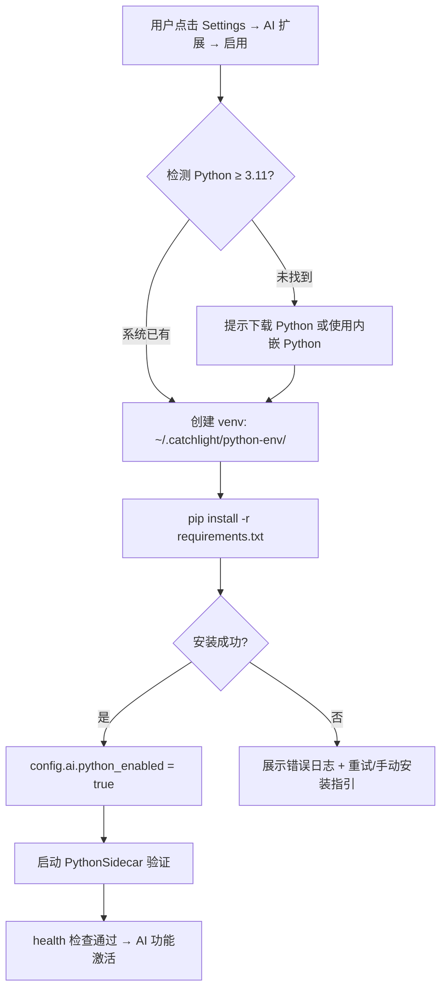

#### 10.6.2 Python 路径解析

```rust
fn locate_python() -> Result<PathBuf> {
    let venv_python = catchlight_dir().join("python-env")
        .join(if cfg!(windows) { "Scripts/python.exe" } else { "bin/python3" });
    if venv_python.exists() {
        return Ok(venv_python);
    }

    // 降级：查找系统 Python
    for name in ["python3.12", "python3.11", "python3", "python"] {
        if let Ok(path) = which::which(name) {
            let version = check_python_version(&path)?;
            if version >= (3, 11) {
                return Ok(path);
            }
        }
    }
    Err(AiError::PythonNotFound.into())
}
```

#### 10.6.3 配置扩展

```json
{
  "ai": {
    "enabled": false,
    "python_enabled": false,
    "python_path": null,
    "idle_timeout_secs": 300,
    "gpu_enabled": false,
    "screenshot_clip": true,
    "semantic_dedup": false,
    "ocr_enabled": false,
    "model_mirror": null,
    "max_memory_mb": 2048
  }
}
```

### 10.7 Rust ↔ Python 能力矩阵

| 功能 | Rust ONNX（基础） | Python（高级） | 降级行为 |
|------|-------------------|----------------|----------|
| 文件哈希去重 (L1) | BLAKE3 ✅ | — | — |
| 感知哈希去重 (L2) | DHash/PHash ✅ | — | — |
| 语义去重 (L3) | CLIP ONNX + 暴力搜索 | CLIP + FAISS HNSW | 无 Python → Rust 暴力（< 5 万可用） |
| 语义搜索 | CLIP ONNX 基础 | CLIP + FAISS + 文本编码 | 无 Python → 仅支持预定义 prompt |
| 截图识别 | 规则 + EXIF + 视觉 | CLIP 零样本 + OCR | 无 Python → 规则判定，无子分类 |
| 场景标签 | — | CLIP 零样本多标签 | 无 Python → 不可用 |
| 人脸检测 | InsightFace ONNX | — | — |
| 人脸聚类 | — | 层次聚类 / Chinese Whispers | 无 Python → 仅检测，不聚类 |
| OCR 文字提取 | — | EasyOCR / PaddleOCR | 无 Python → 不可用 |

### 10.8 错误处理与降级策略

```rust
impl AiDispatcher {
    async fn with_python_fallback<T, F, G>(
        &self,
        python_fn: F,
        rust_fallback: G,
    ) -> Result<T>
    where
        F: FnOnce(&mut PythonSidecar) -> Pin<Box<dyn Future<Output = Result<T>>>>,
        G: FnOnce() -> Result<T>,
    {
        if self.config.python_enabled {
            match self.python.lock().await.deref_mut() {
                sidecar if sidecar.is_alive() => {
                    match python_fn(sidecar).await {
                        Ok(v) => return Ok(v),
                        Err(e) => {
                            tracing::warn!("Python AI failed, falling back to Rust: {e}");
                        }
                    }
                }
                _ => {}
            }
        }
        rust_fallback()
    }
}
```

#### 10.8.1 降级场景

| 场景 | 检测 | 处理 |
|------|------|------|
| Python 未安装 | `locate_python()` 失败 | UI 提示安装，AI 标记为 basic |
| venv 损坏 | `initialize` RPC 失败 | 提示重建 venv |
| 模型文件缺失 | `model_not_loaded` 错误 | 触发下载流程 |
| OOM | `-32004` 错误 | 降低 batch_size 重试 |
| 进程崩溃 | `is_alive()` 返回 false | 重启（最多 3 次），之后禁用本次会话 |
| 超时 | `tokio::time::timeout` | 返回部分结果或降级 |

### 10.9 前端 AI 设置界面

```tsx
// src/pages/settings/AiSettings.tsx

function AiSettings() {
  const { t } = useTranslation('settings');
  const [aiStatus, setAiStatus] = useState<AiStatus>();

  return (
    <SettingsSection title={t('ai.title')}>
      <SettingsToggle
        label={t('ai.enable_basic')}
        description={t('ai.enable_basic_desc')}
        field="ai.enabled"
      />
      <SettingsToggle
        label={t('ai.enable_python')}
        description={t('ai.python_desc')}
        field="ai.python_enabled"
        disabled={!aiStatus?.pythonAvailable}
      />
      {!aiStatus?.pythonAvailable && (
        <InstallPythonGuide onInstalled={refresh} />
      )}
      <SettingsToggle label={t('ai.semantic_search')} field="ai.semantic_dedup" />
      <SettingsToggle label={t('ai.ocr')} field="ai.ocr_enabled" />
      <SettingsSlider
        label={t('ai.memory_limit')}
        field="ai.max_memory_mb"
        min={512} max={8192} step={256}
      />
      <AiStatusCard status={aiStatus} />
    </SettingsSection>
  );
}
```

### 10.10 性能考量

| 操作 | 预期耗时 | 优化策略 |
|------|---------|----------|
| Python 冷启动 | 3–8s | 模型懒加载；首次 `initialize` 仅加载 RPC 框架 |
| CLIP 图像编码（CPU） | ~100 ms/张 | batch 32 并行；GPU 降至 ~20 ms/张 |
| FAISS 搜索（50 万向量） | < 10 ms | `IndexIVFFlat` 或 `IndexFlatIP`（小规模直接暴力） |
| OCR 单张 | 0.5–2s | 按需触发，不在扫描流水线中 |
| 人脸聚类（1 万张） | 10–30s | 后台异步，进度上报 |
| 空闲内存占用 | ~200 MB | 超时自动退出释放 |

**内存管控**：

```python
# catchlight_ai/__main__.py
import resource

def set_memory_limit(max_mb: int):
    if hasattr(resource, 'RLIMIT_AS'):
        resource.setrlimit(resource.RLIMIT_AS, (max_mb * 1024 * 1024, -1))
```

---

## 附录 A：开源方案设计对照表

| 能力 | iPhotron | Lap | FlyPhotos | **CatchLight** |
|------|----------|-----|-----------|----------------|
| 索引位置 | 库内 `.iPhoto/global_index.db` | 集中 `~/.local/share/...` | 内存+SQLite | **集中 `~/.catchlight/library.db`** |
| 快速索引 | walkdir | WalkDir + mtime | 递归扫描 | **MFT/USN + inotify** |
| micro 缩略图 | 16×16 DB BLOB | — | — | **64×64 DB BLOB** |
| 磁盘缩略图 | 512 JPG | 分片 JPG + thumb:// | 三级 Preview/HQ | **256/1024 WebP + thumb://** |
| 缩略图 key | md5(path+size) | hash 分片 | — | **BLAKE3(path+size+mtime)** |
| 去重 | 无 | BLAKE3 | — | **BLAKE3 + DHash/PHash + CLIP** |
| 地理编码 | 离线地图 | cities.csv + rstar | — | **rrgeo + 网格聚类** |
| Gallery | keyset + 三车道 | — | 虚拟化+三级缓存 | **keyset + 三车道 + Burst** |
| 相簿 | `.iphoto.album.json` | — | — | **SQLite + 智能 DSL** |

---

## 附录 B：数据库 Schema 补充

完整 schema 见需求文档；本文档补充去重/截图/缓存表：

```sql
CREATE TABLE duplicate_groups (
    id INTEGER PRIMARY KEY,
    group_type TEXT NOT NULL,
    score REAL,
    created_at INTEGER,
    ignored INTEGER DEFAULT 0
);

CREATE TABLE duplicate_group_members (
    group_id INTEGER NOT NULL,
    file_id INTEGER NOT NULL,
    is_primary INTEGER DEFAULT 0,
    PRIMARY KEY (group_id, file_id)
);

CREATE TABLE ignored_duplicate_groups (
    group_id INTEGER PRIMARY KEY,
    ignored_at INTEGER
);

-- media_files 补充列
ALTER TABLE media_files ADD COLUMN screenshot_subtype TEXT;
ALTER TABLE media_files ADD COLUMN micro_thumb BLOB;
ALTER TABLE media_files ADD COLUMN time_source TEXT;
ALTER TABLE media_files ADD COLUMN platform_id BLOB;
ALTER TABLE media_files ADD COLUMN clip_embed BLOB;
```

---

## 附录 C：开发实现顺序建议

1. **Week 1–2**：`catchlight-db` + `catchlight-index`（Generic + Linux）
2. **Week 3**：Windows MFT/USN + 增量策略 + `scan_state`
3. **Week 4**：`catchlight-metadata` + 时间线 API
4. **Week 5**：`catchlight-thumb` + `thumb://` + micro BLOB
5. **Week 6**：React VirtualGallery + Viewer 基础
6. **Week 7–8**：相簿 + 配置 + i18n + 设置页
7. **Phase 2**：去重 + 截图识别 + 地点 + 搜索 — ✅ 已完成
8. **Phase 3**：Python AI sidecar 框架 + 语义搜索 + 截图 OCR + 人脸聚类

---

*CatchLight（拾光）— 拾一束光，留一段时光。Catch the light, keep the moment.*
