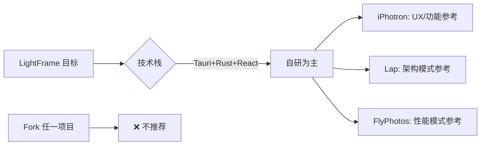
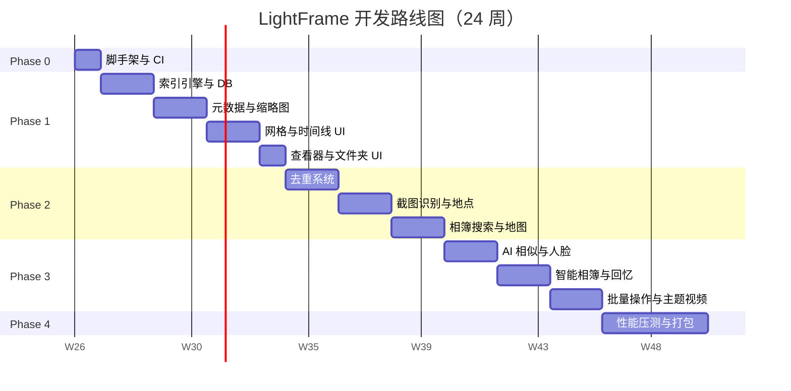
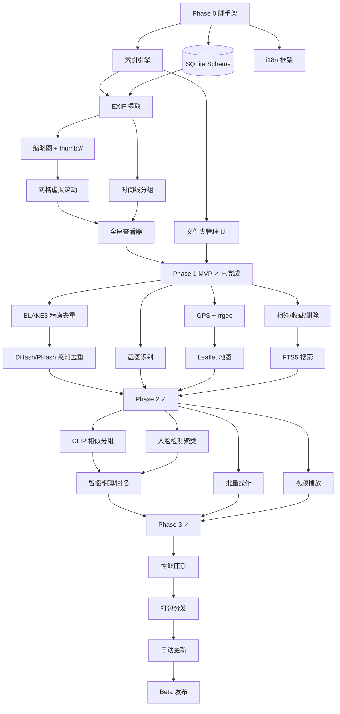
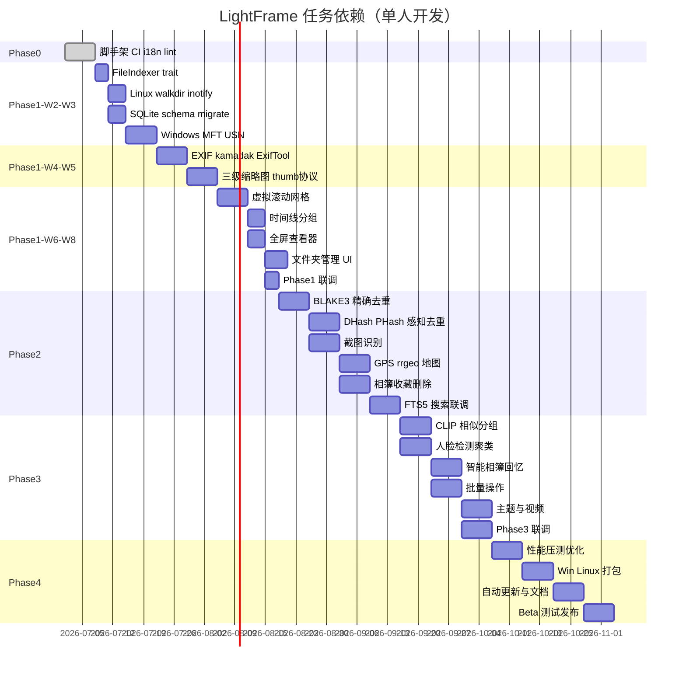
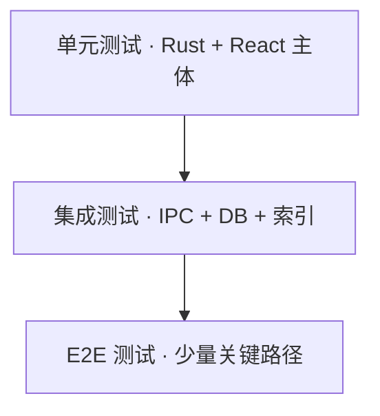
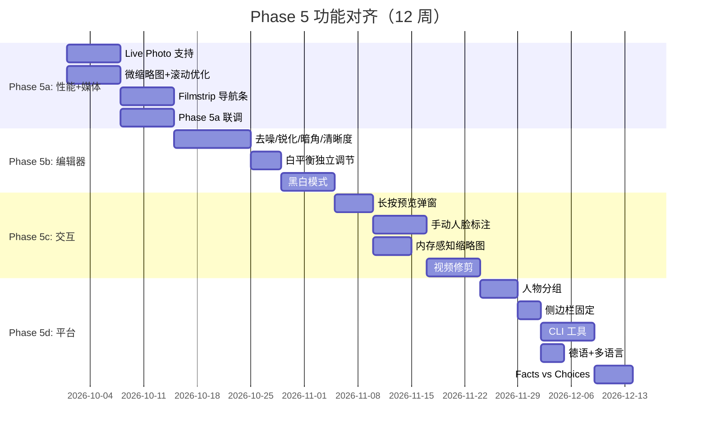

# LightFrame（影迹）详细开发计划

> **文档版本**：v1.3  
> **更新日期**：2026-07-01  
> **当前版本**：v0.0.18（Phase 4 进行中）  
> **产品名称**：影迹 / LightFrame  
> **技术栈**：Tauri 2.x + Rust + React 19 + TypeScript + Python AI 扩展（可选）  
> **开发模式**：单人全职  
> **总工期估算**：36 周（Phase 0–5）  
> **关联文档**：[需求规格](./2-requirements.md) · [架构设计](./3-architecture.md) · [调研报告](./0-research-report.md) · [技术路线决策](./1-tech-stack-decision.md)

---

## 文档说明

本文档是 LightFrame 项目的**执行级开发计划**，在需求规格与架构设计基础上，给出开源方案评估、分阶段路线图、里程碑验收、风险应对、任务依赖与质量保证策略。工作量估算基于**单人全职开发**（每周约 35–40 有效工时），已计入联调、自测与文档同步时间。

---

## 1. 开源方案对比分析与二次开发评估

### 1.1 综合对比表

以下对比基于 LightFrame 需求规格（P0–P2 功能全集）与调研报告结论，评分采用 1–5 分制（5 为最优）。

| 维度 | iPhotron | Lap | FlyPhotos |
|------|----------|-----|-----------|
| **功能覆盖度** | ★★★★☆ **~70%** | ★★★☆☆ **~45%** | ★★☆☆☆ **~25%** |
| **技术栈契合度** | ★★☆☆☆ Python/Qt6，与 Tauri+Rust 差异大 | ★★★★★ Tauri+Rust，栈几乎一致（前端 Vue vs React） | ★★☆☆☆ .NET/WinUI3，仅 Windows |
| **许可证兼容性** | ★★★★★ MIT，可自由参考 | ★☆☆☆☆ **GPL-3.0**，代码不可直接复用 | ★★★☆☆ 需确认具体仓库许可（多为 MIT/Apache） |
| **代码质量与可维护性** | ★★★★☆ MVVM+DDD 分层清晰，Python 类型提示完善 | ★★★☆☆ 功能完整但存在 7300 行单文件模块 | ★★★★☆ 性能优化代码精炼，但 UI 层与 WinUI 强绑定 |
| **社区活跃度** | ★★★☆☆ ~184 Stars，更新中等 | ★★☆☆☆ 社区较小，Issues 响应慢 | ★★★☆☆ Windows 生态活跃，跨平台无 |
| **二次开发可行性** | ★★★☆☆ 功能多但需换栈重写 | ★★☆☆☆ GPL 限制 + 缺核心差异化功能 | ★★☆☆☆ 仅适合借鉴性能模式，无法 fork |

#### 功能覆盖度明细（相对 LightFrame 需求）

| 需求类别 | iPhotron | Lap | FlyPhotos |
|----------|----------|-----|-----------|
| macOS 照片风格 UI | ✅ | ⚠️ 实用主义 | ⚠️ 查看器导向 |
| 文件夹即图库 / 不复制 | ✅ | ✅ | ✅ |
| 极速索引 MFT/USN | ❌ | ❌ | ❌ |
| 时间线 / 地点 / 相簿 | ✅ | ⚠️ 部分 | ❌ |
| 精确/感知去重 | ❌ | ❌ | ❌ |
| 截图识别 / 分类 | ❌ | ❌ | ❌ |
| 相似照片 / CLIP | ❌ | ⚠️ 有 CLIP 搜索 | ❌ |
| 人脸识别 | ✅ | ❌ | ❌ |
| 视频支持 | ✅ | ✅ | ⚠️ 有限 |
| 跨平台 Win+Linux | ✅ | ✅ | ❌ 仅 Windows |

---

### 1.2 二次开发 vs 自研决策

#### 1.2.1 iPhotron

| 评估项 | 分析 |
|--------|------|
| **Fork 可行性** | 技术上可 fork（MIT），但技术栈为 Python + PySide6，与目标 Tauri + Rust + React **完全不兼容**，实质等于「参考产品设计 + 重写后端」 |
| **工作量估算** | 若坚持 Python 栈二次开发：补齐 MFT/USN、去重、截图识别约 **16–20 周**；若换栈则与自研相当 **22–24 周**，且无 Rust 性能收益 |
| **风险** | Python GIL 限制大规模并行哈希/缩略图；PyInstaller 打包体积大；10 万+ 库网格滚动需额外优化；现有扫描为 walkdir，非差异化能力 |
| **结论** | **不推荐 Fork**。作为 UX/功能设计的**参考蓝本**价值最高 |

#### 1.2.2 Lap

| 评估项 | 分析 |
|--------|------|
| **Fork 可行性** | 技术栈最接近（Tauri + Rust），但 **GPL-3.0** 要求衍生作品开源且传染性强，与商业/闭源分发目标冲突；直接 copy 代码存在法律风险 |
| **工作量估算** | 在 Lap 基础上补齐去重/截图/MFT/时间线/地图：约 **18–22 周**（含 GPL 合规重构若仅「参考思路」则 **+0 周**） |
| **风险** | 单文件巨石模块难维护；缺少 LightFrame 核心差异化；Vue → React 迁移成本高；社区支持弱，上游 merge 困难 |
| **结论** | **不推荐 Fork**。借鉴 IPC 分层、ProcessingBudget、thumb:// 协议、CLIP 管线等**设计模式**（洁净室实现） |

#### 1.2.3 FlyPhotos

| 评估项 | 分析 |
|--------|------|
| **Fork 可行性** | C# + WinUI 3，**无法跨平台**；架构与 Tauri 差异极大，仅 Windows 性能优化思路可移植 |
| **工作量估算** | 移植 Preview/HQ 双轨缓存、Burst 预取、多解码器 fallback 到 Rust：约 **3–4 周**（作为 Phase 3 性能优化子任务） |
| **风险** | Win2D/GPU 解码方案无法直接用于 Linux；需用 Rust `image` + 可选 GPU 解码重新实现 |
| **结论** | **不推荐 Fork**。作为**性能优化与查看器体验**的参考 |

#### 1.2.4 总体决策



**推荐路径：自研 + 洁净室借鉴**

- 自研 Tauri 2.x + Rust + React 19 代码库
- 从 iPhotron 借鉴产品功能与交互设计
- 从 Lap 借鉴 Tauri 后端架构模式（不复制 GPL 代码）
- 从 FlyPhotos 借鉴查看器性能优化策略

---

### 1.3 可复用模块清单（参考，非 Fork）

> 以下均为**设计思路与算法模式**的洁净室实现，不直接复制 GPL 或其他不兼容许可的源码。

#### 1.3.1 iPhotron

| 模块 | 可借鉴内容 | LightFrame 对应实现 |
|------|-----------|-------------------|
| **Folder-native 设计** | 监控文件夹 = 图库入口，JSON manifest 管理虚拟相簿 | `watched_folders` 表 + 侧边栏文件夹树 |
| **SQL keyset 分页** | 大库游标分页，避免 OFFSET 性能退化 | `lightframe-db` 中 `keyset_paginate(taken_at, id)` |
| **扫描-缩略图契约** | 扫描完成后触发缩略图队列，状态字段 `thumb_cached` | indexer → thumbnail 事件总线 |
| **MVVM 分层** | View / ViewModel / Service 清晰分离 | React 组件 + `appStore`（useSyncExternalStore）+ Tauri commands |

#### 1.3.2 Lap

| 模块 | 可借鉴内容 | LightFrame 对应实现 |
|------|-----------|-------------------|
| **Tauri IPC 分层** | commands 按域拆分，state 注入 | `src-tauri/src/commands/{index,media,album}.rs` |
| **ProcessingBudget** | 并发任务预算，防止 CPU/IO 过载 | `lightframe-core::task_scheduler` |
| **thumb:// 协议** | 自定义 URI 加载缩略图，前端 `` | `protocol.rs` + 三级缓存 |
| **CLIP 搜索管线** | ONNX 嵌入 + 向量索引 | `lightframe-ai` + `usearch` |
| **FFmpeg sidecar** | 外部 FFmpeg 进程生成视频缩略图/预览 | `lightframe-video` |

#### 1.3.3 FlyPhotos

| 模块 | 可借鉴内容 | LightFrame 对应实现 |
|------|-----------|-------------------|
| **Preview/HQ 双轨缓存** | 低分辨率即时显示，高分辨率后台升级 | micro/small 即时 + large/HQ 异步 |
| **Burst 预取** | 查看器切换时预加载相邻 N 张 | viewer 组件 ±3 张预取 |
| **多解码器 fallback** | JPEG → WebP → PNG → TIFF 解码链 | `image` crate + kamadak-exif + ExifTool |

---

## 2. 开发路线图

### 总览

| Phase | 名称 | 工期 | 累计 |
|-------|------|------|------|
| **Phase 0** | 项目初始化 | 1 周 | W1 |
| **Phase 1** | 核心基础 MVP | 7 周 | W2–W8 |
| **Phase 2** | 照片组织与智能功能 | 6 周 | W9–W14 |
| **Phase 3** | 增强体验 | 6 周 | W15–W20 |
| **Phase 4** | 打磨发布 | 4 周 | W21–W24 |
| **Phase 5** | 功能对齐与体验提升 | 12 周 | W25–W36 |



---

### Phase 0：项目初始化（1 周）

**目标**：可编译、可 CI、可协作的工程骨架。

| 天 | 任务 | 交付物 |
|----|------|--------|
| D1–D2 | Tauri 2.x + React 19 + TypeScript 脚手架；Vite 配置；TailwindCSS v4 + shadcn/ui 初始化 | 空壳应用可启动 |
| D2–D3 | Cargo workspace 多 crate 结构：`lightframe-core`、`lightframe-db`、`lightframe-indexer` 等占位 crate | `cargo build` 通过 |
| D3–D4 | GitHub Actions：Windows + Ubuntu 双平台 `cargo test` + `pnpm test` + `cargo clippy` | CI badge 可用 |
| D4–D5 | 自定义 i18n（`src/i18n/`）；`locales/zh-CN.json`、`locales/en.json`；localStorage + 浏览器语言检测 | 语言切换可用 |
| D5 | eslint + prettier + husky；rustfmt + clippy；CONTRIBUTING.md 代码规范摘要 | lint 钩子生效 |

**目录结构（目标）**：

```
LightFrame/
├── src/                    # React 前端
├── src-tauri/              # Tauri 主 crate
├── crates/
│   ├── lightframe-core/
│   ├── lightframe-db/
│   ├── lightframe-indexer/
│   ├── lightframe-metadata/
│   └── lightframe-thumbnail/
├── locales/
├── .github/workflows/
└── docs/
```

---

### Phase 1：核心基础 MVP（7 周）— ✅ 已实现

**目标**：用户可添加监控文件夹，极速/常规索引照片，网格与时间线浏览，全屏查看，缩略图流畅加载。

**实现摘要（2026-06）：**
- Linux walkdir 扫描 + `futures::stream` / `buffer_unordered` 有界并发流水线
- SQLite schema v1 + v2（`watched_folders.scan_status`）
- 三级缩略图：micro 64 JPEG BLOB / small 256 WebP / large 1024 WebP
- FFmpeg 视频帧抽取（best-effort）、规则层截图检测集成于扫描
- React 网格 + 时间线虚拟滚动、全屏查看器、文件夹管理 UI
- 自定义 i18n + `useSyncExternalStore` 全局 store

#### 第 1 周（W2）：文件索引引擎 — 抽象与 Linux 实现

| 任务 | 详情 |
|------|------|
| `FileIndexer` trait 定义 | `full_scan`、`watch_changes`、`FileChange` 事件 |
| Linux 实现 | `walkdir` 递归扫描 + `notify` inotify 监听 |
| 扩展名过滤 | 图片/视频扩展名白名单（对齐 FMT-xxx 需求） |
| 单元测试 | 临时目录 fixture，增删改事件验证 |

#### 第 2 周（W3）：Windows 索引 + SQLite Schema

| 任务 | 详情 |
|------|------|
| Windows NTFS | `ntfs-reader` MFT 全量扫描 + USN Journal 增量 |
| 降级路径 | 非 NTFS / 无管理员权限 → `walkdir` + `ReadDirectoryChangesW` |
| SQLite schema v1 | `media_files`、`watched_folders` 表；`refinery`/`sqlx migrate` |
| 索引写入 | 批量 INSERT OR REPLACE，事务批量提交 |

#### 第 3 周（W4）：EXIF 元数据提取

| 任务 | 详情 |
|------|------|
| kamadak-exif | JPEG/HEIF/PNG 原生解析 |
| ExifTool fallback | sidecar 进程，超时与并发限制 |
| 字段映射 | `taken_at`、`camera`、`GPS`、`width/height` 写入 DB |
| 后台队列 | 扫描完成后异步 EXIF 提取，emit 进度事件 |

#### 第 4 周（W5）：缩略图系统 + thumb:// 协议

| 任务 | 详情 |
|------|------|
| 三级缩略图 | micro 64×64、small 256×256、large 1024×1024，WebP 80% |
| 生成策略 | 优先 EXIF 嵌入缩略图 → 异步精确生成 |
| `thumb://` 协议 | Tauri custom protocol handler |
| LRU 内存缓存 | 热点 micro 缩略图内存缓存 |
| ProcessingBudget | 并发上限可配置（借鉴 Lap） |

#### 第 5 周（W6）：照片网格视图

| 任务 | 详情 |
|------|------|
| 虚拟滚动 | `@tanstack/react-virtual`，keyset 分页加载 |
| 懒加载 | 可视区 ±2 屏缓冲，`thumb://` 加载 |
| 网格项 UI | 占位符、收藏角标、视频时长、RAW 标签 |
| 多选基础 | 单击/Ctrl/Shift 选择（Phase 3 扩展批量操作） |

#### 第 6 周（W7）：时间线 + 全屏查看器

| 任务 | 详情 |
|------|------|
| 时间线分组 | 年→月→日 SQL 分组，sticky 标题 |
| 时间源优先级 | DateTimeOriginal > CreateDate > mtime |
| 全屏查看器 | 缩放/拖拽/旋转、左右切换、胶片条 |
| Preview/HQ 双轨 | 先 large 缩略图，后台加载原图（借鉴 FlyPhotos） |

#### 第 7 周（W8）：文件夹管理 UI + 联调

| 任务 | 详情 |
|------|------|
| 监控文件夹 CRUD | 设置页 + 拖拽添加 |
| 文件夹树浏览 | 侧边栏文件系统层级 |
| 状态栏 | 照片/视频计数、索引进度 |
| Phase 1 联调 | 5 万张照片实测；修复 P0 bug |
| i18n 补充 | 核心浏览流程中英翻译 |

---

### Phase 2：照片组织与智能功能（6 周）— ✅ 已实现

**目标**：去重、截图识别、地点分组、相簿、搜索、地图——形成差异化竞争力。

**实现摘要（2026-06）：**
- BLAKE3 精确去重 + DHash 感知去重（汉明距离阈值聚类），去重工具页 UI
- 截图识别（规则层）集成扫描流水线，截图专属视图
- rrgeo 离线反向地理编码（reverse_geocoder），地点按国家/城市分组视图
- 相簿 CRUD、收藏夹、软删除（30天自动清理），4 个新视图组件
- SQLite FTS5 全文搜索，同步触发器，顶部搜索栏 + 结果视图
- DB schema 升级到 v5（is_favorite, is_deleted, FTS5, 部分索引）

#### 第 8 周（W9）：精确去重（BLAKE3）

| 任务 | 详情 |
|------|------|
| 文件大小预筛 | 同 size 候选分组 |
| BLAKE3 并行哈希 | `rayon` 并行，结果写入 `file_hash` |
| 重复组 UI | 重复照片列表，保留/删除建议 |
| 进度与暂停 | 后台任务可取消 |

#### 第 9 周（W10）：感知去重（DHash/PHash）

| 任务 | 详情 |
|------|------|
| DHash/PHash 计算 | `img_hash` 或自实现 |
| 汉明距离聚类 | 阈值可配置（默认 DHash distance=0） |
| `duplicate_group_id` | 精确+感知统一分组展示 |
| 去重工具页 | 侧边栏「重复照片」入口 |

#### 第 10 周（W11）：截图自动识别

| 任务 | 详情 |
|------|------|
| 规则快筛 | 无 EXIF 相机、屏幕分辨率、宽高比 |
| 视觉特征 | 边缘方差、状态栏检测 |
| CLIP 可选层 | ONNX Runtime CPU，`media_type='screenshot'` |
| 截图相册 | 自动归入「截图」智能集合 |

#### 第 11 周（W12）：地点分组 + 地图视图

| 任务 | 详情 |
|------|------|
| rrgeo 反向编码 | GPS → 国家/城市 |
| DBSCAN 聚类 | 合并近距离坐标 |
| Leaflet 地图 | 照片钉点、聚合、点击跳转 |
| 地点侧边栏 | 国家→城市→地点三级 |

#### 第 12 周（W13）：相簿 + 收藏 + 最近删除

| 任务 | 详情 |
|------|------|
| 用户相簿 CRUD | `albums` + `album_files` 虚拟关联 |
| 收藏夹 | `is_favorite` 标记与筛选 |
| 最近删除 | `is_deleted` 软删除，30 天自动清理 |
| 拖拽加入相簿 | 网格多选 → 加入相簿 |

#### 第 13 周（W14）：全文搜索（FTS5）+ 联调

| 任务 | 详情 |
|------|------|
| FTS5 虚拟表 | `file_name`、`camera`、`country`、`city` |
| 搜索 UI | 顶部搜索栏，<50ms 响应 |
| 智能相簿基础 | SQL 动态查询（全部照片/视频/收藏/截图） |
| Phase 2 联调 | 10 万库去重/截图压测 |

---

### Phase 3：增强体验（6 周）— ✅ 已实现

**目标**：AI 能力（含 Python 扩展层）、视频、人脸、回忆、批量操作、主题、图像编辑——对标 macOS 照片完整体验。

**实现摘要（2026-06）：**
- 智能相簿：规则 DSL → 动态 SQL；`SmartAlbumListView` / `SmartAlbumView` CRUD
- 回忆：`generate_memories` 按日期+地点聚类；`MemoriesView` / `MemoryDetailView` 卡片 UI
- 批量操作：`SelectionToolbar` + `batch_delete` / `batch_add_to_album` / `batch_toggle_favorite` / 恢复与永久删除
- 主题：深色/浅色/跟随系统（`useTheme` + Tailwind dark mode）
- 视频：`VideoPlayer` 内嵌播放，网格时长角标
- 人物：`PeopleView` / `PersonDetailView`（AI 扩展可选）
- 图像编辑（基础）：非破坏性 JSON 参数 + `ImageEditor` 五区面板 + Rust 导出管线
- 图像编辑（高级，对标 iPhotron）：曲线编辑器（RGB/R/G/B 四通道、Canvas 交互式、三次样条插值）、色阶（输入/输出黑白点 + Gamma）、可选颜色（6 色范围 HSL 独立调节）、透视校正（垂直/水平、单应性矩阵变换）、撤销/重做（50 步、Ctrl+Z/Shift+Z、300ms 防抖）
- UI 打磨：macOS 风格毛玻璃侧栏/顶栏、照片网格动效、空状态插画

#### 第 14 周（W15）：Python AI 扩展框架 + 相似照片

| 任务 | 详情 |
|------|------|
| Python sidecar 框架 | Rust JSON-RPC 客户端（tokio 子进程管理、超时、重连） |
| lightframe-ai-py 骨架 | Python 包入口、模型管理器、JSON-RPC server |
| AI 安装引导 UI | Python 环境检测 + 一键安装提示（Settings → AI 扩展） |
| CLIP ViT-B/32 | Rust ONNX 基础搜索 + Python FAISS 高级语义搜索 |
| 向量索引 | `usearch` / HNSW 近似最近邻 |
| 相似分组 UI | 「相似照片」工具页 |

#### 第 15 周（W16）：截图分类 + 人脸检测

| 任务 | 详情 |
|------|------|
| 截图细分类 | Python CLIP 零样本分类（代码/聊天/文档/游戏） |
| InsightFace ONNX | Rust 基础人脸检测 + Python 高级聚类 |
| 人脸聚类 | Chinese Whispers（Python sidecar 实现） |
| 人物侧边栏 | 人物相册入口 |

#### 第 16 周（W17）：智能相簿 + 回忆功能

| 任务 | 详情 |
|------|------|
| 规则引擎 | 日期范围、地点、镜头、类型组合 |
| 回忆生成 | 按「日期+地点」聚类自动生成 |
| 回忆卡片 UI | 标题、封面、照片数 |
| 自动刷新 | 索引更新后增量生成 |

#### 第 17 周（W18）：批量操作

| 任务 | 详情 |
|------|------|
| 批量删除/移动 | 操作原始文件，确认对话框 |
| 批量加入相簿 | 多选 → 相簿 |
| 批量导出路径 | 复制到指定文件夹（非导入/导出图库） |
| 撤销提示 | 文件系统操作不可逆警告 |

#### 第 18 周（W19）：主题 + 视频播放器

| 任务 | 详情 |
|------|------|
| 深色/浅色主题 | Tailwind dark mode + 系统跟随 |
| FFmpeg sidecar | 视频缩略图、元数据 |
| 视频播放器 | 内嵌播放，基本控制条 |
| 视频网格角标 | 时长显示 |

#### 第 19 周（W20）：Phase 3 联调与 UX 打磨

| 任务 | 详情 |
|------|------|
| AI 功能集成测试 | CLIP/人脸模型加载失败降级 |
| 动画与过渡 | Framer Motion 页面切换 |
| 键盘快捷键 | 查看器/网格通用快捷键 |
| 无障碍 | Radix UI 焦点管理 |

---

### Phase 4：打磨发布（4 周）— ⚠️ 部分完成（v0.0.12）

**目标**：10 万+ 性能达标，三平台安装包，自动更新，Beta 发布。

**实现摘要（2026-06-29，v0.0.12）：**
- ✅ CI 矩阵构建：Windows (msi/nsis) + Linux (deb/rpm/AppImage) + macOS (dmg amd64/arm64)
- ✅ Tauri 自动更新：`tauri-plugin-updater`、签名公钥、`UpdateChecker` UI、CI 生成 `latest.json`
- ✅ 地图 / 幻灯片 / 打印分享 / 缩略图重建 / 语义搜索 / 人脸聚类 UI（v0.0.9–v0.0.11 增量）
- ⬜ Windows Authenticode 签名（需购买证书，见 `docs/SIGNING.md`）
- ⬜ macOS Developer ID + 公证（notarization）
- ⬜ 10 万+ 真实图库压测与性能验收
- ⬜ v0.1.0-beta 公开发布

#### 第 20 周（W21）：性能优化

| 任务 | 详情 |
|------|------|
| 10 万+ 压测 | 索引、滚动、搜索、去重基准 |
| 瓶颈分析 | `tracing` + 火焰图 |
| 优化项 | SQL 索引、缩略图队列优先级、Burst 预取 |
| 内存占用 | 空闲 < 150MB 目标 |

#### 第 21 周（W22）：打包与分发

| 任务 | 详情 |
|------|------|
| Windows | NSIS/MSI 安装包，文件关联 |
| Linux | AppImage + deb + rpm |
| 代码签名 | Windows Authenticode（可选） |
| 依赖文档 | FFmpeg、WebKitGTK 安装说明 |

#### 第 22 周（W23）：自动更新 + 文档

| 任务 | 详情 |
|------|------|
| Tauri updater | 更新通道、签名验证 |
| 用户文档 | 中/英双语 README + 使用指南 |
| 隐私说明 | 本地处理、无上传承诺 |
| CHANGELOG | 版本发布说明 |

#### 第 23 周（W24）：Beta 测试与发布

| 任务 | 详情 |
|------|------|
| Beta 招募 | GitHub Discussions / Issues 模板 |
| Bug 修复 | P0/P1 问题清零 |
| v0.1.0-beta 发布 | GitHub Release 自动化 |
| 反馈迭代计划 | v0.2 路线图 |

---

## 3. 里程碑定义

### Phase 0 里程碑：工程就绪

| 交付物 | 验收标准 |
|--------|----------|
| 可编译应用 | Windows + Linux CI 绿色通过 |
| 开发规范 | eslint/clippy 零 warning（可配置例外） |
| i18n 骨架 | 切换中/英 UI 无硬编码中文 |

### Phase 1 里程碑：可浏览 MVP — ✅ 已完成

| 交付物 | 验收标准 | 状态 |
|--------|----------|------|
| 索引引擎 | Linux walkdir 扫描；stream + buffer_unordered 并发处理 | ✅ |
| 数据库 | schema v1/v2 迁移；EXIF 提取；micro_thumb BLOB | ✅ |
| 缩略图 | 三级缓存（64 BLOB / 256 / 1024 WebP）；thumb:// 协议 | ✅ |
| 网格+时间线 | 虚拟滚动；时间线分页合并同日期组 | ✅ |
| 查看器 | 缩放/切换；相邻预加载 | ✅ |
| 文件夹管理 | 监控文件夹 CRUD；scan_status 进度 | ✅ |

**Phase 1 完成标志**：用户添加本地照片文件夹，无需导入即可网格/时间线浏览并全屏查看。 — **已达成**

### Phase 2 里程碑：智能整理 — ✅ 已完成

| 交付物 | 验收标准 | 状态 |
|--------|----------|------|
| 精确去重 | BLAKE3 哈希 + 重复组 UI；按 file_size 预筛 | ✅ |
| 感知去重 | DHash 汉明距离聚类；精确/感知统一展示 | ✅ |
| 截图识别 | 规则层集成扫描流水线；截图专属视图 | ✅ |
| 地点分组 | rrgeo 反向编码；国家/城市分组视图 | ✅ |
| 相簿/收藏/删除 | 相簿 CRUD、收藏夹、软删除 30 天自动清理 | ✅ |
| FTS5 搜索 | FTS5 虚拟表 + 同步触发器；顶部搜索栏 | ✅ |

**Phase 2 完成标志**：差异化功能（去重、截图、搜索）可用，形成与 iPhotron/Lap 的差异。 — **已达成**

### Phase 3 里程碑：完整体验 — ✅ 已完成

| 交付物 | 验收标准 | 状态 |
|--------|----------|------|
| 相似照片 | CLIP 分组可用；无 GPU 可 CPU 运行（慢但可用） | ✅ |
| 人脸/人物 | 检测 + 聚类 UI（合并/拆分/重命名）；可选 ONNX `face` feature | ✅ |
| 智能相簿/回忆 | 规则创建相簿；回忆自动生成 ≥ 1 条（有 GPS+日期数据时） | ✅ |
| 批量操作 | 多选批量删除/移动/加相簿 | ✅ |
| 主题/视频 | 深/浅色切换；常见 MP4 可播放 | ✅ |
| 图像编辑（基础） | 非破坏性编辑（裁剪/光线/颜色/细节/效果）+ 导出副本 | ✅ |
| 图像编辑（高级） | 曲线/色阶/可选颜色/透视/撤销重做，对标 iPhotron | ✅ |
| 编辑器测试 | 后端 + 前端测试覆盖全功能 | ✅ |

**Phase 3 完成标志**：功能对标 macOS 照片 + iPhotron 核心编辑能力。 — **已达成**

### Phase 4 里程碑：可发布 Beta — ⚠️ 进行中

| 交付物 | 验收标准 | 状态 |
|--------|----------|------|
| 性能 | 10 万+ 库各场景达到调研报告性能目标 | ⬜ 待真实库压测 |
| 安装包 | Win/Linux/macOS 安装包 CI 构建 | ✅ CI 绿色（签名/公证除外） |
| 代码签名 | Windows Authenticode + macOS 公证 | ⬜ 待证书与 CI 集成 |
| 自动更新 | 测试通道可检测到新版本并验证签名 | ✅ |
| 文档 | 中英用户文档完整 | ✅ USER_GUIDE + SIGNING |
| Beta | v0.1.0-beta 发布，已知 P0 bug = 0 | ⬜ |

**Phase 4 完成标志**：v0.1.0-beta 公开发布。 — **未达成**

---

## 4. 技术风险与应对

### Phase 0 风险

| 风险 | 影响 | 概率 | 缓解措施 |
|------|------|------|----------|
| Tauri 2.x API 变更 | 脚手架返工 | 中 | 锁定版本；关注 changelog |
| Linux CI WebKitGTK 依赖 | CI 失败 | 中 | 文档化 apt/dnf 依赖；Docker 镜像 |

### Phase 1 风险

| 风险 | 影响 | 概率 | 缓解措施 |
|------|------|------|----------|
| MFT 需管理员权限 | Windows 首次索引慢 | 高 | 常规扫描降级 + UI 提示提权收益 |
| USN Journal 缓冲区溢出 | 长时间未运行漏变更 | 中 | 启动时校验 + 定期全量补偿 |
| Linux inotify 上限 | 大库漏监听 | 中 | 文档提示 `max_user_watches`；定时轮询 |
| HEIF/RAW 解码失败 | 缩略图缺失 | 中 | ExifTool/libheif fallback；占位图 |
| 虚拟滚动 + thumb:// 内存泄漏 | 长时间卡顿 | 中 | LRU 限制；CI 内存 profiling |

### Phase 2 风险

| 风险 | 影响 | 概率 | 缓解措施 |
|------|------|------|----------|
| BLAKE3 大文件 IO 瓶颈 | 去重耗时超预期 | 中 |  size 预筛 + 并行度限制 |
| CLIP 模型体积 350MB | 用户拒绝下载 | 高 | AI 功能可选；规则层独立可用 |
| rrgeo 精度不足 | 地点分组粗糙 | 低 | 城市级足够；后续可换 open-geocode |
| FTS5 中文分词 | 中文搜索弱 | 中 | unicode61 tokenizer；后续 jieba 扩展 |

### Phase 3 风险

| 风险 | 影响 | 概率 | 缓解措施 |
|------|------|------|----------|
| CLIP CPU 推理慢 | 10 万库相似分组小时级 | 高 | 后台低优先级；仅对小库或抽样 |
| InsightFace 误检 | 人物分组混乱 | 中 | 置信度阈值；手动合并/拆分（v0.2） |
| FFmpeg 未安装 | 视频功能不可用 | 中 | 启动检测 + 安装引导 |
| Linux WebKit 渲染差异 | UI 布局问题 | 中 | Linux 专项 CI screenshot 对比 |

### Phase 4 风险

| 风险 | 影响 | 概率 | 缓解措施 |
|------|------|------|----------|
| 10 万库性能不达标 | 发布延期 | 中 | Phase 1 末提前 5 万库压测；预留 W21 优化 |
| Linux 发行版碎片化 | 支持成本高 | 高 | 优先 AppImage；deb/rpm 次之 |
| 代码签名成本 | Windows 安装警告 | 低 | 文档说明；后续申请证书 |

---

## 5. 任务依赖关系图

### 5.1 关键路径（Mermaid）



### 5.2 并行任务说明

| 可并行组合 | 前提 | 说明 |
|-----------|------|------|
| Linux 索引 ∥ Windows MFT | Phase 0 完成 | 不同平台实现，同 trait |
| EXIF 提取 ∥ 缩略图生成 | DB schema 就绪 | 共享队列，不同 worker |
| 网格 UI ∥ 时间线 UI | thumb:// 可用 | 共享 VirtualGrid 组件 |
| BLAKE3 去重 ∥ 截图规则层 | Phase 1 完成 | 无数据依赖 |
| 地图视图 ∥ 相簿 CRUD | GPS 数据入库 | Phase 2 中后段可并行 |
| 主题 ∥ 视频播放器 | Phase 2 完成 | Phase 3 独立模块 |

### 5.3 详细 Gantt（按周）



---

## 6. 质量保证计划

### 6.1 测试金字塔



### 6.2 单元测试策略

#### Rust（`cargo test`）

| Crate | 测试重点 | 目标覆盖率 |
|-------|----------|-----------|
| `lightframe-indexer` | 扫描结果、事件解析、扩展名过滤 | 核心路径 80%+ |
| `lightframe-db` | 迁移、keyset 分页、FTS 查询 | 90%+ |
| `lightframe-metadata` | EXIF 解析 fixture（JPEG/HEIF/无 EXIF） | 85%+ |
| `lightframe-thumbnail` | 尺寸、格式、缓存 key | 80%+ |
| `lightframe-dedup` | BLAKE3、汉明距离聚类 | 90%+ |
| `lightframe-ai` | 模型 mock、嵌入维度 | 70%+ |

**Fixture 管理**：`crates/*/tests/fixtures/` 存放小样例图片；大样本（1 万+）仅 CI nightly 使用。

#### React（Vitest + Testing Library）

| 模块 | 测试重点 |
|------|----------|
| 虚拟滚动 | 渲染项数量、滚动位置恢复 |
| 时间线 | 分组标题格式化（中/英） |
| 查看器 | 键盘事件、缩放边界 |
| i18n | 关键 UI 字符串无缺失 key |
| Store | 选择状态、相簿操作 |

**当前测试规模（v0.0.18，2026-07-01）：**

| 层级 | 数量 | 命令 |
|------|------|------|
| Rust workspace | **646** | `cargo test --workspace` |
| React (Vitest) | **561**（51 文件） | `pnpm test` |
| **合计** | **1207** | CI 每 PR 运行 |

**运行命令**：

```bash
# Rust
cargo test --workspace
cargo test -p lightframe-indexer -- --nocapture

# 前端
pnpm test
pnpm test:coverage
```

### 6.3 集成测试

| 场景 | 方法 | 频率 |
|------|------|------|
| Tauri IPC | `tauri::test` mock app，invoke commands | 每 PR |
| 索引 → DB → 缩略图 | 临时目录端到端 pipeline | 每 PR |
| thumb:// 协议 | 请求 micro/small/large 返回有效 WebP | 每 PR |
| EXIF → 时间线 | 样本集 taken_at 正确分组 | 每周 |
| 去重 pipeline | 已知重复集识别率 | Phase 2 起每 PR |

### 6.4 性能测试基准

| 基准 | 目标 | 工具 | 频率 |
|------|------|------|------|
| MFT 扫描 10 万文件 | < 5s（Win NTFS） | criterion bench | Phase 1 起 |
| walkdir 10 万文件 | < 15s（Linux） | criterion bench | Phase 1 起 |
| 网格滚动 FPS | ≥ 55fps @ 1080p | 自定义 telemetry + Playwright | Phase 1 末 |
| BLAKE3 10 万张 | < 5min | criterion | Phase 2 |
| FTS5 查询 | p95 < 50ms | criterion | Phase 2 |
| 内存 idle | < 150MB | CI 采样 | Phase 4 |

**基准数据存储**：`benches/results/` JSON，CI 对比 regression > 10% 告警。

### 6.5 CI 自动化

```yaml
# .github/workflows/ci.yml 目标结构
jobs:
  rust:
    strategy:
      matrix:
        os: [ubuntu-latest, windows-latest]
    steps:
      - cargo fmt --check
      - cargo clippy -- -D warnings
      - cargo test --workspace
      - cargo bench --no-run  # 编译 bench

  frontend:
    steps:
      - pnpm lint
      - pnpm test
      - pnpm build

  e2e:  # Phase 1 末启用
    runs-on: ubuntu-latest
    steps:
      - xvfb-run pnpm test:e2e  # Tauri WebDriver
```

| CI 阶段 | 触发 | 阻断合并 |
|---------|------|----------|
| lint + unit test | PR / push main | 是 |
| 集成测试 | PR | 是 |
| bench regression | nightly | 告警 |
| Linux + Windows 构建 | PR | 是 |
| E2E | release 分支 | 是 |

### 6.6 人工测试清单（每 Phase 末）

- [ ] 添加/删除监控文件夹，索引正确
- [ ] 10 万库网格滚动无明显卡顿
- [ ] 中英语言切换完整
- [ ] 查看器 EXIF 信息面板正确
- [ ] 去重/截图/搜索结果符合预期
- [ ] 删除照片进入「最近删除」，30 天逻辑可模拟
- [ ] Windows 无管理员 / 有管理员两种索引路径
- [ ] Ubuntu 22.04 + Fedora 39 实机验证

---

### Phase 5：功能对齐与体验提升（12 周）— ⬜ 计划中

**目标**：补齐 LightFrame 相对 iPhotron 的功能差距，形成完整的桌面照片管理体验。

**背景**：基于 v0.0.18 与 iPhotron v6.6.8 的对比分析，LightFrame 缺少 20 项功能。按优先级和依赖关系分为 4 个子阶段执行。

---

#### Phase 5a：性能感知 + 媒体支持增强（3 周，W25–W27）

##### 5a-1 Live Photo 支持（P1）

| 任务 | 详情 |
|------|------|
| 配对识别 | 扫描时检测同名/同时间戳的 HEIC/JPG + MOV 文件对；解析 Apple `ContentIdentifier` (QuickTime mdta atom) |
| 数据模型 | `media_files` 新增 `live_pair_id` 外键关联；`live_content_id` 索引字段 |
| 前端展示 | PhotoCard 显示 "LIVE" badge；点击 badge 切换为内嵌视频播放（静音） |
| 查看器集成 | 长按/悬停播放 MOV 部分；松开回到静帧 |
| **技术细节** | Rust: 解析 MOV atom 获取 `com.apple.quicktime.content.identifier`；使用 `mp4parse` 或轻量解析器。前端: `<video>` 元素叠加在 `` 上，CSS transition 切换 |
| **验收** | 扫描 iPhone Live Photo 目录后自动识别配对；badge 可见且可交互 |

##### 5a-2 微缩略图 + 滚动意图分类（P1）

| 任务 | 详情 |
|------|------|
| 微缩略图生成 | 扫描时生成 32×32 JPEG micro thumbnail，存入 DB BLOB（~1KB/张） |
| 即时上屏 | 滚动时先展示 micro 缩略图（无网络请求），再异步加载 small/large |
| 滚动意图分类 | 监测 `scrollTop` 变化速率：slow (< 200px/s) / medium / fast (> 1000px/s) / burst (> 3000px/s) |
| 动态预取深度 | slow: 预取 ±3 屏；medium: ±1 屏；fast: 仅可视区；burst: 暂停预取，仅 micro |
| IntersectionObserver 优化 | 替代当前 scroll 事件监听，按可见性触发精确加载 |
| **技术细节** | Rust: `image::imageops::resize()` 到 32×32 → JPEG encode → `UPDATE media_files SET micro_thumb = ?`。前端: CSS `image-rendering: pixelated` 放大 micro；`useRef` 记录 scroll velocity |
| **验收** | 快速滚动 10 万张库无白屏闪烁；micro 缩略图 50ms 内可见；slow 滚动时 small 缩略图 200ms 内替换 |

##### 5a-3 Filmstrip 导航条（P2）

| 任务 | 详情 |
|------|------|
| 组件设计 | 查看器底部水平缩略图条，当前图高亮居中 |
| 虚拟滚动 | 使用 `@tanstack/react-virtual` 水平模式，仅渲染可见区 ±20 项 |
| 交互 | 点击跳转；键盘 ←/→ 导航时自动居中；滚轮水平滚动 |
| 设置 | `showFilmstrip` 偏好设置（可隐藏） |
| **技术细节** | 固定高度 64px 水平条；每项 48×48 micro 缩略图 + 选中高亮边框；CSS `overflow-x: hidden` 由 virtualizer 管理 |
| **验收** | 查看器切换图片时 filmstrip 自动居中；1000 张序列无性能问题 |

---

#### Phase 5b：编辑器增强（3 周，W28–W30）

##### 5b-1 去噪 / 锐化 / 暗角 / 清晰度（P2）

| 任务 | 详情 |
|------|------|
| Rust 后端滤镜 | `image_edit.rs` 新增 4 个滤镜实现 |
| 去噪 (Denoise) | Non-local means 或双边滤波；`intensity: 0-100` 参数 |
| 锐化 (Sharpen) | Unsharp mask：`amount`, `radius`, `threshold` 三参数 |
| 暗角 (Vignette) | 径向渐变黑色叠加：`strength`, `radius`, `softness` |
| 清晰度 (Clarity) | 中频增强：高通滤波 + overlay 混合 |
| 前端面板 | `ImageEditor.tsx` 新增 4 个 Section，各含对应滑块 |
| **技术细节** | 去噪: `image` crate + 自定义 3×3/5×5 核卷积或 `imageproc::filter`。暗角: 距中心距离 → alpha 衰减公式。清晰度: Gaussian blur 20px → 原图减模糊 = 高频 → 加回原图 |
| **验收** | 各滤镜实时预览；导出结果与预览一致；参数 JSON 可保存/恢复 |

##### 5b-2 白平衡独立调节（P2）

| 任务 | 详情 |
|------|------|
| 色温 (Temperature) | 冷(蓝)→暖(黄) 范围 2000K–10000K |
| 色调 (Tint) | 绿→品红 范围 -100~+100 |
| Rust 实现 | RGB → 色温偏移矩阵变换 |
| **技术细节** | 色温映射: Kelvin → RGB multiplier（Planckian locus 近似）；色调: Green-Magenta 轴偏移 |
| **验收** | 白平衡滑块独立调节，与其他编辑参数叠加正确 |

##### 5b-3 黑白模式（P2）

| 任务 | 详情 |
|------|------|
| 灰度转换 | 可选通道权重（标准 / R强调 / G强调 / B强调） |
| 胶片预设 | 3-5 种预设色调映射（暖调/冷调/高对比/柔和） |
| 颗粒 (Grain) | Gaussian noise 叠加，强度可调 |
| 前端 UI | 编辑器新增 "Black & White" section，含预设选择器 + 滑块 |
| **验收** | 预设一键切换；grain 强度平滑可调 |

---

#### Phase 5c：交互与浏览增强（3 周，W31–W33）

##### 5c-1 网格长按预览弹窗（P2）

| 任务 | 详情 |
|------|------|
| 长按检测 | 130ms 阈值触发；移动超过 5px 取消 |
| 预览窗口 | 居中浮层 min(400px, 60vw)；图片用 `original://` small/large |
| 视频预览 | 静音自动播放 MP4 |
| 关闭 | 松开手指/鼠标 或按 Escape |
| **技术细节** | React Portal + `usePointerEvent`；CSS `position: fixed` + backdrop blur；`requestAnimationFrame` 位置跟随 |
| **验收** | 长按显示、松开消失；视频预览静音自动播放 |

##### 5c-2 手动人脸标注（P2）

| 任务 | 详情 |
|------|------|
| 标注 UI | 查看器模式下，用户画矩形/圆形框选人脸区域 |
| 姓名输入 | 弹出输入框，支持已有人物名自动补全 |
| 后端存储 | `faces` 表新增 `is_manual: bool`；手动标注不受重新扫描影响 |
| 嵌入计算 | 保存后异步裁剪区域 → 计算 face embedding → 关联到 person |
| **技术细节** | Canvas overlay 在查看器图片上；`mousedown → mousemove → mouseup` 画框；保存 `(x, y, w, h)` 归一化坐标 |
| **验收** | 手动标注后人物出现在 People 视图；重新扫描不覆盖手动标注 |

##### 5c-3 内存感知缩略图预算（P2）

| 任务 | 详情 |
|------|------|
| 系统内存检测 | Rust: `sysinfo` crate 获取可用 RAM |
| 动态 LRU 大小 | 根据可用内存调整 thumb cache 上限：>8GB → 2000/500；4-8GB → 1000/250；<4GB → 500/100 |
| Worker 数量调整 | 缩略图生成并发数随内存动态缩放 |
| **技术细节** | 应用启动时检测；每 60s 轮询一次；memory pressure 超过 80% 时主动 evict LRU |
| **验收** | 4GB 机器不 OOM；16GB 机器充分利用缓存 |

##### 5c-4 视频修剪（P2）

| 任务 | 详情 |
|------|------|
| 前端 UI | 查看器内视频时间轴 trim bar（拖动 in/out 手柄） |
| 非破坏性存储 | 编辑参数 JSON: `{ "video_trim_in_sec": 2.5, "video_trim_out_sec": 10.0 }` |
| 导出渲染 | FFmpeg sidecar: `ffmpeg -i input.mp4 -ss {in} -to {out} -c copy output.mp4` |
| 播放时应用 | 前端 `<video>` 播放时 `currentTime` 约束在 in/out 范围 |
| **验收** | 拖动 trim 手柄实时预览；导出的视频时长正确 |

---

#### Phase 5d：平台体验 + 架构改进（3 周，W34–W36）

##### 5d-1 人物分组（P3）

| 任务 | 详情 |
|------|------|
| 数据模型 | `person_groups` 表：`id`, `name`, `cover_person_id`；`persons.group_id` FK |
| 前端 UI | PeopleView 支持拖拽人物到组卡片；组内展开显示成员 |
| CRUD | 创建/重命名/解散组；设置组封面 |
| **验收** | 多人可归组；组卡片显示组合头像 |

##### 5d-2 侧边栏固定/收藏（P3）

| 任务 | 详情 |
|------|------|
| 固定功能 | 右键菜单 "Pin to sidebar"；侧边栏顶部显示固定项 |
| 支持类型 | Albums, People, Smart Albums 可固定 |
| 持久化 | `settings` 表存储 `pinned_items: string[]` |
| **验收** | 固定项跨重启保持；最多 10 项 |

##### 5d-3 CLI 命令行工具（P3）

| 任务 | 详情 |
|------|------|
| 框架 | `clap` derive 宏；子命令: `scan`, `export`, `status`, `dedup` |
| scan | 指定目录扫描，输出统计信息 |
| export | 导出编辑后的照片到指定目录 |
| status | 显示库统计（照片/视频/人脸/去重组数量） |
| dedup | 列出重复文件并可选删除 |
| **技术细节** | 独立 binary target `lightframe-cli`（共享 crate 依赖）；不依赖 Tauri/WebView |
| **验收** | `lightframe-cli scan /path` 正确输出；`lightframe-cli status` 显示统计 |

##### 5d-4 德语 + 多语言扩展框架（P3）

| 任务 | 详情 |
|------|------|
| 德语翻译 | 新增 `src/i18n/locales/de.json`；翻译所有 key |
| 贡献指南 | 文档说明如何贡献新语言翻译 |
| 动态加载 | i18n 支持运行时切换，不需要重启 |
| **验收** | 设置中可切换至德语；UI 无缺失 key |

##### 5d-5 Facts vs Choices 架构分离（P2）

| 任务 | 详情 |
|------|------|
| 分离定义 | 可重建数据（scan results, thumbs, embeddings）vs 用户数据（favorites, album assoc, person names, edits） |
| 重建命令 | `rebuild_cache` 命令：清除 facts 表并重新扫描，保留 choices |
| 数据库标记 | schema 注释标记每张表为 `-- FACT` 或 `-- CHOICE` |
| **验收** | 执行 rebuild 后用户相簿/收藏/人物名称全部保留 |

---

#### Phase 5 总览



---

## 7. 附录

### 7.1 技术依赖与许可证

详见调研报告 §7.3 与架构文档。核心依赖均为 MIT/Apache/BSD 兼容许可；FFmpeg 以 sidecar 形式 LGPL 隔离；AI 模型权重单独分发。

### 7.2 版本规划

| 版本 | 范围 | 说明 | 状态 |
|------|------|------|------|
| v0.0.18 | Phase 0–4 安全/架构改进 | 代码审查修复、commands 拆分、安全加固 | ✅ 当前 |
| v0.1.0-beta | Phase 4 完成 | 签名/公证、10万+压测、P0 bug 清零 | ⬜ 目标 |
| v0.2.0 | Phase 5a | Live Photo、微缩略图、Filmstrip | 计划中 |
| v0.3.0 | Phase 5b | 编辑器增强（去噪/锐化/暗角/白平衡/黑白） | 计划中 |
| v0.4.0 | Phase 5c | 交互增强（预览弹窗/手动人脸/视频修剪） | 计划中 |
| v0.5.0 | Phase 5d | 平台体验（CLI/多语言/架构分离） | 计划中 |
| v1.0.0 | 稳定版 | 功能完整、性能达标 | 计划中 |

### 7.4 v0.1.0-beta 剩余工作清单

详见 [`BETA_ROADMAP.md`](./BETA_ROADMAP.md)「Updated Development Plan」章节。摘要：

| 项 | 优先级 | 工期 | 阻塞 Beta? |
|----|--------|------|------------|
| Windows Authenticode 签名 | P0 | 2–3 天 | 软阻塞（UX） |
| macOS 公证 | P0 | 2–4 天 | 软阻塞（UX） |
| 10万+ 真实库性能测试 | P0 | 3–5 天 | **是** |
| Beta bug 修复 | P0 | 1–2 周 | **是** |
| RAW libraw 解码增强 | P1 | 5–8 天 | 否 |
| 云同步 | P2 | 15–20 天 | 否 |

### 7.3 文档维护

| 文档 | 更新时机 |
|------|----------|
| `requirements.md` | 需求变更时 |
| `architecture.md` | 架构决策变更时 |
| `development-plan.md` | 每 Phase 结束复盘更新 |

---

> **影迹 / LightFrame** — 每一帧光影，都是时间的印迹。  
> Every frame of light is a trace of time.
