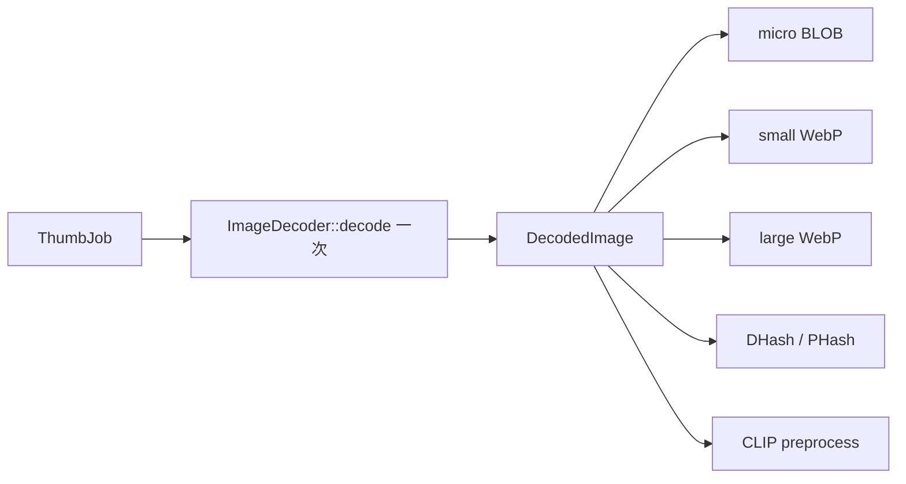

# ADR-007：GPU 加速策略

> **文档版本**：v1.0  
> **更新日期**：2026-06-28  
> **状态**：已采纳（Phase 2 实施中）  
> **关联文档**：[架构设计](./3-architecture.md) · [详细方案设计](./4-detailed-design.md) · [开发计划](./5-development-plan.md)

---

## 1. 背景（Context）

LightFrame 面向 **10 万–100 万级** 本地照片库，核心流水线包括：文件索引、EXIF 提取、三级缩略图生成、BLAKE3/DHash 去重、CLIP 语义推理与截图识别。随着库规模增长，以下瓶颈逐渐显现：

| 瓶颈 | 现状 | 目标 |
|------|------|------|
| 缩略图生成 | 每张图多次完整解码（micro / small / large 各自解码） | 单次解码、多级复用 |
| AI 推理 | Python sidecar 或 CPU ONNX，~100 ms/张 | GPU EP 降至 ~20 ms/张 |
| 并发争抢 | 缩略图、哈希、AI 共享 CPU | 按任务类型隔离预算 |

需求规格 [FR-303](./2-requirements.md) 要求 AI 模型可选安装并支持 **DirectML / CUDA** GPU 加速，CPU 回退必须可用。架构文档 [ADR-006](./3-architecture.md#adr-006tokio-异步--信号量限流) 已确立 `ProcessingBudget` 式限流；本 ADR 在其基础上扩展 **GPU 能力检测与后端抽象**。

调研报告 ([0-research-report.md](./0-research-report.md) §3.4) 表明：CLIP CNN 推理在 GPU 上可达 ~50 张/秒，而 CPU 仅 ~10 张/秒；缩略图 resize 在 CPU SIMD 下已足够高效，GPU 单张 resize 的 PCIe 传输开销往往超过计算收益。

---

## 2. 决策（Decision）

### 2.1 AI 推理：ort + Execution Provider 链

| 组件 | 选型 | 说明 |
|------|------|------|
| 运行时 | [`ort`](https://crates.io/crates/ort) v2（`download-binaries` feature） | 跨平台 ONNX Runtime 绑定，与 [lightframe-ai](./3-architecture.md#lightframe-ai) crate 集成 |
| Windows 默认 EP | **DirectML** | 覆盖 Intel / AMD / NVIDIA 全品牌 GPU，无需 CUDA Toolkit |
| Linux NVIDIA EP | **CUDA** | 需运行时检测 CUDA 驱动，不可用时跳过 |
| 回退 | **CPU** | 所有平台最终回退，保证功能可用 |
| 高级 AI | Python sidecar（JSON-RPC） | 保留现有 [AiDispatcher](./4-detailed-design.md#7-ai-统一分发器详细设计) 架构，Rust ort 负责基础 CLIP / InsightFace |

**EP 选择优先级（运行时自动探测）：**

```
Windows NVIDIA: CUDA → DirectML → CPU
Windows 其他:   DirectML → CPU
Linux NVIDIA:   CUDA → CPU
Linux 其他:     CPU
```

### 2.2 图像处理：CPU SIMD 优先

| 组件 | 选型 | 说明 |
|------|------|------|
| Resize | [`fast_image_resize`](https://crates.io/crates/fast_image_resize) v5 | AVX2 / NEON SIMD，单张 resize 性能优于 `image` crate |
| 解码 | `image` + 平台解码器（JPEG/PNG/WebP） | 通过 `ImageDecoder` trait 抽象，预留 libheif / raw 扩展 |
| 前置条件 | **Decode-once pipeline** | 一次解码 → 共享 `DecodedImage` → micro / small / large / DHash 复用 |

### 2.3 延期决策

| 能力 | 版本 | 理由 |
|------|------|------|
| wgpu compute shader 批量缩略图 | **v0.3.0** | 需 batch ≥ 32 才摊平 GPU 传输开销；Phase 2 优先 decode-once + CPU SIMD |
| GPU BLAKE3 / GPU DHash | **拒绝** | 哈希计算量小，GPU 启动与回读成本高于收益 |
| `cudarc` 直接 CUDA 推理 | **拒绝** | 过低层级，无法直接运行 ONNX 模型 |

---

## 3. 架构变更（Architecture Changes）

本 ADR 在 [3-architecture.md §2.1 模块划分](./3-architecture.md#21-模块划分cargo-workspace) 与 [4-detailed-design.md §3 缩略图系统](./4-detailed-design.md#3-缩略图系统详细设计) 基础上，引入以下抽象层：

### 3.1 `DecodedImage` + `ImageDecoder` trait

`DecodedImage` 已在 `lightframe-core` 中实现（RGBA 缓冲区），作为 decode-once 管道的核心载体：

```rust
// lightframe-core/src/media.rs（已实现）
pub struct DecodedImage {
    pub rgba: Vec<u8>,
    pub width: u32,
    pub height: u32,
}

// lightframe-core/src/decode.rs（扩展）
pub trait ImageDecoder: Send + Sync {
    fn decode(&self, path: &Path) -> Result<DecodedImage>;
    fn supports(&self, path: &Path) -> bool;
}

pub struct DefaultImageDecoder;  // JPEG/PNG/WebP via `image`
```

**数据流变更**（对比 [4-detailed-design.md §3.4 生成流程](./4-detailed-design.md#34-生成流程)）：



预期收益：消除 micro / small / large 三次完整解码，**3–4× 缩略图吞吐提升**。

### 3.2 `ThumbnailBackend` trait

```rust
pub trait ThumbnailBackend: Send + Sync {
    fn resize(&self, src: &DecodedImage, target: (u32, u32)) -> Result<DecodedImage>;
    fn backend_name(&self) -> &'static str;
}

pub struct CpuSimdBackend;   // fast_image_resize — Phase 2 默认
pub struct WgpuBatchBackend; // v0.3.0 — 批量 ≥ 32 张时启用
```

集成点：`lightframe-thumbnail` 的 `generate_from_decoded()` 改为通过 `ThumbnailBackend` 调度，与 [三级缩略图规格](./4-detailed-design.md#32-三级缩略图规格)（micro 64 / small 256 / large 1024）保持一致。

### 3.3 `InferenceBackend` trait

```rust
pub trait InferenceBackend: Send + Sync {
    fn embed_image(&self, tensor: &[f32]) -> Result<Vec<f32>>;
    fn execution_provider(&self) -> ExecutionProvider;
    fn is_available(&self) -> bool;
}

pub struct OrtBackend {
    session: ort::Session,
    ep: ExecutionProvider,  // DirectML | CUDA | CPU
}

pub struct PythonFallbackBackend;  // JSON-RPC → Python sidecar
```

`AiDispatcher`（[4-detailed-design.md §7](./4-detailed-design.md#7-ai-统一分发器详细设计)）路由规则：

1. 基础 CLIP / InsightFace → `OrtBackend`（GPU EP 优先）
2. 高级语义搜索 / OCR / 深度聚类 → Python sidecar
3. GPU 不可用时静默降级至 CPU，不阻断用户流程

### 3.4 `ComputeContext` — GPU 能力检测

```rust
pub struct ComputeContext {
    pub has_cuda: bool,
    pub has_directml: bool,
    pub gpu_name: Option<String>,
    pub recommended_ep: ExecutionProvider,
}

impl ComputeContext {
    pub fn detect() -> Self;  // 启动时一次性探测，结果缓存
}
```

探测时机：应用启动 / 首次 AI 请求前。结果写入日志与用户可见的设置页（「AI 加速：DirectML / CUDA / CPU」）。

### 3.5 `ProcessingBudget` 扩展

在 [ADR-006 ProcessingBudget](./3-architecture.md#232-processingbudget-信号量限流) 基础上，AI 信号量保持 **单槽**（`ai: Arc<Semaphore>` = 1），避免 GPU 与 CPU 推理并发争抢显存/算力：

```rust
pub struct ProcessingBudget {
    // ... 现有字段（scan / exif / normal_thumb / heavy_thumb / hash）
    pub ai: Arc<Semaphore>,  // = 1，GPU/CPU 推理互斥
}
```

缩略图与 AI 推理分属不同预算池，符合 [4-detailed-design.md §3.4.2 ThumbConcurrency](./4-detailed-design.md#342-并发限流lap-模型) 的三车道模型。

---

## 4. 跨平台 GPU 策略

| 平台 | GPU 类型 | AI Primary EP | Fallback 链 |
|------|----------|---------------|-------------|
| Windows | 任意（Intel / AMD / NVIDIA） | DirectML | CPU |
| Windows | NVIDIA（检测到 CUDA） | CUDA | DirectML → CPU |
| Linux | NVIDIA（检测到 CUDA 驱动） | CUDA | CPU |
| Linux | AMD / Intel / 无独显 | — | CPU |

**设计原则：**

- **不假设 GPU 存在**：所有 EP 初始化失败均捕获并降级，应用不崩溃
- **不捆绑 CUDA Toolkit**：`ort` 的 `download-binaries` 提供预编译 ORT；CUDA EP 仅在用户已安装 NVIDIA 驱动 + cuDNN 时启用
- **DirectML 覆盖 Windows 主流硬件**：包括集成显卡，满足 FR-303 跨品牌要求

---

## 5. 优先级路线图（Priority Roadmap）

| 优先级 | 阶段 | 工作项 | 预期收益 |
|--------|------|--------|----------|
| **P0** | Phase 2 W9 | Decode-once pipeline（CPU） | 缩略图 + 去重 3–4× 加速 |
| **P1** | Phase 2 W11 | ort CLIP inference + GPU EP | AI ~100 ms → ~20 ms/张 |
| **P2** | Phase 2 W10 | `fast_image_resize` CPU SIMD 集成 | 单次 resize 2× 加速 |
| **P3** | v0.3.0 | wgpu batch thumbnails（≥ 32 张/batch） | 后台批量 micro 生成 5×+ |

**已拒绝项：**

| 方案 | 拒绝理由 |
|------|----------|
| GPU BLAKE3 | 流式 I/O 绑定，GPU 无法加速磁盘读取；BLAKE3 CPU 已 ~500 MB/s |
| GPU DHash | 64×64 灰度哈希计算量极小（< 1 ms），GPU 调度开销更大 |
| `cudarc` 直接推理 | 需手写 CUDA kernel 加载 ONNX，维护成本不可接受 |
| `wgpu` 单张 resize | Host↔Device 传输 ~2 ms >> resize 计算 ~0.1 ms |
| Vulkan EP | ORT Vulkan EP 仍为 Experimental，Linux/Windows 支持有限 |

---

## 6. 备选方案对比（Alternatives Considered）

### 6.1 `cudarc` 直接 CUDA 编程

| 维度 | 评估 |
|------|------|
| 优势 | 零 ORT 开销，理论最优延迟 |
| 劣势 | 需手动实现 CLIP 前向传播；模型格式锁定；无 DirectML 路径 |
| **结论** | **拒绝** — 与「ort 统一 ONNX 推理」目标冲突 |

### 6.2 `wgpu` compute shader 缩略图（Phase 2）

| 维度 | 评估 |
|------|------|
| 优势 | 跨平台 GPU（Vulkan / DX12 / Metal） |
| 劣势 | 单张 64→256 resize 传输开销 > 计算；需维护 WGSL shader |
| **结论** | **延期至 v0.3.0**，仅用于后台 batch ≥ 32 |

### 6.3 Vulkan Execution Provider

| 维度 | 评估 |
|------|------|
| 优势 | 开源驱动友好（Mesa） |
| 劣势 | ORT 标记 Experimental；AMD/Intel Windows 驱动兼容性差 |
| **结论** | **拒绝** — DirectML（Windows）+ CUDA（Linux NVIDIA）已覆盖目标用户 |

### 6.4 纯 Python GPU（PyTorch / ONNX Runtime Python）

| 维度 | 评估 |
|------|------|
| 优势 | 生态成熟，FAISS GPU 等高级功能 |
| 劣势 | sidecar 启动延迟 ~2 s；内存占用高；与「核心不依赖 Python」原则冲突 |
| **结论** | **保留为高级 AI 扩展**，基础 CLIP 迁移至 Rust ort |

---

## 7. 依赖项（Dependencies）

```toml
# lightframe-ai/Cargo.toml
ort = { version = "2", features = ["download-binaries"] }

# lightframe-thumbnail/Cargo.toml
fast_image_resize = "5"
```

可选 feature flag：

```toml
[features]
default = ["cpu-simd"]
cpu-simd = ["fast_image_resize"]
gpu-ai-cuda = ["ort/cuda"]
gpu-ai-directml = ["ort/directml"]
```

---

## 8. 风险评估（Risk Assessment）

| 风险 | 影响 | 缓解措施 |
|------|------|----------|
| DirectML 在旧 GPU 上性能差或初始化失败 | AI 推理变慢 | 捕获 EP 初始化错误 → 自动降级 CPU；设置页显示当前 EP |
| Linux 未安装 NVIDIA 驱动 / cuDNN | CUDA EP 不可用 | `ComputeContext::detect()` 运行时探测；跳过 CUDA，使用 CPU |
| 模型体积（CLIP ViT-B/32 ~350 MB） | 首次安装包过大 | 小模型（InsightFace ~15 MB）随包分发；CLIP 首次使用时下载至 `~/.catchlight/models/` |
| GPU 与缩略图 CPU 任务争抢 | 滚动卡顿 | `ProcessingBudget.ai = 1` 互斥；P0 可见区域缩略图优先于 P2 AI 批量 |
| `ort` 预编译 binary 与系统 GLIBC 不兼容 | Linux CI / 旧发行版崩溃 | CI 使用 ubuntu-latest；文档注明 Ubuntu 22.04+ / Fedora 38+ |
| wgpu batch 延期导致期望落空 | 用户预期 GPU 加速缩略图 | ADR 明确 Phase 2 缩略图走 CPU SIMD；v0.3.0 里程碑见 [开发计划](./5-development-plan.md) |

---

## 9. 验收标准

- [ ] 同一张 JPEG 生成 micro + small + large 仅解码 **1 次**（单元测试 + 计数器断言）
- [ ] Windows NVIDIA 机器：`ComputeContext` 报告 `CUDA` 或 `DirectML`
- [ ] 无 GPU 机器：CLIP 推理 CPU 回退可用，无 panic
- [ ] 10 万库缩略图后台生成：decode-once 后吞吐 ≥ 当前 3×
- [ ] CI（[build.yml](../.github/workflows/build.yml)）tag 发布构建通过，artifact 含 Windows MSI/NSIS + Linux deb/AppImage

---

## 10. 相关 ADR 索引

| ADR | 标题 | 关系 |
|-----|------|------|
| [ADR-006](./3-architecture.md#adr-006tokio-异步--信号量限流) | Tokio 异步 + ProcessingBudget | 本 ADR 扩展 `ai` 预算语义 |
| [ADR-005](./3-architecture.md#adr-005preview--hq-双轨缓存查看器) | 三级缩略图缓存 | decode-once 直接优化此流水线 |
| 本文 ADR-007 | GPU 加速策略 | — |
