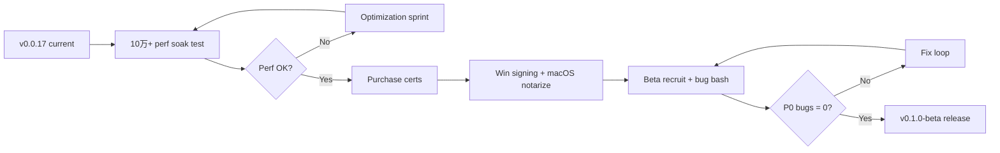

# LightFrame v0.1.0-beta Roadmap

> **Current version:** v0.0.19  
> **Last updated:** 2026-07-01

## Current Status (v0.0.17)

### Core (Phase 1–2) — ✅ Complete

- ✅ Core photo management (import, browse, organize)
- ✅ Album management with cover photos
- ✅ Full-text search (FTS5)
- ✅ Perceptual deduplication (DHash + PHash + LSH)
- ✅ Similar photo detection (CLIP cosine similarity)
- ✅ Face detection framework (ONNX, optional `face` feature)
- ✅ CLIP embedding framework (ONNX, optional `clip` feature)
- ✅ Screenshot classification (rule layer + optional CLIP sub-types)
- ✅ Geo-reverse coding (rrgeo / reverse_geocoder)
- ✅ Basic image editing (crop, rotate, filters, curves, levels, selective color)
- ✅ Batch export
- ✅ Keyboard shortcuts
- ✅ Timeline view ("On this day" / Memories)
- ✅ Favorites system
- ✅ Soft delete + permanent delete
- ✅ File watcher (real-time, inotify / notify)
- ✅ Database read/write split
- ✅ LSH-based dedup optimization

### Beta features (v0.0.9–v0.0.17) — ✅ Implemented

- ✅ CLIP model auto-download with progress bar (`download_model` + `model-download-progress` event)
- ✅ Semantic search fully functional (Rust ONNX + `semantic_search` IPC + search UI mode toggle)
- ✅ Face clustering UI — `PeopleView` / `PersonDetailView` with merge, split, rename
- ✅ Update checker (GitHub Releases API, in-app notification; no signed auto-update)
- ✅ Thumbnail regeneration for corrupt/missing thumbnails (`regenerate_thumbnails` / settings UI)
- ✅ HEIC/AVIF support — AVIF decode via `avif-native`; HEIC indexed with graceful thumbnail skip (no libheif yet)
- ✅ Map view for geo-tagged photos (`MapView` + Leaflet)
- ✅ Slideshow mode (`SlideshowView`, 3/5/10 s speeds)
- ✅ Print/share integration (`window.print` + Web Share API in `PhotoViewer`)
- ✅ macOS `.dmg` packaging in CI (amd64 + arm64 matrix)
- ✅ Face cache disk persistence with proper invalidation on media lifecycle events
- ✅ Windows WebView2 custom protocol compatibility (double-encoding fix)
- ✅ Producer-consumer scan architecture (event queue, incremental refresh)

### Still open for v0.1.0-beta

- ⬜ Windows Authenticode code signing (SmartScreen warning remains — see `docs/SIGNING.md`)
- ⬜ macOS Developer ID signing + notarization (Gatekeeper warning on first open)
- ⬜ RAW file improved decode (indexed + RAW badge; optional `raw-decode` feature with rawloader + bilinear demosaic; default build uses embedded JPEG preview only)
- ⬜ 10万+ real-world performance validation (benchmarks exist; large-library soak testing pending)
- ⬜ Cloud sync (P2, future)

---

## Optional features & licensing

### RAW full decode (`raw-decode`)

LightFrame's default MIT build extracts embedded JPEG previews from RAW files (CR2, NEF, ARW, DNG, ORF, PEF, RW2, RAF, 3FR, NRW, SRW, etc.) without linking any LGPL code.

To enable full sensor decode (Bayer extraction + bilinear demosaic + white balance + orientation):

```bash
cargo build -p lightframe-core --features raw-decode
# or propagate through the app crate:
cargo build -p lightframe-app --features lightframe-core/raw-decode
```

This pulls in [`rawloader`](https://crates.io/crates/rawloader) **0.37**, licensed under **LGPL-2.1**. Distribution of binaries built with `raw-decode` must comply with LGPL obligations (provide source/object relink info, allow user replacement of the library, etc.). The default release pipeline does **not** enable this feature to keep the primary artifact MIT-licensed.

When `raw-decode` is enabled, `decode_image()` tries full RAW decode first and falls back to the embedded JPEG preview on failure.

---

## Remaining for v0.1.0-beta

### Must-Have (P0)

- [x] CLIP model auto-download with progress bar
- [x] Semantic search fully functional
- [x] Face clustering UI (view/merge/split persons)
- [ ] Windows code signing (remove SmartScreen warning)
- [x] macOS `.dmg` packaging (CI builds; notarization still needed)
- [x] Update checker (GitHub Releases notification; no signed auto-update yet)

### Should-Have (P1)

- [x] Thumbnail regeneration for corrupt/missing thumbnails
- [ ] RAW file support — **partial:** extension recognized, embedded preview by default; optional full sensor decode via `raw-decode` feature (`rawloader`, LGPL-2.1)
- [x] HEIC/AVIF support — **AVIF full decode; HEIC graceful fallback** (libheif optional)
- [x] Map view for geo-tagged photos
- [x] Slideshow mode
- [x] Print/share integration

### Nice-to-Have (P2)

- [ ] Cloud sync (WebDAV/S3)
- [ ] Mobile companion app
- [ ] Plugin system
- [ ] Advanced editing (layers, masks)
- [ ] Video timeline editor

---

## Release Criteria

| Criterion | Status | Notes |
|-----------|--------|-------|
| All tests passing on Windows, macOS, Linux | ⚠️ Partial | CI: Ubuntu + Windows on every PR; macOS on tag builds only |
| Rust + frontend test suite green | ✅ | **752** Rust + **639** frontend = **1391** tests (v0.0.19) |
| <3s cold start time | ⬜ Unverified | Target from roadmap; needs release-build measurement |
| <100MB memory usage for 10K photos | ⬜ Unverified | Needs profiling on real library |
| 10万+ library performance targets | ⬜ Pending | Criterion benches exist; soak test on 100K+ library not done |
| No known P0 bugs | ⬜ Pending | Beta testing cycle |
| User guide complete | ✅ | `docs/USER_GUIDE.md` (zh/en) |
| Installer tested on clean Windows 10/11 | ⬜ Pending | Unsigned builds available |
| macOS notarized `.dmg` | ⬜ Pending | Unsigned `.dmg` builds in CI |

---

## Updated Development Plan — Remaining Work to v0.1.0-beta

Below is the execution plan for what remains after v0.0.17. Effort estimates assume **single developer, full-time**.

| # | Item | Priority | Effort | Dependencies | Blocks v0.1.0-beta? |
|---|------|----------|--------|--------------|---------------------|
| 1 | **Windows Authenticode signing** | P0 | 2–3 days | Purchase OV/EV code-signing certificate (~$200–500/yr); configure `WINDOWS_CERTIFICATE` CI secret; `signtool` on release pipeline | **Soft block** — app runs unsigned; SmartScreen hurts first-run UX on Windows |
| 2 | **macOS notarization** | P0 | 2–4 days | Apple Developer Program ($99/yr); Developer ID cert; `APPLE_*` CI secrets; notarytool + stapler in workflow | **Soft block** — `.dmg` ships but Gatekeeper warns on first open |
| 3 | **10万+ real-world performance testing** | P0 | 3–5 days | Hardware with SSD + 100K+ photo library (or synthetic fixture); profiling (`tracing`, memory sampling); grid scroll / search / dedup soak | **Yes** — NFR-001–NFR-008 acceptance requires evidence |
| 4 | **RAW improved decode** | P1 | 5–8 days | Optional `raw-decode` feature (`rawloader` LGPL-2.1 + bilinear demosaic); default MIT build uses embedded JPEG preview only | **No** — partial RAW support acceptable for beta |
| 5 | **Beta bug triage & P0 fixes** | P0 | Ongoing (1–2 weeks) | Beta testers; GitHub Issues template; reproduction on Win/Linux/macOS | **Yes** — release criteria require P0 = 0 |
| 6 | **Cloud sync (WebDAV/S3)** | P2 | 15–20 days | Storage backend design; conflict resolution; optional network | **No** — explicitly deferred post-beta |

### Recommended sequence



### Phase 4 mapping (from `5-development-plan.md`)

| Week | Task | v0.0.17 status |
|------|------|----------------|
| W21 Performance | 10万+压测、瓶颈优化 | ⬜ Not started (unit benches only) |
| W22 Packaging | Win/Linux/macOS installers | ✅ CI matrix (deb/rpm/AppImage/msi/nsis/dmg) |
| W23 Auto-update + docs | Update checker, user docs | ✅ Update checker + USER_GUIDE + SIGNING docs |
| W24 Beta release | Bug fix, v0.1.0-beta tag | ⬜ Pending |

---

## Post-beta (v0.2+) preview

| Version | Focus |
|---------|-------|
| v0.2.0 | Beta feedback, HEIC/libheif optional pack, face UX polish |
| v0.3.0 | RAW preview enhancement, GPU ONNX, MFT/USN production hardening |
| v1.0.0 | Stable release — performance signed off, P0/P1 bugs closed |
